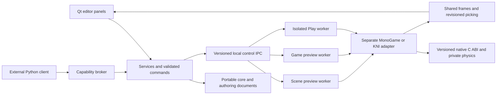

# Dragon Pixel Engine

**Visual 2D and 3D authoring for code-first games, with C# and C++ components and separate MonoGame and KNI runtimes.**

Dragon Pixel Engine combines a C++20/Qt desktop editor, a portable native core, and isolated .NET workers. Build scenes with GameObjects, typed components, linked prefabs, tiles, cameras, lights, and physics while keeping source code accessible in an external editor. Scene and Game views show framework-rendered output; saved authoring data stays under the editor's control.

The goal is a dependable path from a new or existing MonoGame/KNI project to visual authoring, iteration, recovery, and eventual publishing. Familiar Hierarchy, Inspector, Project, and Play workflows make the editor approachable without making Unity a dependency.

> **Development status:** Early development; no qualified production release. This README describes documentation baseline **0.1.0**, reviewed against source on **2026-09-18**, under **DPE-ARCH-0017**. Tilemap work is merged into `develop`; newer Project Window work remains in unmerged [PR #7](https://github.com/DragonLensStudios/Dragon-Pixel-Engine/pull/7). **KNI is experimental.** The documentation version does not change binary, package, schema, or protocol versions. All four product slices still have open acceptance gates.

## Contents

- [Design goals](#design-goals)
- [Feature overview](#feature-overview)
- [Architecture and ownership](#architecture-and-ownership)
- [Projects, components, and runtime workflows](#projects-components-and-runtime-workflows)
- [Development workflow](#development-workflow)
- [Project View workflow](#project-view-workflow)
- [Windows development quick start](#windows-development-quick-start)
- [Tilemap authoring workspace](#tilemap-authoring-workspace)
- [Tiled tilemap import](#tiled-tilemap-import)
- [Ubuntu verification from Windows](#ubuntu-verification-from-windows)
- [Platform evidence and limitations](#platform-evidence-and-limitations)
- [Roadmap to 1.0](#roadmap-to-10)
- [Repository and documentation map](#repository-and-documentation-map)
- [License and dependencies](#license-and-dependencies)

## Design goals

Dragon Pixel targets programmers and technical designers who want visual scene construction over code-first projects, plus designers who need a component workflow without editing scene JSON. MonoGame is the primary adapter. KNI is developed independently against the same intended contracts.

Engineering priorities are data safety, architecture integrity, recoverable failures, cross-platform correctness, contributor experience, performance, and then feature breadth:

- **Keep source ownership visible.** C# and C++ remain ordinary project sources with stable identities and generated metadata. Rider opens sources outside the editor.
- **Use one authoring model.** Both languages resolve the same entity/component IDs. Framework types stay inside adapters.
- **Make edits reversible.** Commands, transactions, Undo/Redo, staged publication, and recovery protect previous valid data.
- **Separate editing from running.** Play consumes an immutable snapshot; Stop discards runtime changes.
- **Preserve unfamiliar data.** Missing/incompatible components retain opaque records and diagnostics rather than disappearing on save.
- **Prove the workflow.** Real device frames, public Qt interactions, recovery tests, and platform-separated evidence determine acceptance.

The [Design Document](docs/Dragon%20Pixel%20Engine%20Design%20Document.md) defines exact contracts, tradeoffs, risks, and gates. Its future requirements are not a list of finished features.

## Feature overview

**Implemented** means code and recorded implementation evidence exist in this documentation branch, not that all platform gates passed. **Planned** means an accepted goal without completed end-to-end delivery evidence.

| Area | Current implementation | Boundary or remaining work |
| --- | --- | --- |
| Projects | Project Hub, recent projects, declarative 2D/3D templates, clean scenes, candidate-open validation | Complete upgrades/settings/archive/restore and POC M remain open |
| Workspace | Full-grid split/tab/floating docks, reset, versioned per-user layouts, 2D/3D/Debug workspaces | Complete accessibility and designer matrices remain open |
| Hierarchy | Stable IDs, ordered multi-selection, rename/enable, duplicate/delete/group, transactional reparent/reorder | Multi-scene editing and separate Prefab Mode are outside the current increment |
| Inspector | Component cards, typed/nested/collection/polymorphic values, mixed editing, filtered references, lockable panels | Missing/unbuilt records stay preserved; full platform qualification remains open |
| Project View | Favorites, saved searches, immediate folder contents, icon/list sizing, breadcrumbs, layout/lock, validated drops | DPE-ARCH-0017 remains in PR #7 with a blocked complete Ubuntu gate |
| Assets | Copied/linked image intake, identity/dependency diagnostics, rename/move/duplicate, recoverable trash/restore | Broader reimport/cache qualification and model/audio/font importers remain incomplete |
| Components | C#/C++ generation, metadata, isolated builds and worker loading, lifecycle dispatch, Rider handoff | Native transform-control parity, packaging, and full POC I remain open |
| Scene and Game | Independent docks, cameras/gizmos, real device output, revision-correlated picking | Accepted simultaneous-output topology and full POC L remain open |
| Input | Named action maps, keyboard/mouse, SDL standard-gamepad path, rebinding and neutralization | Physical-controller/hot-plug and complete Qt-event-to-paint evidence remain open |
| Physics | Private Box2D 2D/Jolt 3D backends, basic bodies/colliders, isolated Simulate/Play worlds | Complete platform and designer qualification remains open |
| Prefabs | Linked nested sources, mappings/overrides/fallbacks, instantiate/apply/revert/rebase/unpack | Complete nesting/recovery/designer acceptance remains open |
| Tilemaps | Five layouts, multi-TileSet palettes/maps, typed tiles, tools/brushes, slicing, collision, Tiled JSON | Complete POC K/O/P and runtime conformance remain open |
| Automation | External Python client, capabilities, inspect/dry-run/validated rename, cancellation/audit proof | Broad AI authoring and build/import automation are planned |
| Migration | Read-only MonoGame/KNI scanner with JSON/Markdown evidence | Assisted sibling-project generation and behavioral validation are planned |
| Distribution | Windows developer bundle with hash manifest and packaged smoke test | Signed clean-machine packages, updates/rollback, and POC R/S are planned |

## Architecture and ownership



This shows implemented session ownership, not acceptance of the open POC L topology. Portable native modules have no Qt, CLR, MonoGame, KNI, Unity, or Python dependencies. `DragonPixel.Contracts` targets .NET Standard 2.1; workers/adapters target .NET 10. C++ classes, STL values, exceptions, GC objects, and framework types do not cross the C ABI. Control uses framed JSON-RPC over Windows named pipes or Unix-domain sockets; BGRA image bytes use shared memory.

Deterministic versioned UTF-8 JSON and UUIDs define authoring data. Runtime caches and IDE files are disposable. Compatible unknown records survive round trips; invalid/newer data is diagnosed or rejected without silent rewriting.

| Implemented boundary | Version in this branch | Purpose |
| --- | --- | --- |
| Project / template | 4 / 1 | Identity, declared roots, startup scene, requirements, declarative creation |
| Scene / prefab | 3 / 1 | Local records and linked instance provenance |
| Asset sidecar | 3 | Stable identity, ownership, hashes, dependencies and recovery |
| Component metadata | 4 | Typed language-neutral authoring descriptors |
| Input map | 1 | Named maps/actions/bindings |
| TileSet / Tile Palette / Tilemap | 2 / 1 / 2 | Definitions, palettes and sparse layered maps |
| Runtime snapshot | 5, with explicit v4 reading | Flattened immutable worker data; not a saved scene |

These contract versions are not stable-release certification. [Schemas](schemas), [native sources](src/native), and the [ADR index](docs/adr/README.md) provide details. Broader migration/plugin/build/update/support-bundle contracts in the design remain partly or wholly planned.

## Projects, components, and runtime workflows

### Project Hub, Hierarchy, and Inspector

A no-argument editor launch opens **Project Hub**. New Project validates a staged candidate before publishing into a new destination. The minimal 2D scene contains an orthographic camera; 3D contains a perspective camera and directional light. Templates include declared roots, an input map, and a component project. Opening older readable content does not silently rewrite it.

Hierarchy commands create, rename, enable, duplicate, delete, group, and reparent ordered selections transactionally. Stable IDs survive model refresh. Scene View supplies camera navigation, picking, overlays, and Move/Rotate/Scale tools; typed Inspector values provide precise edits.

Inspector offers component cards, searchable component creation/addition, constrained properties, nested objects, lists/dictionaries, polymorphic values, and filtered references. Mixed selections stay unchanged until explicit commit. All targets validate before one compound edit, and Undo restores their distinct prior values. Missing records remain visible and preserved.

**View > New Inspector** creates another independently lockable dock. Locks capture scene/entity IDs rather than following global selection. Deleted targets become unavailable and can return through Undo. Dock count/layout persists per user; locks clear on restart or scene/project close.

### C# and C++ behavior

Component creation generates contained source and metadata with stable type/property IDs. The editor reads metadata without loading project code. Supervised builds publish content-addressed module manifests; only disposable workers load validated binaries. Missing/stale/incompatible modules preserve authoring records with diagnostics.

C# scripts can derive from `GameObjectController`: stable `Guid Id`, shared per-entity `Transform`, immutable action input, timing, and concise `Enabled`, `Disabled`, `Update`, and `FixedUpdate` overrides. Legacy interfaces remain available. Native components use size-tagged versioned C tables with v1 fallback. Lifecycle dispatch covers create, enable, bounded fixed updates, variable/late updates, render submission, disable, and destruction. Stage failures are contained within workers.

Read the [managed contracts](src/managed/DragonPixel.Contracts/RuntimeComponents.cs) and [native ABI](src/native/CAbi/include/dragonpixel/cabi/component_plugin_v1.h). Script transforms affect disposable rendering/picking and never saved scenes. Managed render overrides are not a general physics-body control API; native transform-control parity remains open.

Activate a source in Project View or choose an Inspector Rider action. `ScriptEditorService` regenerates disposable `.dragonpixel/Ide/Rider` files and launches Rider with an argument vector. `DPE_RIDER_EXECUTABLE` selects an installation. Editing does not itself execute code inside Dragon Pixel. Build Components remains available; the recorded generated-C# workflow also schedules an isolated build.

### Input, physics, and linked prefabs

The focused Game view owns Play input. **Edit > Project Settings > Input...**, **Assets > Input Map...**, or an input-map asset opens named maps/actions/bindings. Canonical keyboard, mouse, and standard-gamepad controls use scales and dead zones. Sample movement consumes `move.x`/`move.y`; rebinding does not require device-specific scripts. Focus loss, Pause, Stop, release, and worker failure neutralize input. Hardware and complete timing qualification remain open.

Private Box2D and Jolt backends supply baseline 2D/3D bodies and box/circle/sphere colliders behind neutral contracts. Edit displays authoring state; Simulate Preview and Play own disposable worlds. Stop discards runtime state without writing simulated transforms into authoring files.

Linked prefabs keep source revisions, instance mappings, normalized overrides, and fallback content distinct from locally owned records. Instantiate, Apply, Revert, Repair/Rebase, Unpack, and Unpack Completely use commands and recoverable publication. Missing/newer sources preserve fallbacks; cycle/depth/entity guards prevent unsafe expansion. Complete designer/recovery matrices remain open; see [prefab evidence](docs/Prototypes/POC%20F%20Linked%20Nested%20Prefab%20Evidence.md).

## Development workflow

Feature work starts from current `develop`, uses one focused `feature/*` branch and a mirrored living plan, proceeds through small tested commits, and ends with aggregate diff review plus a draft pull request into `develop`. Multiple independent feature PRs may remain open and be reviewed manually at the same time. A genuinely dependent child may temporarily target one parent `feature/*` branch only when both plans and PR bodies identify the dependency, ownership, overlap, merge order, and retarget steps; the child cannot merge first and must be updated, retargeted to current `develop`, re-reviewed, and retested after its parent merges. Codex and contributors must read [AGENTS.md](AGENTS.md) and the [Development Constitution](docs/Development/Development%20Constitution.md); the reusable [feature-plan template](docs/Development/Feature%20Plan%20Template.md), [GitFlow handbook](docs/Development/GitFlow%20Handbook.md), [verification checklist](docs/Development/Verification%20Checklist.md), and [feature PR template](.github/PULL_REQUEST_TEMPLATE/feature.md) define the handoff.

## Project View workflow

The **Project** dock follows the supported structure and behavior of Unity 5.4's Project Window while retaining Dragon Pixel visuals and ownership. Favorites and the folder tree appear on the left; the active folder's immediate contents appear as scalable icons or a compact Name/Kind list on the right. The toolbar provides Create, search, type/status filters, Save Search, one/two-column layout, and lock; Back, Forward, Up, and clickable breadcrumbs provide stable navigation. Search is whitespace-AND with ORed `t:` types and Dragon Pixel `s:` statuses. Refresh restores valid folder, expansion, selection, splitter, layout, lock, and icon-size state as non-authoritative per-user settings without changing project files.

Supported OS files import into the validated visible folder. Project assets and folders can move between contained Project folders through `AssetService` even when no Scene is open; successful moves preserve stable IDs. Sprite, Tilemap, prefab, and compatible asset drops into Scene, Hierarchy, or Inspector continue through their existing validated command owners. Hierarchy-to-Project prefab creation remains Scene-dependent. Stale, cross-project, colliding, recursive, incompatible, and ambiguous mutations are rejected before authoritative writes. See the [Project View user guide](docs/Dragon%20Pixel%20Engine%20Project%20View%20User%20Guide.md) for the complete workflow and team GitFlow rules.

## Windows development quick start

Normal development starts from reviewed `develop`:

```powershell
git clone --branch develop https://github.com/DragonLensStudios/Dragon-Pixel-Engine.git
Set-Location Dragon-Pixel-Engine
```

To inspect this baseline and inherited unmerged Project Window work, fetch and check out `feature/documentation-baseline-0.1.0`. `main` is reserved for releases and does not contain all development features.

These are repository pins inspected for this update, not claims about latest upstream versions:

| Tool/dependency | Selection | Configuration |
| --- | --- | --- |
| Native build | C++20, CMake 3.25 minimum, Ninja Multi-Config | [CMakeLists](CMakeLists.txt), [presets](CMakePresets.json) |
| Windows / Qt | MSVC v143, Qt 6.11.1 MSVC 2022 x64 | [prerequisite installer](scripts/dev/Install-WindowsPrerequisites.ps1) |
| Managed SDK/language | .NET SDK 10.0.203 with latest-patch roll-forward, C# 14 | [global.json](global.json), [properties](Directory.Build.props) |
| Portable contracts | .NET Standard 2.1 | [contracts project](src/managed/DragonPixel.Contracts/DragonPixel.Contracts.csproj) |
| MonoGame DesktopGL | 3.8.5 | [worker project](src/managed/DragonPixel.Adapter.MonoGame.Worker/DragonPixel.Adapter.MonoGame.Worker.csproj) |
| Experimental KNI SDL2 GL | 4.2.9001.1 | [worker project](src/managed/DragonPixel.Adapter.Kni.Worker/DragonPixel.Adapter.Kni.Worker.csproj) |
| Native libraries | Box2D 3.1.1, Jolt 5.6.0, SDL3, nlohmann-json through pinned vcpkg | [manifest](vcpkg.json) |

From an elevated PowerShell session:

```powershell
& '.\scripts\dev\Install-WindowsPrerequisites.ps1'
```

Open a new PowerShell session after installation, then verify the complete C++20, Qt Widgets, CMake/CTest, Ninja, and .NET 10 loop:

```powershell
& '.\scripts\dev\Test-WindowsEnvironment.ps1'
```

The verifier builds disposable native/Qt and managed smoke projects under the Windows temporary directory, runs their tests, checks dynamic Qt linkage, and removes successful artifacts. Use `-KeepArtifacts` when debugging the smoke project.

The install script is driven by the repository `.vsconfig`, uses the Qt-supported MSVC v143 toolset, and pins Qt to 6.11.1 MSVC 2022 x64. Environment decisions and evidence are recorded in `docs\Plans`.

Build and run the complete Windows Release test suite:

```powershell
& '.\scripts\dev\Build-Windows.ps1'
```

Build under MSVC AddressSanitizer:

```powershell
& '.\scripts\dev\Build-Windows.ps1' -AddressSanitizer
```

Launch the editor with a writable copy of the checked-in sample:

```powershell
& '.\scripts\dev\Launch-Editor.ps1'
```

Use `-SkipBuild` for a fast edit/run cycle after a successful build. Use `-ResetSample` when you intentionally want to discard the writable development copy and recreate it from `samples\Slice1Sample`:

```powershell
& '.\scripts\dev\Launch-Editor.ps1' -SkipBuild -ResetSample
```

For the fastest production-style editor iteration on Windows, build only the Release editor and its required runtime dependencies, deploy a stable runnable bundle, run its packaged smoke test, and launch it:

```powershell
& '.\scripts\dev\Build-Production-Editor.ps1' -Launch
```

After the first validated bundle, close the running editor and use the fast incremental path while editing:

```powershell
& '.\scripts\dev\Build-Production-Editor.ps1' -Fast -Launch
```

Relaunch the current bundle without building:

```powershell
& '.\scripts\dev\Launch-Editor.ps1' -Production -SkipBuild
```

The directly runnable executable is `out\product\windows-x64\DragonPixelEditor\DragonPixelEditor.exe`. Its adjacent bundle includes Qt plugins, native runtime libraries, MonoGame/KNI workers, the isolated Tiled importer worker, contracts, Python tools, schemas, a sample, and a SHA-256 file manifest. This is a production-style developer bundle for rapid local testing; it is not yet the signed, clean-machine-validated POC R release package.

The editor opens the 2D/3D sample in authoring mode. The Hierarchy, typed Inspector, Project Explorer, Scene View, and structured Console are model-backed full-grid docks: there is no reserved center obstruction, and panels can split, tab, float, move to any dock area, reset deterministically, and restore versioned per-user layouts. GameObject presets, multi-selection, component editing, direct New C# Script/New C++ Component attachment, asset drag/drop, Undo/Redo, workspaces, picking, camera controls, and Move/Rotate/Scale gizmos route authoritative edits through validated scene transactions. Contained C#/C++ component sources appear in Project Explorer; double-clicking one or choosing the Inspector component-card Rider edit action regenerates a disposable `.dragonpixel/Ide/Rider` solution and opens the selected source in JetBrains Rider without loading project code into the editor process.

The current implementation supervises separate `scene`, `game-preview`, and `play` sessions. Scene uses the editor camera; Game previews the unique enabled primary scene camera and becomes the isolated Play output. The design's single-preview-worker simultaneous-output goal remains an open POC L question. Play launches a MonoGame or experimental KNI worker from an immutable snapshot. Simulate Preview runs an isolated native Box2D/Jolt world; Play owns a disposable runtime world. Stop never writes simulated transforms into the authoring scene. Both adapters use real graphics-device render targets, revisioned IPC, ID-buffer picking, and BGRA8 shared frames. Baseline static-mesh rendering does not imply imported skinned-model or advanced rendering support.

## Tilemap authoring workspace

Choose **Assets > Create TileSet from Image...** to turn a PNG, JPEG, BMP, or GIF sprite sheet into a contained Texture and TileSet. Automatic, cell-size, and cell-count slicing share one preview and support offset, padding, empty-cell handling, pivot, pixels-per-unit, layout, and collision choices. Leave **Create a Tilemap and GameObject ready for painting** checked to atomically publish and open the Texture, TileSet, Tile Palette, Tilemap, assigned Tilemap2D GameObject, and optional TilemapCollider2D. Inputs are validated by decoded content rather than filename: valid extensionless PNGs remain accepted, while JPEG/BMP/GIF sources are normalized to real project PNG content. Missing, malformed, or unsupported formats such as SVG are rejected before publication.

For an existing TileSet, double-click it or choose **Create Tilemap from Selected TileSet...** from the Assets menu or its Project context menu. The editor asks for the map name, atomically creates an empty reusable Tilemap and palette, opens the workspace, and completes the same paint-ready GameObject workflow. It reuses only a selected Tilemap2D GameObject whose Tilemap reference is empty; it never silently replaces a populated reference. Project Explorer drag/drop accepts compatible images, TileSets, palettes, Tilemaps, and prefabs, and a Tilemap asset can still be assigned explicitly through the Inspector.

The Tile Palette workspace has explicit Active Palette, Active Target, and active-layer selectors, target following and pinning, a neutral multi-cell brush, palette organization, brush properties, TileSet definition editing, grid and renderer settings, and selection editing. Paint, Erase, Box, Line, Flood, Pick, Select, and Move tools have familiar-letter, legacy-number, and validated per-user Custom shortcut profiles. Basic, Animated, Rule, Rule Override, and losslessly preserved Custom tiles are represented in TileSet v2; Random Selection, Group Stamp, metadata-safe GameObject, and worker-only Custom Extension brushes extend the basic brush. Safe re-slicing preserves stable tile IDs and blocks removal of referenced definitions. Rectangular, hex point-top, hex flat-top, isometric, and isometric Z-as-Y layouts use the same portable projection, picking, and collision owner.

TileSet, palette, Tilemap, and scene changes participate in validated transactions and recoverable atomic saving. A persistent sharing lock retains previous valid files and unsaved editor state. Grid and Sprite Outline colliders lower to neutral Box2D shapes, with safe opt-in rectangular Grid composite merging. Runtime snapshot v5 and both adapters consume the expanded contracts; KNI remains experimental. PR #6 was reviewed and merged into `develop` on 2026-07-29; that merge does not close its platform, POC, or release gates. See the [Tilemap Editor user guide](docs/Dragon%20Pixel%20Engine%20Tilemap%20Editor%20User%20Guide.md) and [tilemap plan](docs/Plans/Dragon%20Pixel%20Engine%20Tilemap%20Authoring%20Workspace%20Plan.md) for workflows, evidence, and limits.

## Tiled tilemap import

With a project open, choose **Assets > Import Tiled Tilemap...** (`Ctrl+Alt+T`), select a `.tmj` or JSON-format Tiled map, and enter its pixels-per-unit scale. A successful import creates contained atlas textures, TileSets, a palette, and a Tilemap with version-3 asset sidecars, refreshes Project Explorer, and opens the paint-ready workspace.

The importer accepts finite numeric arrays or infinite numeric chunks, multiple inline or external JSON atlas TileSets, orthogonal, isometric, staggered, and hexagonal orientations, tile animation, and conservatively representable terrain/Wang rules. Layer order, names, visibility, negative coordinates, and Tiled GID transformations are preserved. TMX/TSX XML, encoded or compressed layers, object/image/group layers, image collections, unsupported Wang semantics, and reimport remain rejected before publication. See the [Tiled import feature plan](docs/Plans/Dragon%20Pixel%20Engine%20Tiled%20Tilemap%20Import%20Plan.md) for historical PR #5 evidence and the parity follow-up disposition.

## Ubuntu verification from Windows

With Docker Desktop running, build a clean Ubuntu 24.04 image pinned to Qt 6.11.1, .NET SDK 10.0.203, and the repository's vcpkg baseline, then run the Release suite:

```powershell
& '.\scripts\ci\Test-UbuntuContainer.ps1'
```

Reuse the cached toolchain image for the Clang AddressSanitizer matrix:

```powershell
& '.\scripts\ci\Test-UbuntuContainer.ps1' -AddressSanitizer -SkipImageBuild
```

The container copies the source into its native filesystem before building so shared-memory frame measurements are not distorted by a Windows bind mount. Use `-VerboseTests` to display individual worker metrics and graphics-probe results.

For native Unix development, configure Qt/.NET/vcpkg/compiler prerequisites from the [cross-platform workflow](.github/workflows/slice1.yml), set `VCPKG_ROOT`, and expose Qt through `CMAKE_PREFIX_PATH`. Then:

```sh
cmake --preset unix-clang
cmake --build --preset unix-release
ctest --preset unix-release --output-on-failure
```

Sanitizer counterparts are configure preset `unix-clang-asan` and build/test preset `unix-asan`. Linux GUI/device tests also need the workflow's display/graphics setup. macOS remains a required target with unresolved failures; these are development entry points, not passing-platform evidence.

## Platform evidence and limitations

This is **recorded 2026-07-28/29 evidence**, inspected for the documentation update. No engine/runtime/sanitizer matrix was rerun for this prose-only baseline. Each count belongs to its named source snapshot.

| Scope | Platform/configuration | Recorded result |
| --- | --- | --- |
| Merged Tilemap PR #6 | Local Windows Release / MSVC ASan | 63/63 in 570.78 s / 63/63 in 895.30 s; no sanitizer finding |
| Merged Tilemap PR #6 | Hosted Ubuntu Release / ASan | 62/62 in 156.85 s / 62/62 in 218.22 s; earlier intermittent crash retained |
| Project Window PR #7 changed aliases | Windows Release / MSVC ASan | 3/3 in 340.03 s / 3/3 in 571.63 s; no sanitizer finding |
| Project Window PR #7 changed aliases | Ubuntu Release | 3/3 in 48.25 s |
| Project Window PR #7 complete matrix | Ubuntu Release | Three 61/62 runs: crash-recovery allocator failure, then two KNI throughput failures |
| Product gate | macOS 14+ arm64 | Complete acceptance open; parent feature deferred/unrun |

The [Tilemap plan](docs/Plans/Dragon%20Pixel%20Engine%20Tilemap%20Authoring%20Workspace%20Plan.md) and [Project View plan](docs/Plans/Dragon%20Pixel%20Engine%20Project%20View%20and%20Team%20GitFlow%20Workflow%20Plan.md) retain commands, artifacts, failures and reruns. Recorded hosted Windows runners compiled successfully but lacked required OpenGL framebuffer capability for device tests; local success does not replace missing hosted evidence.

- PR #7's complete Ubuntu gate is blocked. Two KNI runs measured 29.250 and 28.879 FPS against the unchanged 30 FPS threshold. Passing focused reruns do not erase full-suite failures.
- Historical macOS POC B throughput fell below the unchanged 1280×720/30 FPS gate. Current complete Release/sanitizer and expanded conformance remain required.
- Aggregate real Qt-event-to-first-reflecting-paint timing, full controller coverage, and POCs I-L remain open. Revision echo and synthetic frames cannot satisfy rendering/input acceptance.
- Multi-item atomic Project moves, cursor/surface-specific 3D placement, general model/audio/font import, reimport, and full lifecycle tooling are incomplete.
- Complete designer/accessibility, long-running stability, compatibility, security/privacy, dependency, and distribution reviews remain open.
- A documentation tag is not a signed installer, supported-release promise, completed slice, or accepted ADR.

## Roadmap to 1.0

The [Slices 1-4 plan](docs/Plans/Dragon%20Pixel%20Engine%20Slices%201-4%20Version%201.0%20Completion%20Plan.md) owns delivery tracking. Later implementation does not waive earlier acceptance failures.

| Slice | Intended outcome | Remaining acceptance |
| --- | --- | --- |
| 1 — Foundation | Core, ABI, metadata, serialization, adapters, editor, open/save, isolated Play/recovery | Current three-platform foundations, macOS frame gate, aggregate input timing |
| 2 — Visual authoring | Complete designer workflows, components, prefabs, tiles, physics, input/views, accessibility | POCs E-L, service separation, designer/accessibility and adapter matrices |
| 3 — Project lifecycle | Create/migrate/upgrade/archive, asset integrity, builds, packages/plugins/updates, Unity bridge prototype | POCs M-R; existing template/asset/build/scanner foundations are partial |
| 4 — Release qualification | Consistent versioning, compatibility/budgets/stability, clean install/update/rollback, reviews/tutorials | POC S and every earlier release gate |

Unity integration is a planned bounded contracts-and-bridge prototype, not current full integration. Unreal, AAA rendering, networking, visual scripting, a marketplace, a general IDE, and automatic semantic conversion of arbitrary games remain outside 1.0. Python/AI stays outside the real-time loop behind capabilities, staging, validation, and audit.

## Repository and documentation map

| Location | Contents |
| --- | --- |
| [src/native](src/native) | Core, scenes/commands, metadata, serialization/recovery, prefab, tiles, physics, C ABI and tests |
| [src/editor](src/editor) | Qt shell, services/models, panels, workflows and public interaction tests |
| [src/managed](src/managed) | Contracts, interop, adapter host/workers and managed tests |
| [src/importers](src/importers), [pocs](pocs) | Isolated importers and architecture/conformance probes |
| [schemas](schemas), [templates](templates), [samples](samples) | Versioned contracts, declarative projects and reference data |
| [tools/python](tools/python) | External automation client and protocol tests |
| [scripts/dev](scripts/dev), [scripts/ci](scripts/ci), [scripts/docs](scripts/docs) | Builds/launchers, CI/container checks and mirror validation |
| [docs/adr](docs/adr), [docs/Prototypes](docs/Prototypes), [docs/Milestones](docs/Milestones), [docs/Plans](docs/Plans) | Decisions, dated evidence, acceptance audits and plans |
| [docs/Compliance](docs/Compliance), [prompts](prompts) | Licensing obligations and operational development prompts |

Start with these records:

- [Design Document](docs/Dragon%20Pixel%20Engine%20Design%20Document.md): architecture, boundaries, risks, POCs and acceptance criteria.
- [LLM Prompt Source — 0.1.0](docs/Dragon%20Pixel%20Engine%20LLM%20Prompt%20Source.md): original prompt, consolidated result, subsequent prompts/results, research and complete retained architecture history.
- [Original first-structure prompt](docs/Dragon%20Pixel%20Engine%20First%20Structure%20Prompt%20Main%20Flow.md): immutable historical source.
- [Detailed 1.0 product summary](docs/Dragon%20Pixel%20Engine%201.0%20%E2%80%94%20Detailed%20Product%20Summary.md): target vision; use dated plans for completion status.
- [0.1.0 baseline plan](docs/Plans/Dragon%20Pixel%20Engine%200.1.0%20Documentation%20Baseline%20Plan.md): preservation checks, licensing decision, verification and Git handoff.

Maintainers keep durable Markdown in `docs` byte-identical with the governed external root using UTF-8/LF. The shared root requested for this baseline is also verified. Contributors without private-root access may submit clearly labeled repository-only proposals; maintainer synchronization is still required before acceptance. Run `scripts/docs/Test-DocumentationMirrors.ps1` when both governed roots are available.

Keep this README adaptive through review: update feature rows, workflows, limits, branch/merge status, links, and dated evidence with relevant changes. Promote planned work only with implementation evidence, reconcile after merges, and never label old counts as fresh results. Documentation `0.1.0`, architecture `DPE-ARCH-0017`, and data/ABI/protocol versions are distinct.

Use [issues](https://github.com/DragonLensStudios/Dragon-Pixel-Engine/issues) and [pull requests](https://github.com/DragonLensStudios/Dragon-Pixel-Engine/pulls) for bounded work and reproducible reports with platform/adapter details. The [sustainability guide](docs/Development/Open%20Source%20and%20Commercial%20Sustainability.md) describes services, expertise, training, and sponsorship supporting an open-source core.

## License and dependencies

Dragon Pixel's own code remains **[MIT licensed](LICENSE.md)**, copyright 2026 Monydragon, as confirmed by the owner for this baseline. MIT permits commercial use, modification, and redistribution subject to retaining its notice; it provides no warranty. [MIT text](https://opensource.org/license/mit).

MonoGame and KNI use **Microsoft Public License (Ms-PL)** with MIT notices for inherited portions. Dragon Pixel's MIT license does not relicense dependencies or copied upstream source. Retain their notices and applicable terms: Ms-PL-covered source redistribution retains Ms-PL; binary distribution must comply with its conditions. [MonoGame license](https://github.com/MonoGame/MonoGame/blob/develop/LICENSE.txt), [KNI license](https://github.com/kniEngine/kni/blob/main/LICENSE.txt), [Ms-PL text](https://opensource.org/license/ms-pl).

The compatibility approach keeps project/dependency licenses distinct and satisfies each applicable obligation. Qt follows the project's dynamically linked LGPLv3 path; notices, corresponding source, replacement/relinking rights, and the existing legal review remain distribution gates. [Qt obligations](https://www.qt.io/development/open-source-lgpl-obligations).

See the [MIT/dependency compatibility record](docs/Compliance/Dragon%20Pixel%20Engine%20MIT%20and%20Dependency%20Compatibility.md), [Qt inventory](docs/Compliance/Qt%206.11.1%20LGPL%20Deployment%20Inventory.md), and [physics inventory](docs/Compliance/Box2D%203.1.1%20and%20Jolt%20Physics%205.6.0%20Dependency%20and%20License%20Inventory.md). Primary licensing sources were checked on 2026-09-18; this documentation is not a completed package/license audit.
