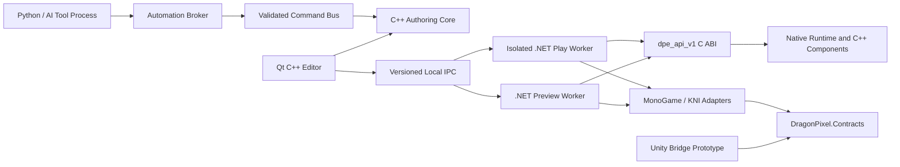
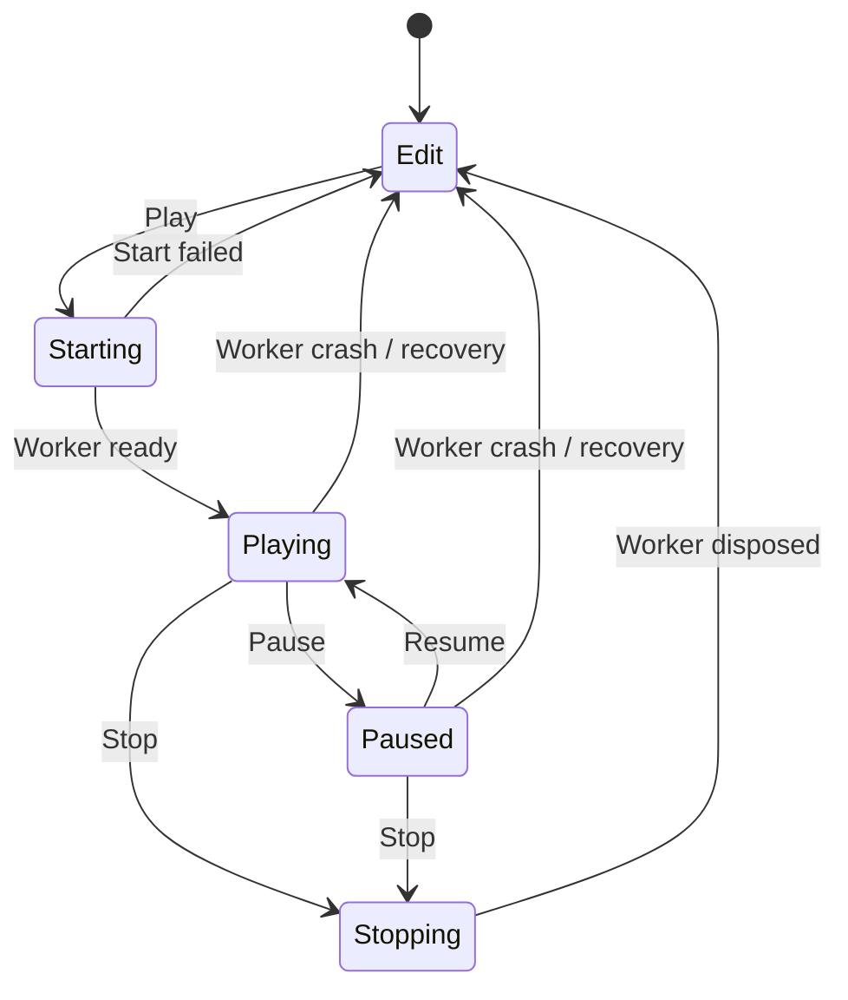

# Dragon Pixel Engine Design Document

> **Status:** Accepted full version 1.0 delivery architecture; implementation in progress
> **Design revision:** `DPE-ARCH-0014`
> **Last reviewed:** 2026-07-27
> **Current phase:** Gate-preserving completion of Slices 1 through 4 and the full design-defined Dragon Pixel Engine 1.0 feature set
> **Documentation-system path:** `C:\Projects\Documentation\Engines\Dragon Pixel Engine\Dragon Pixel Engine Design Document.md`  
> **Repository mirror:** `C:\Projects\Github\Engines\Dragon Pixel Engine\docs\Dragon Pixel Engine Design Document.md`

This is the authoritative logical architecture document for Dragon Pixel Engine. Its documentation-system and repository copies are required mirrors of the same content; neither copy wins automatically if they differ. It is a living document: architectural changes must update both copies, the matching result in `Dragon Pixel Engine LLM Prompt Source.md`, the revision history, and any affected architecture decision records (ADRs). Compatibility facts are dated and must be reverified before dependency upgrades or when older than 90 days.

## Documentation Mirroring and Durable Response Capture

- Every Markdown file in `C:\Projects\Documentation\Engines\Dragon Pixel Engine` has a same-named, byte-identical mirror under the repository `docs` folder.
- Create, edit, rename, or remove a mirrored document in both locations in the same work item. Never leave synchronization as a follow-up task.
- Use UTF-8 without a byte-order mark and LF line endings for all mirrored Markdown files.
- If paired hashes differ, stop documentation, planning, or implementation work and reconcile the intended content explicitly. Do not select one side solely from path, timestamp, or Git status.
- Durable project documentation, implementation plans, architecture research, and substantive generated responses must be recorded in the appropriate living Markdown document or a descriptively named new Markdown document, then mirrored to both locations. A chat response alone is not the project record.
- `AGENTS.md` governs the mirror mapping and required verification. The repository copy provides version control; the external copy remains available to the user's documentation system.

## Decision Status and Evidence

- **Decision** means the project has selected the approach for the current architecture baseline. Reversing it requires an ADR.
- **Verified fact** means the statement is supported by a primary source listed in [Sources](#sources), checked on 2026-07-24.
- **Assumption** means the project has selected a working constraint that must be validated by a prototype or user testing.
- **Deferred decision** means the choice is intentionally outside the current architecture iteration; its decision gate is named.

### Verified technology baseline

- **Verified:** .NET 10 is an active LTS release supported through November 2028; C# 14 is the matching current language release.
- **Verified:** MonoGame's current migration guidance describes a .NET 8 dependency and permits applications to use .NET 10.
- **Verified:** KNI's current source targets `net8.0` and `netstandard2.0` in its principal framework projects. A Dragon Pixel `.NET 10` KNI worker is therefore a compatibility claim to test, not an upstream guarantee.
- **Verified:** Unity 6.3 LTS supports managed plug-ins targeting .NET Standard 2.1 and does not support plug-ins targeting .NET Core.
- **Verified:** Qt 6.11.1 is the current public Qt 6.11 release. Qt 6.11 supports Windows, macOS, and Linux and provides dock widgets, render-capable widgets, and accessibility interfaces.
- **Verified:** Qt's LGPLv3 option permits dynamic linking when all LGPL obligations are met, including notices, a corresponding-source offer, relinking rights, and the absence of restrictions that conflict with those rights. This document is not legal advice; distribution must pass a license review.

### Implementation evidence reviewed and corrected 2026-07-25

This progress update records implementation evidence only. It does not change the accepted architecture, design revision, compatibility review date, ADR status gates, or acceptance thresholds.

- **Verified on the current Windows 11 x64 worktree:** the expanded strict Release build passes 45 of 45 registered tests; the persisted CTest log records 294.56 seconds of test execution, 45 pass markers, and zero failures. The refreshed MSVC AddressSanitizer build passes 45 of 45 tests in 368.80 seconds. The two full Qt interaction registrations complete under ASan in 95.78 and 91.47 seconds; sanitizer builds use a bounded 180-second harness timeout while ordinary builds retain 90 seconds. These results do not change any cross-platform acceptance disposition.
- **Verified on the current Ubuntu 24.04 x64 worktree:** the strict Release matrix passes 36 of 36 registered tests in 102.20 seconds, and the Clang AddressSanitizer matrix passes 36 of 36 registered tests in 101.97 seconds. Current Ubuntu POCs E-H pass in these registered matrices.
- **Verified by manual Windows QA:** the editor opened a disposable sample copy under `out/dev`, exposed the typed Inspector and manifest-indexed Project Explorer with thumbnails and import/dependency/structural status, created a GameObject preset as one transaction and undid it, ran an isolated Simulate session, displayed actual MonoGame and KNI preview/play output, and exercised pause and stop without using the tracked source sample as writable state.
- **Verified implementation corrections:** picking queues one-pixel ID-buffer readback on the graphics thread and retains the ID target across visually identical frames; the persistent frame consumer retries transient seqlock write windows and derives FPS from producer timestamps; the worker uses origin-derived absolute deadlines on a 64 Hz lattice while retaining the unchanged 30 FPS acceptance threshold; Unix native targets use position-independent code; and managed child tests receive the required AddressSanitizer preload.

Current verbose worker/renderer evidence is recorded below. These measurements remain **viewport-command receipt-to-present**, not the POC J action-to-first-reflecting-Qt-paint metric. Separately, the full-state `InputMotion2D` proof now consumes a real Play action and changes device-produced pixels and retained-ID picks through both adapters. The missing evidence is aggregate timing from the actual Qt key event through the first reflecting Qt paint, including median/tail, drops, and timeouts. Control response and crash recovery remain separate lifecycle measurements.

| Platform and run | Adapter | Presented FPS | Median viewport-command-to-present | Control response | Crash recovery | Device/readback | Publish |
| --- | --- | ---: | ---: | ---: | ---: | ---: | ---: |
| Windows combined POC B | MonoGame | 64.1 | 15.4 ms | 566.3 ms | 933.0 ms | 2.5 ms | 0.1 ms |
| Windows combined POC B | KNI | 32.1 | 32.4 ms | 253.2 ms | 1213.4 ms | 22.6 ms | 0.1 ms |
| Windows independent POC E | MonoGame | 64.0 | 15.5 ms | 601.7 ms | 1084.2 ms | 2.9 ms | 0.2 ms |
| Windows independent POC E | KNI | 32.0 | 31.0 ms | 245.2 ms | 778.4 ms | 22.2 ms | 0.1 ms |
| Ubuntu combined POC B | MonoGame | 61.7 | 16.3 ms | 306.2 ms | 492.1 ms | 8.5 ms | 0.2 ms |
| Ubuntu combined POC B | KNI | 32.3 | 55.1 ms | 315.1 ms | 534.4 ms | 26.6 ms | 0.2 ms |
| Ubuntu independent POC E | MonoGame | 61.6 | 16.4 ms | 349.1 ms | 487.6 ms | 6.8 ms | 0.1 ms |
| Ubuntu independent POC E | KNI | 33.3 | 55.2 ms | 353.1 ms | 544.7 ms | 28.0 ms | 0.1 ms |

- **Previously verified on Windows and Ubuntu for the foundational baseline:** POC A completes 10,000 native/managed ownership cycles and converts native and managed failures into structured ABI errors without leaking live handles or buffers.
- **Previously verified on Windows and Ubuntu for the foundational baseline:** POC B exercises real MonoGame and KNI graphics devices, renders a sprite and static cube into framework render targets, reads the results back, and reports a normal graphics-device status. Windows observed 5,608 distinct colors per adapter and Ubuntu observed 5,589 in that foundational probe.
- **Previously verified on Windows and Ubuntu for the foundational baseline:** the Qt editor opens the canonical project manifest, rejects a startup scene that escapes the project root, routes entity/component changes through commands or an atomic transaction, saves a scene, fully closes the project, reopens it, rediscovers assets, and reproduces native, managed, enabled, hierarchy, property, and opaque-record state.
- **Previously verified on Windows and Ubuntu for the foundational baseline:** preview and play are distinct supervised worker processes with different process IDs. A forced play-worker crash restarts only the disposable play session while the preview frame and editor-owned scene remain available.
- **Previously verified on Windows and Ubuntu for the foundational baseline:** the external standard-library Python client negotiates a user-restricted local endpoint, inspects state, dry-runs and applies a validated command, receives an invalid-command rejection, exercises the cancellation contract, and produces a capability-specific JSONL audit that does not contain the inherited session token.
- **Previously verified on Windows and Ubuntu for the foundational baseline:** POC C validates native and generated managed metadata against one schema and passes deterministic known, renamed, missing, newer, and migrated component round trips, including atomic-save recovery.
- **Previously verified on Windows and Ubuntu for the foundational baseline:** POC D produces JSON and Markdown scan reports out of process while proving the inspected project tree is byte-for-byte and metadata unchanged.
- **Previously verified on Windows and Ubuntu for the foundational baseline:** the production Qt editor shell loads the Slice 1 sample, exposes the required docks and metadata-driven Inspector, displays 2D and 3D content, controls both adapter workers over the platform local IPC transport, receives shared frames, preserves the saved scene during play/stop, and recovers from a forced worker crash. Windows exercises authenticated named pipes; Ubuntu exercises Unix-domain sockets.
- **Historical macOS 14+ arm64 evidence with an open failure:** 14 of the then-current 15 registered tests pass in the available Release and native AddressSanitizer runs. `poc_b.worker_viewport` remains failing at 1280×720 because observed presented throughput is 14.2–20.8 FPS, below the unchanged 30 FPS gate. There is no current macOS POC E-H or AddressSanitizer rerun.
- **Verified partial POC J evidence on Windows:** the focused Game widget emits immutable full-state snapshots for `move.x`, `move.y`, and `jump` with focus/capture state and press/release counters. Transactional protocol-v2 validation rejects malformed, duplicate, regressing, or future state; failure restarts Play, forces neutral, and gates input on a neutral acknowledgement. `InputMotion2D` changes real adapter pixels and pick location, then stabilizes after neutral, without changing the saved scene.
- **Verified safety/correctness evidence on Windows:** candidate project-open validation preserves the active session; project-index roots and sources share portable alias/collision checks; the native multi-file journal binds staged/backed-up bytes with SHA-256 and recovers injected failures; prefab fallback covers missing/newer/incompatible sources plus cycle/depth/entity guards; and component runtime manifests/artifacts are build-hash-, platform-, tool-, root-, placement-, and hash-validated before worker-only load.
- **Acceptance boundary:** current Windows and Ubuntu automation plus Windows manual QA are implementation progress, not Slice 1 or Slice 2 closure. Slice 1 remains blocked by macOS as the last unclosed baseline. Slice 2 remains open because the current macOS POCs E-H and complete designer, nested-prefab, and accessibility matrices are not finished.
- **Status constraint:** KNI remains experimental until its complete .NET 10 and three-platform conformance matrix passes. Current Windows and Ubuntu success do not establish production support.

## DPE-ARCH-0006 Functional Editor and Slice 2 Architecture

This revision accepts the user's expanded delivery boundary: close the remaining Slice 1 platform gate and implement the complete Slice 2 designer workflow. It supersedes the prior instruction that later-slice tooling remain out of scope. Slice 1 is still not accepted until its original cross-platform gates pass, and a failing platform or adapter result must remain visible.

### Authoring ownership and services

- “GameObject” is the editor-facing term; `EntityRecord` remains the portable durable model.
- `EditorWindow` is composition-only. Project, Scene, Selection, Command, Metadata, Asset, RuntimeSession, Diagnostics, Workspace, Prefab, and AssetPreview services own behavior and expose model/view state to panels.
- The Command service is the sole authoritative mutation path. It supports validation and dry-run, compound transactions, affected-record before-images, coalesced continuous edits, undo/redo, clean savepoints, dirty state, and audit correlation.
- Preset creation, duplicate/remap, subtree delete, reparent/reorder, multi-edit, transform deltas, component changes, compatible asset assignment, gizmos, and prefab workflows are typed/versioned commands.
- Deleting a subtree previews descendants and incoming references, asks once, retains dangling stable IDs as diagnostics, and restores IDs, order, opaque records, and payloads on Undo.
- A project open builds and validates a candidate session before replacing the current session. Open, reload, close, and exit use Save–Discard–Cancel prompts. Invalid actions are disabled and unsaved state appears in the window title.
- The asset service indexes declared project roots, folders, scenes, prefabs, and parsed asset sidecars. It reports duplicate IDs, invalid roots, missing sources, dependency cycles, stale revisions, and external changes.

### Durable formats and linked nested prefabs

| Contract | Accepted revision |
| --- | --- |
| `dpe.project` | Version 3 adds contained component roots; version 2 added explicit sorted scene roots |
| `dpe.scene` | Version 3 adds explicit sibling order, physics settings, and `prefabInstances`; version 2 entities/components remain structurally preserved |
| `dpe.prefab` | New version 1 linked-prefab document with source revision, local entities, direct nested instances, mappings, normalized overrides, and fallbacks |
| `dpe.asset` | Version 2 adds sorted direct dependencies and importer/preview diagnostics |
| Component metadata | Version 4 adds component source/implementation and add-policy fields; version 3 added property constraints and drawer metadata |
| Runtime snapshot | `DragonPixel.Contracts` version 3 adds entity enabled state, flattened prefab entities, asset bindings, camera/render data, physics DTOs, and revision correlation |

- Component identity remains `(entity UUID, component type UUID)`; one component of a given type may exist on an entity.
- Container `entities` store locally owned records. Linked prefab instances materialize into the authoring view and flatten to ordinary framework-neutral entities for runtime snapshots.
- A prefab has one root, stable local entity IDs, direct nested instances, deterministic ordering, dependencies, and a canonical SHA-256 content revision.
- An instance records its instance/source IDs, source revision, placement parent, stable nested-path/source-entity mappings, normalized structural/property overrides, and the last successfully resolved fallback subtree.
- Refresh/rebase preserves surviving mappings, allocates new mappings within the command, reapplies overrides, and retains unresolved overridden content with diagnostics. Dependency cycles and expansion-depth/entity limits are validated before mutation.
- Create from Selection, Instantiate, Apply at an explicitly chosen nesting level, Revert Selected/All, Repair/Rebase, Unpack, and Unpack Completely are compound commands. Missing or incompatible sources disable Apply/Revert but never discard fallbacks; Unpack Completely stays available.
- Prefab create/apply is the only Slice 2 asset-file creation/update exception. It uses a validated atomic multi-document transaction with backups, recovery evidence, and undo information.

### Real framework rendering and protocol

- MonoGame and KNI remain separate worker assemblies implementing one real `IFrameworkAdapter` lifecycle. Production acceptance uses their actual `GraphicsDevice`, `RenderTarget2D`, sprite and mesh submission, depth/effect state, and CPU BGRA8 readback; the synthetic continuous software renderer cannot satisfy acceptance.
- The flattened snapshot drives enabled transforms, cameras, sprites, static meshes, materials, managed Rotators, ambient light, directional lights, and up to four point lights. Shadows are deferred.
- Edit uses a framework-neutral editor camera. Play requires one enabled primary scene camera and diagnoses missing or ambiguous primaries.
- The framework graphics loop stays on the worker graphics thread while control IPC is asynchronous. Preview snapshots reload atomically in place using revision numbers.
- Worker JSON-RPC adds negotiated editor-camera, selection, viewport resize, atomic snapshot reload, simulate-preview, diagnostics subscription, revision-correlated frames, and single-pixel ID-buffer picking.
- Shared-frame header version 2 adds snapshot, camera, command, and frame revisions while retaining negotiated version 1 compatibility.
- POC B uses absolute frame deadlines and separately records MonoGame and KNI. At 1280×720 each path must present at least 30 FPS and correlate an input command through the presented frame with median latency below 100 ms; no platform-specific threshold reduction is permitted.

### Physics

- Pin Box2D 3.1.1 for 2D and Jolt 5.6.0 for 3D behind engine-owned private backends. No backend type enters portable scene/metadata/contracts, the C ABI record model, or saved JSON.
- Each native runtime world owns its Box2D world, Jolt system, UUID maps, transform caches, and event queues. Runtime backend handles are transient.
- Physics uses a fixed 60 Hz clock with at most four catch-up ticks, four Box2D solver substeps, and one Jolt collision step. Excess accumulated time is dropped with a structured diagnostic.
- Edit mode displays collider overlays without advancing simulation. Simulate creates an isolated preview simulation; Play always simulates. Stop destroys runtime worlds and cannot mutate authoring state.
- Baseline components are `RigidBody2D`, `BoxCollider2D`, `CircleCollider2D`, `RigidBody3D`, `BoxCollider3D`, and `SphereCollider3D`, including body mode, damping, gravity, initial velocity, sensor state, density, friction, restitution, CCD, layer, and mask.
- ABI minor 1 adds negotiated `dpe_physics_api_v1` batches for rebuild, command application, fixed stepping, transforms, contacts, and queries. Jolt acceptance promises same-binary repeatability only; cross-platform comparisons are tolerance based.

### Complete Slice 2 Qt experience

- Hierarchy and Project Explorer use service-backed `QAbstractItemModel` implementations with stable IDs, filtering, ordered multi-selection, keyboard navigation, inline edits, context menus, and hierarchy drag/reorder.
- Presets are one transaction and select their result: Empty = Transform; Sprite = Transform + Sprite; Cube = Transform + Static Mesh + Material; Camera = Transform + Camera; Light = Transform + directional Light.
- Inspector uses typed component cards/drawers for booleans, numbers, strings/enums, vectors, Euler-presented quaternions, colors, entity references, and filtered asset references. It supports mixed multi-edit, component enable/add/remove/reorder, inline validation, first-party drawer registration, specialized Transform/Collider drawers, and visible read-only opaque records.
- Project Explorer supports folders, scenes, prefabs, assets, search/type filters, dependency/import status, refresh/watch, asynchronous thumbnails, scene opening, compatible assignment, and sprite/mesh/prefab drag-to-scene. General filesystem import/create/rename/delete remains deferred.
- Scene View has one authoring scene with a 2D/3D camera-mode toggle, pan/zoom/orbit/fly navigation, focus, click picking, selection outlines, grid, camera/light/collider overlays, Move/Rotate/Scale gizmos, local/global orientation, and snapping. Gizmo previews commit one undo item or restore originals on Escape.
- Console is a structured model with time, severity, subsystem, worker/session, correlation/context, filtering, clear/copy/export, and entity/asset navigation.
- Built-in 2D, 3D, and Debug workspaces, View-menu restoration, reset/save, and per-user layout/camera state are non-authoritative. All controls require correct encoding, focus order, accessible names/roles/actions, keyboard operation, high-DPI support, and high-contrast behavior.

### Scope exclusions

General project templates/creation, arbitrary import, filesystem rename/delete, plugin distribution, packaging/updating, Unity/Unreal implementation, and migration UI remain Slice 3 or later. Slice 2 excludes shadows, skeletal animation, advanced materials, joints, characters, vehicles, soft bodies, static mesh colliders, terrain, global illumination, ray tracing, and VR.

## DPE-ARCH-0007 Inspector, Custom Component, and Runtime Input Architecture

This revision accepts a focused Slice 2 closure increment requested on 2026-07-25. Unity is an interaction reference only; Dragon Pixel keeps Qt, command, metadata, worker-isolation, and framework-neutral ownership. The increment fixes unsafe mixed-value editing before adding polish, makes project-defined component metadata discoverable without loading game code into the editor, creates C# and C++ component source stubs through a bounded project workflow, and adds real Play-mode input whose consumption must visibly affect a presented frame.

### Unity-familiar Inspector without Unity dependencies

- The Inspector has a GameObject header, search/filter affordance, scrollable collapsible component cards, clear native/C++ versus managed/C# ownership badges, local context actions, and a full-width searchable **Add Component** control. Dragon Pixel does not copy Unity branding, assets, proprietary drawers, or serialized behavior.
- Every component action remains a typed command transaction. Add applies to every compatible selected GameObject in one transaction; Remove, Reset, enable/disable, and Move Up/Down validate all targets before commit. Undo restores values, ordering, enabled state, opaque payloads, and distinct pre-multi-edit values.
- Unequal multi-selection values use a first-class mixed state. Opening, focusing, or dismissing a mixed editor is mutation-free; only an explicit user change may create the compound edit. This is a data-integrity requirement, not cosmetic behavior.
- Entity and asset references use nullable, filtered selectors rather than unvalidated identifier text. Opaque or unavailable components remain visible, read-only, and losslessly preserved.
- Component foldout state is per-user editor state. Rebuilding selection must not forcibly expand every card or write foldout state into a scene.

### Project-defined C# and C++ components

- Component metadata format version 4 extends version 3 with component-level category, tooltip, add/remove/reset policy, implementation language (`csharp`, `cpp`, or `data-only`), project-relative source path, and optional runtime module identity. Stable type/property IDs remain authoritative.
- Project format version 3 adds explicit contained `componentRoots`. The editor reads only validated `*.dpecomponents` JSON manifests beneath those roots. It never loads project assemblies or native libraries. Version 2 projects migrate deterministically with `componentRoots: ["Components"]` when that directory exists, otherwise an empty list.
- The bounded **Create C# Script** and **Create C++ Component** workflows create source stubs plus a matching manifest entry with a generated stable type UUID. They use validated, contained paths and atomic file replacement. They do not silently compile, execute, or claim that an unbuilt source stub is runtime-ready.
- C# attributes/source generation and C++ registration/code generation remain the production path for generated manifests and worker registration. Runtime modules load only inside preview/play workers through generated managed factories or a versioned C function table; editor-side reflection or library loading remains prohibited.
- This increment may ship one built-in managed input component as the end-to-end execution proof. Arbitrary project assembly/native-module loading, dependency resolution, and build orchestration require POC I evidence before being called supported. Until then, custom source-backed records are authorable and preserved, with an explicit **unbuilt/unavailable at runtime** diagnostic.

### Real Play-mode input boundary

- The Qt Scene View owns input capture while embedded Play has focus because the framework worker window is not the visible user surface. Edit-mode camera/gizmo shortcuts do not leak into captured Play input. Pause, Stop, focus loss, worker crash, and capture release publish a neutral state so held controls cannot stick.
- `DragonPixel.Contracts` adds framework-neutral runtime-input DTOs: canonical control tokens; button, axis-1D, and axis-2D action values; focus/capture state; pressed/released counters; and a monotonic input revision. Qt key integers, scan codes, and MonoGame/KNI `Keys` never enter portable or saved contracts.
- Worker JSON-RPC adds capability-negotiated `runtimeInput`. The editor sends immutable full states to the play worker only. The worker rejects stale revisions, consumes the latest state during update/render, and publishes the consumed revision in shared-frame version 2; no frame-layout version change is required.
- MonoGame and KNI receive the same framework-neutral input state through the shared adapter lifecycle. The first proof supports Play-only keyboard buttons and one `Move` action with WASD/arrow bindings. DPE-ARCH-0013 expands that proof with project-owned `dpe.inputmap` v1 documents, named control maps, keyboard/mouse/standard-gamepad bindings, and validated persistent rebinding. Text/IME, touch, controller-specific extensions, rumble, motion sensors, and locked raw-relative pointer capture remain deferred until their own contract/UX evidence exists.
- A managed `Input Mover` sample component applies action state to a disposable runtime transform in Play. It never changes the editor-owned scene or saved JSON. The same input must change real MonoGame and KNI device pixels and picking, and release must stop the change, before input latency is accepted.

### Compatibility and gate status

- The existing Windows/Ubuntu 36-test Release/AddressSanitizer results remain valid for their registered assertions, but they predate this revision and do not validate the new Inspector/component/input contracts.
- POC I gates metadata-v4/project-v3 manifest discovery, C#/C++ generation parity, bad/missing module behavior, editor-process exclusion, runtime registration/ownership, and lossless fallback.
- POC J gates real Qt Play capture, action-state validation, focus/pause/stop/crash neutralization, managed component consumption, actual MonoGame/KNI pixel and pick changes, and correlated input-to-present latency.
- macOS remains open, KNI remains experimental, and no ADR is promoted by Windows-only or two-platform evidence.

## DPE-ARCH-0008 Structured Inspector, Tile Authoring, and Multi-View Architecture

This revision accepts the 2026-07-25 implementation plan for a Unity-familiar structured Inspector, worker-executed project C#/C++ components, orthogonal tile authoring, and independently dockable Scene and Game views. The editor remains authoritative and never loads project code.

### Structured object and interface editing

- Metadata format version 4 is completed before release with component policy and module fields plus language-neutral contract descriptors, object-type descriptors, and recursive value shapes for fixed/nullable objects, lists, string-key dictionaries, polymorphic inline values, and filtered entity/component references.
- Stable type/property/contract IDs are authoritative. Polymorphic values store an explicit concrete type/schema envelope. Inline cycles are rejected; cyclic relationships use stable references.
- The Inspector becomes a service-backed scrollable GameObject header and component-card surface. Known values use typed Qt drawers and path-based command transactions, never editable raw JSON. Opaque records retain a read-only diagnostic/raw-data foldout.
- Mixed values remain mutation-free until explicit commit. Continuous edits coalesce into one transaction, and nested/collection/concrete-type operations participate in validation, Undo/Redo, automation, and audit like root properties.

### Project component execution

- Project version 3 declares contained component roots. Create C# Component and Create C++ Component generate source, stable metadata, serializers, registration, and build definitions atomically.
- Explicit component builds run out of process and publish hash/platform/architecture-bound module manifests below `.dragonpixel/Cache`. Preview/Play workers load generated managed factories or `dpe_component_plugin_v1`; successful builds reload by worker restart.
- Missing, stale, failed, or incompatible modules leave records authorable and preserved with runtime-unavailable diagnostics. Project code, runtime reflection, and project binaries remain excluded from the editor process.

### Scene and Game views

- Scene and Game are independent dockable panels, tabified by default and usable side by side. Scene owns editor-camera interaction; Game shows the unique enabled primary camera outside Play and the isolated Play worker during Play.
- The preview worker supports named Scene and Game outputs with independent size, camera source, frame mapping, revision, and pick correlation. Play publishes the Game output only. Stop restores live primary-camera preview without applying runtime state.
- Only the focused Game view captures Play input. Focus loss, Pause, Stop, crash, and capture release publish a neutral state.

### Orthogonal tile authoring

- `dpe.tileset` version 1 records one contained PNG texture binding, slicing settings, stable tile IDs, source rectangles, names, and optional rectangular 2D collision. `dpe.tilemap` version 1 records ordered layers and deterministic sparse 32-by-32 chunks referencing stable tile IDs.
- `Tilemap2D` references reusable tilemap data; `TilemapCollider2D` lowers resolved collision cells into static Box2D colliders owned by the tilemap entity. Durable scene format remains version 3.
- The TileSet wizard performs narrowly scoped contained PNG intake. The Tile Palette supplies layer selection, paint, erase, rectangle, fill, eyedropper, and selection tools through preview/commit/cancel command transactions.
- Runtime snapshot version 4 contains immutable resolved asset bindings, flattened tiles, and generated collision records. MonoGame and KNI consume the same framework-neutral snapshot; workers do not parse authoring manifests.

### Evidence gates

- POC I expands to cover nested/polymorphic manifest generation and worker-executed C#/C++ modules. POC J remains the real Game-view input gate.
- POC K gates deterministic tile formats, editor tools, adapter pixels/picking, save/recovery, and Box2D collision. POC L gates simultaneous Scene/Game output, primary-camera diagnostics, independent resize/correlation, Play isolation, and crash recovery.
- The current DPE-ARCH-0009 Windows worktree passes **45 of 45 strict Release tests** and **45 of 45 MSVC AddressSanitizer tests in 368.80 seconds**. Registered coverage includes metadata-v4/project-v3, typed nested Inspector editing, contained PNG TileSet creation, tile documents/tools, worker-only managed/native component modules, named Scene/Game sessions, full-state focus-owned action input, actual MonoGame/KNI input-dependent pixels and picks, candidate project-open isolation, transaction recovery, and launcher/frame-pacing repairs.
- The Windows component builder discovers and initializes Visual Studio's C++ environment itself, requires explicit selection among multiple declared component roots, and hashes exact .NET/CMake/compiler/generator/build-program identities. Module outputs remain build-hash-addressed under `.dragonpixel/Cache`; workers validate manifest shape, placement, platform/architecture, contracts/tools, links, and artifact hashes, while the editor process continues to load manifests only.
- Windows POC I evidence is sufficient to exercise the implementation but not to promote ADR-0014: matching current Ubuntu/macOS generator, module-loading, lifecycle, and failure-containment runs remain required. Windows tile/editor tests cover deterministic formats, tools, PNG containment, save/recovery, and flattened rendering data; explicit adapter tile-pixel/pick/collision evidence on all platforms remains part of POC K.
- The current implementation supervises separate `scene`, `game-preview`, and `play` workers, with a stable negotiated view ID and separate mapping per session. This supplies independent dockable views and Play isolation on Windows, but the single-preview-worker simultaneous-output topology described by ADR-0017 remains an unclosed POC L question and is not claimed as accepted.
- POC J now proves Windows full-state/neutral/restart behavior and real pixel/pick displacement, but its real Qt-event-to-first-reflecting-Qt-paint latency distribution remains open. Three-platform Release/AddressSanitizer evidence, complete screen-reader/high-contrast/manual designer review, and Qt/LGPL distribution review remain required. macOS retains its prior 1280×720 POC B throughput failure until a current run passes the unchanged gate; KNI remains experimental.

## DPE-ARCH-0009 Full Version 1.0 Delivery Architecture

This revision accepts the user's 2026-07-25 expansion from the active Slice 1/2 boundary to completion of all four documented slices and the full design-defined Dragon Pixel Engine `1.0.0`. It changes roadmap scope and release governance, not the existing acceptance thresholds or non-goals. Every open Slice 1/2 gate remains blocking, and later-slice work cannot be used to conceal or waive earlier failures.

### Delivery ownership and sequencing

- The active durable tracker is `Plans/Dragon Pixel Engine Slices 1-4 Version 1.0 Completion Plan.md`. Narrower plans remain historical evidence and are superseded for active tracking only.
- Slice closure is sequential as an acceptance statement: Slice 1 must pass its original three-platform gates; Slice 2 must pass its complete designer/accessibility scenarios; Slice 3 must pass end-to-end lifecycle acceptance; Slice 4 must pass release qualification. Implementation may prepare independent later-slice foundations when doing so does not obscure an earlier failure.
- `ProjectLifecycleService`, `MigrationService`, `BuildService`, `PackageService`, `PluginService`, `UpdateService`, and `SupportBundleService` become editor application services. UI panels and dialogs remain composition/interaction surfaces and may not own authoritative filesystem or process mutations.
- Project creation, import, migration, upgrade, archive/restore, build, packaging, plugin changes, and update staging use validated commands or explicit operation transactions with dry-run summaries, contained staging, cancellation, diagnostics, audit correlation, and recoverable commit boundaries.
- Project code, importer code, migration evaluation, build tools, packagers, plugins, and crash-prone analyzers run out of process. The editor parses validated data manifests and consumes structured results.

### Project lifecycle and durable contracts

| Contract | Version 1.0 boundary |
| --- | --- |
| `dpe.project` | Version 4 adds an engine semantic-version range, required SDK/toolchain descriptors, declared build/package targets, plugin requirements, and optional template provenance while preserving version-3 component roots |
| `dpe.project-template` | Version 1 is a declarative, non-executable template manifest with stable template ID/version, supported engine range, parameters, contained source entries, expected output documents, and hashes |
| `dpe.asset` | Version 3 adds source ownership (`copied`, `linked`, or `generated`), source/import hashes, importer identity/version, deterministic cache key, dependency revisions, and recovery state |
| `dpe.migration-plan` | Version 1 stores source manifests/hashes, evidence-backed classifications, explicit user decisions, destination/staging identity, generator version, and a removal/rollback manifest |
| `dpe.plugin` | Version 1 stores plugin identity/version, engine/API ranges, integrity/signature metadata, platform/architecture support, dependencies, runtime kind, contributions, and requested capabilities |
| `dpe.build-result` | Version 1 records target/configuration, toolchain identity, input hashes, diagnostics, produced artifacts and hashes, dependency/license inventory, cancellation, and reproducibility metadata |
| Release/update manifest | Version 1 is a signed distribution record containing channel, version, platform/architecture, artifact hashes/sizes, minimum compatible version, dependency/SBOM/notices identities, and rollback metadata |
| Support-bundle manifest | Version 1 records included files, redactions, hashes, consent scope, engine/platform identity, and retention intent; secrets and project content are excluded by default |

- Built-in 2D and 3D templates are immutable installed resources. Expansion occurs in a sibling staging directory, generates stable IDs through an injected provider, validates the complete candidate through the same project/scene/schema services used for open, and commits only when the destination is new and empty.
- Project discovery and recent-project state are per-user, non-authoritative indexes. They never make a discovered path trusted and never modify a project while scanning.
- Project v1-v3 documents migrate deterministically to v4 through explicit ordered migrations. Opening a newer/incompatible project remains read-only or fails with preserved diagnostics; it never silently rewrites the project.
- Archive moves a validated project into a user-selected recoverable archive target and emits a manifest; restore validates conflicts before mutation. Permanent deletion is outside the first implementation and, if later enabled, requires a separate explicit destructive approval and recovery policy.

### Asset import and filesystem safety

- General Slice 3 asset import, create, rename, move, and remove operations become command-backed workflows. All project-relative paths are normalized and containment-checked after resolving links/reparse points; escapes, reserved metadata locations, duplicate stable IDs, and case-folding collisions fail before mutation.
- Importers execute in disposable workers with read-only source access and a writable operation staging directory. Workers return deterministic asset sidecars, cache outputs, hashes, dependencies, previews, and diagnostics; the editor validates and atomically commits them.
- Copied sources become project-owned. Linked sources remain external references with explicit portability diagnostics and never authorize writes to the external source. Generated sources record their generator and inputs.
- `.dragonpixel/Cache` stays disposable. Authoritative sidecars and project documents must be sufficient to rebuild it, and an interrupted or corrupt cache operation cannot invalidate saved authoring state.

### Reversible MonoGame and KNI migration

- `DragonPixel.Migration` evolves from POC D into a production out-of-process service. Discovery is read-only by default and records pre/post source-tree path, size, timestamp, attribute, and hash manifests.
- MSBuild/Roslyn evaluation and restore/custom-target execution are separate disclosed capabilities. Static XML/source inspection may run without executing project targets; any operation that can restore packages or run build logic requires explicit user approval and an isolated worker.
- Reports classify findings as `reuse`, `adapt`, `manual`, `unsupported`, or `unknown`, with confidence and source evidence. The user selects the startup project, adapter, target, asset policy, and transformations before generation.
- Generation writes to staging and commits to a new sibling Dragon Pixel project. A removal manifest covers generated outputs; rollback never modifies or deletes the original MonoGame/KNI source tree.
- Acceptance uses representative real projects as well as fixtures and compares original/migrated build and run behavior where automation is feasible without claiming semantic equivalence from static analysis alone.

### Build, package, install, and update boundary

- Project builds run in supervised disposable workers from declared project-v4 targets. The editor never loads build outputs. Build results are structured, hash-bound, cancellable, and reproducible from recorded toolchain and input identities.
- Installed editor/runtime resources use relocatable paths derived from the executable/install root or explicit platform application-data roots. Source-tree and build-tree absolute paths are forbidden in release artifacts.
- CMake `install()` rules and CPack-compatible staging are the cross-platform packaging foundation; platform artifact formats remain explicit ADR-0021 decisions. CMake's current guidance favors relative install destinations for relocatability and provides runtime-dependency installation on Windows, Linux, and macOS.
- Windows distribution artifacts are signed and signature-verified; macOS direct distribution uses correctly nested Developer ID signing, hardened runtime where applicable, notarization, and stapled verification; Linux artifacts include verifiable hashes/signatures and dependency metadata. Exact store/channel support remains a packaging decision, not a portable engine contract.
- Every package includes the applicable dependency inventory, licenses/notices, Qt LGPL materials and relinking instructions, source offers where required, SBOM/provenance identity, and the engine/version manifest. Distribution still requires the documented legal review.
- Updates are never applied by the running editor to its own binaries. A minimal update helper validates a signed manifest and artifact hashes, stages side by side, confirms process shutdown, switches atomically where supported, retains the last known-good version, and records rollback. Interrupted update, incompatible manifest, signature failure, and rollback are acceptance cases.

### Plugin and Unity boundaries

- The editor may discover and validate plugin manifests without loading plugin code. Native and managed runtime plugins load only in workers. Declarative editor contributions use commands/metadata; trusted native Qt editor plugins remain exact-editor-version-bound, explicit-install, restart-required, and quarantined after a crash.
- Plugin install/update/remove is a package transaction with integrity, compatibility, dependency, permission, license, and rollback checks. A plugin cannot write authoritative project documents directly or acquire capabilities not declared and approved.
- `DragonPixel.Unity.Contracts` targets `.NET Standard 2.1` and contains only AOT-safe DTOs, stable IDs, metadata, commands, and serialization primitives. `DragonPixel.Unity.Bridge` owns all Unity APIs and coordinate/lifecycle conversion.
- The Unity 6.3 bridge prototype must pass both Mono and IL2CPP-compatible builds, managed-code stripping/link preservation, coordinate golden fixtures, and round-trip command/scene exchange. It is a bounded interoperability prototype, not supported full Unity integration.

### Version 1.0 stabilization and release policy

- One generated version source supplies CMake, managed assemblies/packages, Python tooling, schemas, protocol handshakes, packages, and displayed product identity. Release artifacts may not mix slice-era or incompatible version strings.
- Before the first release candidate, the project records and freezes measurable budgets for editor startup, representative project open/save, viewport throughput/latency, idle and long-running memory/handle growth, import/build/package time, and worker recovery on each baseline. Existing 1280×720/30 FPS/below-100-ms gates remain unchanged.
- POC S runs multi-hour authoring/preview/play/rebuild cycles, repeated worker failures, format-upgrade fixtures, corruption and interrupted-operation injection, leak/handle/process checks, and reference-project reproduction. No unexplained sanitizer, data-loss, security-critical, or release-blocking accessibility defect may remain.
- Crash reports and support bundles are local and user-initiated by default. Collection is opt-in, previewable, redactable, capability-limited, and excludes secrets, session tokens, prompt content, arbitrary project source/assets, and personally identifying paths unless the user explicitly includes them. No network telemetry is enabled by default.
- Public API, C ABI, protocol, schema/document, plugin, and package compatibility rules are frozen for `1.0.0`. Breaking changes require an ADR, version change, migration/compatibility path, deprecation policy, and fixtures.
- Keyboard-only, screen-reader name/role/state/action, high-DPI, high-contrast, localization/encoding, installer/updater, and documentation-driven workflows must pass on the supported matrix before release.

### New evidence gates

- POC M gates project templates, creation, discovery, settings, SDK validation, upgrades, archive/restore, containment, and injected recovery.
- POC N gates read-only representative MonoGame/KNI analysis, explicit plans, sibling generation, source-tree integrity, build/run verification, and rollback.
- POC O gates importer isolation, stable sidecars/cache keys, dependencies, link/path safety, reimport, interrupted recovery, and adapter consumption.
- POC P gates plugin manifest/integrity/permissions, dependency conflicts, install/update/remove, worker isolation, crash quarantine, upgrade compatibility, and licensing inventory.
- POC Q gates the Unity 6.3 `.NET Standard 2.1` bridge through Mono and IL2CPP-compatible paths with AOT/link preservation and portable-contract purity.
- POC R gates relocatable packages, clean install, launch, sample build/run, update, interruption recovery, rollback, uninstall, signing/notarization, provenance, notices, and Qt compliance on all three baselines.
- POC S gates final performance/memory budgets, long-running stability, sanitizer/leak evidence, corruption recovery, security/privacy, compatibility fixtures, accessibility, and documentation reproduction.

The fresh Windows 42/42 Release and 42/42 AddressSanitizer results are the DPE-ARCH-0009 starting baseline. POCs M-S are not implemented or accepted. Slice 1, Slice 2, KNI support, and every existing ADR remain open under their prior gates.

## DPE-ARCH-0010 Fluid Workspace and Project-Component Lifecycle Contract

This revision accepts the user's 2026-07-26 request for a fully repositionable editor workspace and attachable script/component behavior with an explicit lifespan. It refines the already accepted Qt docking and common runtime-lifecycle decisions without weakening isolation, authoring ownership, platform, or POC gates.

### Fluid dock-grid workspace

- The editor main window reserves no empty central widget. Scene, Game, Hierarchy, Project Explorer, Inspector, Tile Palette, Console, and supporting panels are ordinary movable `QDockWidget` surfaces that may occupy the full available grid.
- Nested splits, tab groups, floating panels, grouped drag, and animated docking are enabled. Every built-in panel accepts every main-window dock area and retains close, move, and float controls.
- Reset Layout reconstructs a deterministic hierarchy/project-left, Scene/Game-center, Inspector-right, Console/Tile-bottom arrangement. Layout persistence is per user and uses an explicit state version; an incompatible saved state fails closed to the deterministic default.
- Scene and Game remain independent named views. Repositioning a panel does not change view identity, authoring ownership, worker isolation, input focus ownership, or revision correlation.

### Backward-compatible full component lifespan

- The managed `IProjectComponent` contract remains source/binary compatible. Its existing `Initialize`, `Update`, and `Shutdown` calls are the compatibility mapping for `Create`, variable update, and `Destroy`.
- A managed `IProjectComponentLifecycle` extension adds `OnEnable`, `FixedUpdate`, `LateUpdate`, `SubmitRender`, and `OnDisable`. A worker dispatches `Initialize`, `OnEnable`, zero or more fixed updates, `Update`, `LateUpdate`, `SubmitRender`, `OnDisable`, and `Shutdown` in that order. Legacy components continue to receive their three established calls.
- Native project plugins gain a size-tagged `dpe_component_plugin_v2` table and lifecycle-phase enum. Version 2 retains create, property, destroy, error, stable entity/type identity, and diagnostic callbacks while adding phase dispatch for enable, fixed update, variable update, late update, render submission, and disable. Workers prefer a valid v2 export and retain exact v1 fallback compatibility.
- Fixed component updates use the accepted 60 Hz runtime clock with at most four catch-up calls per presented update. Excess accumulated time is dropped with a structured diagnostic rather than creating an unbounded stall.
- A failure in any lifecycle stage disables that instance, records the exact stage/type/entity diagnostic, and performs best-effort disable/destroy cleanup. It cannot corrupt another instance, escape the worker boundary, or mutate the editor-owned authoring scene.
- New C# Script and C++ Component generators emit the lifecycle extension/v2 ABI. Add Component exposes creation entry points and attaches a newly generated stable type to the selected GameObjects through one validated authoring transaction. Generated but unbuilt records stay editable and losslessly preserved; Build Components remains explicit and worker-only.
- Project code does not execute merely because a project, scene, Inspector, or Scene View is open. Editor manipulation remains command-backed; script lifecycle executes only in disposable Preview/Play workers against isolated runtime state.

Current Windows implementation evidence (2026-07-26): the Qt editor has no central widget and the complete interaction alias proves full-grid split/tab/floating movement, deterministic reset, versioned restore, direct generated-script attachment, typed Inspector visibility, and command-backed scene persistence. `s2.editor_interactions` passes in Release at 84.73 seconds and under MSVC AddressSanitizer at 111.73 seconds. Both POC I runtime aliases prove ordered managed/native v2 lifespan dispatch, native v1 fallback, four-step fixed catch-up/drop behavior, initialization/property/stage failure containment, and disable-before-destroy cleanup; both pass in Release and AddressSanitizer. Both generator aliases prove managed lifecycle/native v2 source generation plus isolated build/cache integrity in Release and AddressSanitizer. This is Windows implementation evidence only and does not satisfy the remaining three-platform, packaging, clean-install, crash/restart, or designer/accessibility gates.

POC I now requires ordered managed and native lifecycle evidence, fixed-step/catch-up/drop evidence, legacy managed/v1-native compatibility, stage-specific failure containment, and complete disable/destroy cleanup on Stop, reload, crash, and failed initialization. ADR-0014 remains `Proposed` until its complete three-platform and packaging gates pass.

## DPE-ARCH-0011 External Rider Source-Authoring Contract

This revision accepts the user's 2026-07-26 request to edit project scripts/components through JetBrains Rider, expose an Inspector edit action familiar to Unity users, and show generated source files in Project Explorer. It is a bounded external-tool refinement of project-component authoring, not an embedded IDE or a relaxation of worker isolation.

### Project source visibility and ownership

- Project Explorer indexes C# and C++ source/header files beneath declared `componentRoots` as first-class `Component Source` entries. Supported source suffixes are `.cs`, `.cpp`, `.cc`, `.cxx`, `.h`, and `.hpp`; metadata/project documents retain their existing entry kinds.
- Every indexed source must be a stable contained regular file reached without following a link/reparse point and must pass the same portable path and case/Unicode alias checks as indexed documents. Rejected paths remain diagnostics and never become launch targets.
- Source files are project-owned code artifacts, not scene state. Editing them externally does not bypass scene commands, change stable component/type identity, or implicitly build/reload a runtime module.
- A successful Create C# Script or Create C++ Component transaction rebuilds the detached project index, so every generated source/header becomes visible immediately without manual JSON editing.

### Disposable Rider workspace and launch boundary

- `ScriptEditorService` owns external-editor preparation and launch. It creates a deterministic disposable Rider workspace beneath `.dragonpixel/Ide/Rider/`, containing a solution and project whose item list is rebuilt from the current validated component-source entries. C# files are compile items; C++ sources/headers and component manifests are visible non-compile items.
- The generated Rider project targets the project-component managed baseline and references the bundled/development `DragonPixel.Contracts` assembly through a generated hint path. The workspace is derived cache, is not authoritative project state, and may be deleted and regenerated at any time.
- Inspector component cards with a valid source expose **Edit Script in Rider** for C# and **Edit Component Source in Rider** for C++. Activating a component-source row in Project Explorer provides the same operation. The service first opens the generated solution, then asks Rider to open the selected file at line 1 using Rider's documented `--line <number> <path>` command-line form.
- Rider discovery prefers an explicit `DPE_RIDER_EXECUTABLE` configuration, then an executable discoverable through the platform command path/JetBrains Toolbox installation, then normal platform installation locations. Launch uses an argument-vector process API with no project-controlled shell command construction and reports a structured diagnostic if Rider, the contracts assembly, the workspace, or the selected source is unavailable.
- Rider is a user-owned external process. The editor neither waits for it nor manages its lifetime, and project code remains unexecuted in the editor process. Build Components stays an explicit supervised out-of-process operation; Preview/Play workers remain the only consumers of validated runtime modules.

POC I is extended to prove contained source indexing, deterministic Rider workspace regeneration, correct launch argument routing without starting an IDE in automated tests, missing/link/escape rejection, immediate post-generation visibility, and Inspector/Project Explorer actions on Windows, macOS, and Linux. ADR-0014 remains `Proposed`; focused Windows evidence cannot close the cross-platform or packaging gate.

Current Windows implementation evidence (2026-07-26): the validated project index publishes contained C#/C++ source/header and component-metadata entries without parsing source as JSON; the Project Model exposes them under their declared folders and filters them as Scripts / Components. `ScriptEditorService` atomically regenerates a deterministic solution/project, rejects missing/outside/linked sources, prefers explicit Rider configuration, and routes two detached argument-vector launches for the solution and selected `--line 1` file. Qt interaction coverage proves immediate visibility after New C# Script, Project Explorer activation, and the Inspector **Edit Script in Rider** context action with an injected launcher so automation does not open an IDE. The five focused aliases pass Release in 83.89 seconds and MSVC AddressSanitizer in 104.67 seconds. The installed Windows Rider executable was discovered at `C:\Users\monyd\AppData\Local\Programs\Rider\bin\rider64.exe` with product version `261.25134.178.0-RD`; actual launch remains a user-owned action. This evidence does not close POC I or a slice.

## DPE-ARCH-0012 Managed GameObject Controller Contract

This revision accepts the user's 2026-07-26 request for an idiomatic managed base class that gives every C# GameObject script stable identity, a common transform, concise lifespan overrides, and input-driven movement without exposing lifecycle implementation details in Inspector.

### Author-facing managed surface

- `IGameObjectControllerLifecycle` is the author-facing lifespan interface. It declares parameterless `Enabled`, `Disabled`, `Update`, and `FixedUpdate` methods. `GameObjectController` is the recommended abstract base class and supplies safe no-op virtual implementations so a script overrides only the stages it needs.
- Every bound `GameObjectController` exposes a stable `Guid Id` parsed from the scene entity UUID and one non-null `Transform`. `Transform` exposes `System.Numerics.Vector3` position, Euler rotation in degrees, and scale plus a translation helper; scale starts at `Vector3.One`.
- The base class supplies the current immutable input snapshot and legacy action lookup through `Input`, plus elapsed, variable-delta, and fixed-delta seconds. Generated user code does not receive adapter, Qt, MonoGame, KNI, scene-document, or IPC types.
- Existing `IProjectComponent` and `IProjectComponentLifecycle` remain public and binary compatible. `GameObjectController` explicitly adapts their worker calls to the concise surface, owns binding/unbinding, and keeps property changes overridable. Legacy components that implement the existing interfaces directly continue unchanged.
- C# generation derives from `GameObjectController`. The generated source is a minimal editable script; a mover example reads the already accepted `move.x` and `move.y` actions, which are backed by WASD and arrow keys, normalizes diagonal input, scales by the Inspector-authored `Speed` property and delta time, and translates its `Transform`.
- Inspector shows the script source and exposed authoring properties only. It does not show a synthetic Lifecycle property row because lifecycle methods are implementation, not serialized component data. Source editing remains available through the component-card context action and Project Explorer.

### Runtime transform ownership and composition

- A Preview/Play worker creates one shared managed `Transform` per entity from the immutable scene snapshot and gives the same instance to every managed controller on that entity. A script mutation marks that entity's runtime transform dirty; no scene JSON or editor-owned model is changed.
- After component and physics simulation for a frame, the worker overlays dirty managed transforms onto its disposable render scene. The resulting transform drives real framework rendering and revision-correlated picking. A managed script therefore moves the visible/pickable GameObject rather than a disconnected C# object.
- Managed transform state is reset from the next immutable snapshot and discarded on Stop, worker restart, or crash. Stop never writes a runtime transform back to the authoring scene. Where a managed controller and physics both write one entity in the same frame, the managed transform is the final render/pick override; integrating controller motion into a physics body requires an explicit engine-owned physics command contract and is not implied by this revision.
- Native component transform mutation is unchanged; language-neutral/native ABI parity remains an open POC I requirement rather than an unsafe managed-object or framework-object ABI leak.

POC I is extended to prove base-class dispatch, stable GUID binding, shared per-entity transform state, input/time propagation, real render/pick displacement, Stop/reload/crash discard, legacy compatibility, generator output, and Inspector omission on Windows, macOS, and Linux. ADR-0014 remains `Proposed`; this refinement does not close a slice or promote KNI.

Current Windows implementation evidence (2026-07-26): `DragonPixel.Contracts` now contains the compatible controller/lifecycle/input/transform surface, and the runtime host shares one transform per managed entity, composes dirty values after physics into the disposable `RenderScene`, and resets the override on Stop. Focused runtime tests prove GUID binding, concise lifecycle dispatch, immutable input/time propagation, delta-scaled translation, scene-overlay displacement, reset/discard, and unchanged legacy managed/native execution. C# generator/build tests prove `GameObjectController` source, `move.x`/`move.y`, Speed parsing, and isolated compilation; Qt interaction proves Script Source and Speed remain while Lifecycle is absent. Release runtime aliases pass in 0.20/0.20 seconds, generator aliases in 23.31/20.21 seconds, and the registered Qt interaction alias in 83.13 seconds. The matching five AddressSanitizer aliases pass 5/5 in 143.15 seconds. The exact writable `MyMover.cs` builds with zero warnings/errors against the refreshed bundle, whose 157 manifest records hash-verify and whose packaged MonoGame self-test exits zero. This is focused Windows evidence; a new managed-controller actual-device pixel/pick test, Stop/crash lifecycle matrix, native parity, packaging, and Ubuntu/macOS evidence remain open, so POC I, every slice, and ADR-0014 remain unaccepted.

## DPE-ARCH-0013 Configurable Input Maps and Rebinding Contract

This revision accepts the user's 2026-07-26 request for `MyMover` to use the same input path as `Input Motion 2D` and for a simple project input system with keyboard, mouse, standard gamepad, persistent rebinding, and named control maps.

### Durable input-map model

- `dpe.inputmap` format version 1 is a language- and framework-neutral project document referenced by a normal `dpe.asset` v2 sidecar whose `assetType` is `input-map`. The sidecar keeps the map visible and discoverable in Project Explorer; its contained source path identifies the authoritative input-map document.
- One document has a stable UUID, one active control-map UUID, and an ordered set of named control maps. Each map has a stable UUID, enabled state, and ordered actions. Each action has a stable UUID, unique canonical name, kind (`button` or `axis1d` in the first authoring increment), and ordered bindings. Each binding has a stable UUID, canonical control path, finite scale, and an optional normalized dead zone.
- Canonical paths use portable physical locations such as `keyboard/w`, `mouse/left`, `mouse/delta-x`, `mouse/wheel-y`, `gamepad/left-x`, `gamepad/dpad-up`, and `gamepad/south`. Qt key values, native scan codes, SDL enums, and MonoGame/KNI enums are never serialized or sent through portable contracts.
- Binding values in the active map are scaled, dead-zoned when analog, summed, and clamped to `[-1, 1]`. Button actions are active when the clamped magnitude is non-zero. The existing full-state action protocol carries the resulting action names and values without a wire-format revision.
- The first sample map defines `move.x` and `move.y` for WASD, arrow keys, the left gamepad stick, and gamepad d-pad; `jump` for Space and the standard south face button; `look.x`/`look.y` for mouse delta and the right stick; and `fire` for the left mouse button and right trigger. Both built-in `InputMotion2D` and generated/edited `GameObjectController` movers consume `move.x`/`move.y`; scripts remain device-agnostic and require no change when bindings are edited.

### Capture, device, and authoring ownership

- The focused Qt Game view remains the only owner of embedded Play capture. Qt supplies keyboard, mouse-button, motion, and wheel samples. SDL 3's standard gamepad API supplies hot-plug-aware positional buttons, sticks, triggers, and d-pad controls on Windows, macOS, and Linux; optional controller capabilities remain out of scope.
- Device state is sampled only for active focused Play capture. Focus loss, Pause, Stop, capture release, input-map replacement, worker failure, and editor shutdown clear raw device state and publish a complete neutral action snapshot. Mouse delta and wheel values are transient and reset after publication; held buttons/axes remain full state.
- `InputMapService` owns parse, validation, canonical serialization, compare-before-write, temporary-file publication, replacement, and diagnostics. Input-map UI does not write files directly. Invalid, linked, escaping, duplicate-ID/name/path, unsupported-version, non-finite, or out-of-range documents fail without replacing the last valid runtime map or authoritative bytes.
- The editor exposes an **Input Map** action and opens the same editor when an `input-map` Project Explorer asset is activated. Authors can select/add/rename/remove control maps and actions, add/rebind/remove bindings from canonical keyboard, mouse, and standard-gamepad choices, and save through the service. The current map is refreshed in the Game view only after a successful save.
- SDL is an editor runtime dependency under its zlib license. It is linked behind the editor input-device adapter, included in dependency/license inventories and developer bundles, and may not leak SDL types into portable core, saved formats, managed contracts, workers, or project code.

### Compatibility and evidence gate

- Projects without a valid input-map asset use an in-memory compatibility map matching the existing `move.x`, `move.y`, and `jump` keyboard behavior. This fallback is not silently serialized. Unknown future fields are preserved on load/save where the containing record remains compatible.
- POC J expands to cover schema/round-trip determinism, invalid-document preservation, atomic save recovery, map/action/binding authoring, fallback compatibility, keyboard and mouse events, injected and actual standard-gamepad samples, hot plug/removal, rebinding persistence, lifecycle neutralization, identical `InputMotion2D`/`MyMover` action consumption, actual MonoGame/KNI pixel and pick displacement, and the unchanged three-platform timing gates.
- This increment does not add text/IME, touch, raw locked-relative mouse capture, controller rumble/sensors, per-user cloud binding profiles, or adapter-specific input APIs. ADR-0015 remains `Proposed` until the complete POC J gate passes; Windows-only focused evidence cannot close it, a slice, or KNI support.

Current Windows implementation evidence (2026-07-26): the editor indexes and loads the sample `input-map` asset, evaluates the same `move.x`/`move.y` actions for `InputMotion2D` and `MyMover`, captures Qt keyboard/mouse input, polls SDL 3.4.12 standard-gamepad state behind the editor adapter, and exposes map/action/binding creation, removal, rebinding, and validated save through one Input Map dialog. Service tests prove deterministic unknown-field round trips, canonical keyboard/gamepad evaluation, analog dead zones, invalid identifier/path/dead-zone rejection, rooted containment, compare-before-write conflict rejection, and atomic replacement. Game-view tests prove custom rebinding, mouse button/motion evaluation, transient neutralization, and focus/lifecycle clearing. The five focused Release aliases pass 5/5 in 94.67 seconds and their MSVC AddressSanitizer equivalents pass 5/5 in 116.79 seconds. The production-style bundle passes the packaged MonoGame offscreen self-test; all 179 manifest records hash-verify, with editor SHA-256 `4C63A11EB7E05F9DE4C60544104900C0DF276CA025211567C51E02028AB4F73D`, manifest SHA-256 `F381D9FA4FB679740377DA4098E429DF0A1893C4C0BCDE3E106AE065AACC1363`, default map SHA-256 `2D54F4FC49A327BF3FBE4A5F1B7B654B5C398568A7A9770BD9553C5EEC8EEED4`, preserved `MyMover.cs` SHA-256 `58FA9AB06D5358CE1BF1AB877707DDDC8C76B48B5F516F57EA498F2495B49B60`, and `SDL3.dll` SHA-256 `50553284F985A32A18EA95BA25DE47F44A0B6E3629B214080C7BEEB8C44A235D`. No physical-controller run, hot-plug hardware matrix, aggregate Qt input-to-paint timing, or current Ubuntu/macOS evidence was performed, so POC J, ADR-0015, both active slices, and KNI support remain unaccepted.

Follow-up Windows evidence (2026-07-26): Inspector GameObject and component enabled states now use embedded 18-pixel high-contrast checked and mixed-state indicators while retaining the same validated commands. The Input Settings editor is available through **Edit > Project Settings > Input...**, **Assets > Input Map...**, and Project Explorer; it now exposes control-map enabled state, action rename, and binding path/scale/dead-zone editing. Generated C# movers and the canonical sample `MyMover` expose the same Horizontal Action, Vertical Action, and Speed setup as `Input Motion 2D`, consume those configured action names, normalize diagonal input, apply delta-scaled shared-Transform motion, and omit per-frame console output. Newly created C# scripts schedule a worker-only component build automatically. An exact-source managed test compiles and executes `MyMover` with custom `player.strafe`/`player.climb` actions and proves GUID binding, lifecycle state, expected Transform displacement, and shutdown reset. Ten focused Release aliases pass 10/10 in 133.55 seconds and ten MSVC AddressSanitizer aliases pass 10/10 in 157.17 seconds; final UI reruns pass in 87.61 and 108.35 seconds respectively. The writable sample compiles with zero warnings/errors. The production bundle passes the packaged MonoGame self-test and all 183 records hash-verify; editor SHA-256 is `98F8B01EE04395CC6EDAD2C507BE18B8C972E58C231369A67156D16833DFE6C9`, manifest SHA-256 is `F6D746C0558B5FD593B8058D8328AE3DFA336BBD31C9A7E693ABCFDA702CB6B2`, and deployed/repository `MyMover.cs` SHA-256 is `BDF5110FFAEF7353E2E1783DB03756604422B7984C0FA63E4F7FE26295945845`. This remains focused Windows evidence and does not close the physical-controller, timing, current cross-platform, POC J, ADR, slice, or KNI gates.

## DPE-ARCH-0014 New Project, Asset Workflow, Hierarchy, and Multi-Inspector Contract

This revision accepts the user's 2026-07-27 request for a Unity-familiar first-use and daily-authoring workflow: Project Hub and minimal project creation, clean scenes, a manageable Project Browser, visible linked-prefab drag paths, ordered Hierarchy multi-operations, and multiple independently lockable Inspectors. It activates the first implementation increments of POCs M and O while advancing POCs F and H. It does not waive their remaining three-platform, recovery, rendering, accessibility, or designer gates.

### Project lifecycle and clean-scene ownership

- A no-argument production launch opens a Project Hub with New Project, Open Project, and per-user recent projects. Explicit project/scene and self-test launches retain their current behavior.
- `ProjectLifecycleService` owns template discovery, creation dry-run/commit, deterministic injected identities, compatibility checks, recent-project state, clean-scene creation, cancellation, staging, commit, and recovery. Dialogs and panels collect intent and display results but never write project files directly.
- Installed 2D and 3D templates are immutable relocatable resources expressed through `dpe.project-template` version 1. Expansion occurs in a contained sibling staging directory, validates the complete project candidate, and commits only to a new empty destination.
- New projects use `dpe.project` version 4. Existing project versions 1 through 3 remain readable through deterministic in-memory migration and are never silently rewritten. The first implementation does not claim the later archive/restore, migration, packaging, plugin, or update gates.
- The minimal 2D scene contains only one enabled primary orthographic camera. The minimal 3D scene contains one enabled primary perspective camera and one directional light. Both templates include declared scene/asset/component roots, a default input-map asset, and a worker-only C# component project without executing project code.
- New Scene writes scene version 3 below a declared scene root only after dirty-scene resolution and complete validation. Scene View drops create one root object at world origin; drops on a Hierarchy parent create a child at local origin.

### Asset service, Project Browser, and runtime binding

- `AssetService` owns import, folder creation, rename, move, duplicate, dependency-impact analysis, recoverable removal, restore, cache identity, and immutable runtime asset bindings. Every authoritative filesystem mutation uses a validated operation transaction with resolved containment, staging, cancellation, diagnostics, audit identity, and recovery disposition.
- `dpe.asset` version 3 records the already accepted source ownership, hashes, importer identity, deterministic cache key, dependency revisions, and recovery state. Asset versions 1 and 2 remain readable without implicit rewrite.
- Project Browser is a two-pane service-backed folder/content browser with breadcrumbs, thumbnail/list presentation, search/type/status filters, stable selection, previews, dependency/import diagnostics, and command-backed context and keyboard actions.
- External drops may copy a source into a declared asset root or create an explicit read-only link. PNG/JPEG sources produce renderable sprite assets in the first importer increment. Unsupported files may remain generic indexed assets with a diagnostic; 3D model, audio, and font importers remain deferred.
- Validated image bytes cross into Preview/Play only through immutable runtime asset bindings. Workers cache by content identity and never receive authority to mutate a project or linked source.
- Removal presents reference impact, moves project-owned files into operation-owned project trash with a recovery manifest, and supports exact Restore/Undo. Linked external bytes are never modified. Generic filesystem actions do not mutate component source/module identity.

### Versioned drag/drop, Hierarchy, prefabs, and selection

- Project and Hierarchy drag payloads are versioned and carry project/scene identity, stable domain IDs, entry kind, ordered selection, and source revision. Cross-project, stale, unsafe, incompatible, or ambiguous drops fail before mutation.
- Supported authoring paths are OS-to-Project import, Project-to-Project move, sprite/prefab-to-Scene or Hierarchy creation, compatible asset-to-Inspector assignment, and one locally owned Hierarchy root-to-Project linked-prefab creation.
- Linked prefab creation includes the complete selected subtree. Prefab instantiation remains source-linked and uses the existing mapping/override/fallback ownership. Apply, Revert, Repair/Rebase, Unpack, and Unpack Completely stay command-backed; a dedicated isolated Prefab Mode is outside this increment.
- `SelectionService` owns ordered global selection, active entity, scene identity, origin, and change notifications. Hierarchy multi-drag operates on selected top-level roots, removes redundant selected descendants, preserves relative order, and commits reparent/reorder atomically. Multi-delete, duplicate, enable, and grouping also use one transaction.
- Hierarchy filtering, expansion, inline enable/rename, keyboard/context actions, and model refresh preserve stable domain selection instead of treating view indices as authority.

### Multiple lockable Inspector panels

- Inspector becomes a reusable panel/controller. View > New Inspector creates another dock with a stable dock identity and independent model, search, targets, and lock state.
- An unlocked Inspector follows SelectionService. Lock captures the current scene identity and ordered stable entity IDs; global Hierarchy/Scene selection continues changing independently. Extra dock count/layout persists per user, but every Inspector reopens unlocked after restart and locks clear on scene/project close.
- A deleted locked target remains visible as unavailable and non-editable so Undo can restore it. Panel actions always use that panel's targets rather than the current global selection.
- Multi-edit remains the intersection of component/property stable IDs. Mixed editors are mutation-free until explicit commit; all targets validate before one compound transaction; failure changes none; Undo restores every distinct before-image. Component enable/reset/paste/remove/reorder and Add-to-missing follow the same target and transaction rules.

### Compatibility and evidence gate

- Scene v3, prefab v1, metadata v4, runtime snapshot v4, C ABI, managed component lifecycle, Rider, and input-map contracts remain compatible. Project v4/template v1 and asset v3 implementations add fixtures rather than silently rewriting older authoritative data.
- POCs F, H, M, and O expand to cover public drag/drop, multiple locked Inspectors, template creation and recovery, asset operations, imported image device pixels/picking, path/link/case safety, accessibility, package relocatability, and current Windows/macOS/Linux Release and sanitizer evidence.
- Dedicated Prefab Mode, cursor/surface drop placement, imported 3D/audio/font content, multi-scene editing, archive/restore, migration, packaging, plugin management, and updates remain outside this focused increment.
- ADR-0005, ADR-0007, ADR-0008, ADR-0013, ADR-0018, and ADR-0020 remain `Proposed` until their complete gates pass. Partial or Windows-only implementation cannot close a POC, slice, platform matrix, or KNI support gate.

## 1. Product Definition and Non-Goals

Dragon Pixel Engine is a standalone, cross-platform game engine and visual editor with first-class 2D and 3D authoring. Its initial runtime focus is projects built on MonoGame and KNI. It also exposes portable contracts and tooling that can support other engines without making those engines dependencies of the core.

The primary users are programmers, technical designers, and designers who want an entity/component workflow over code-first MonoGame or KNI projects. The editor should feel familiar to Unity users through concepts such as scenes, a hierarchy, an Inspector, assets, dockable panels, edit/play states, and component-based authoring. Familiarity does not mean copying Unity implementation details, branding, layouts, or assets.

### Version 1.0 product outcomes

- Create, open, edit, validate, build, run, recover, archive, and upgrade a Dragon Pixel project on Windows, macOS, and Linux.
- Author a modest 2D or 3D project with entities, components, scenes, prefabs, assets, cameras, basic materials and lighting, and baseline physics authoring.
- Use C# and C++ components in the same scene without duplicate entity models or cross-runtime ownership ambiguity.
- Run projects through MonoGame and, after conformance validation, KNI adapters.
- Inspect an existing MonoGame or KNI project without modifying it, then perform a reversible, assisted migration.
- Extend runtime behavior, editor metadata, importers, and automation through versioned contracts.

### Explicit non-goals for 1.0

- Replacing MonoGame or KNI, or hiding access to their framework-specific capabilities when an advanced project needs them.
- Fully automatic conversion of arbitrary game loops, gameplay intent, dynamic code, custom native dependencies, or custom content processors.
- A supported Unreal Engine integration or a production-grade Unity replacement. Unity receives a contracts-and-bridge prototype only.
- Advanced AAA rendering features such as ray tracing, global illumination, large-world streaming terrain, cinematic pipelines, or VR/AR.
- Built-in networking, a visual scripting system, a marketplace, or a general-purpose IDE.
- Running Python or AI models inside the deterministic real-time game loop.
- Matching every Unity feature or UI detail before shipping a stable project workflow.

## 2. Proposed High-Level Architecture

### Architecture principles

1. Put interfaces at boundaries where multiple implementations, processes, runtimes, or versions genuinely exist. Do not create an interface for every class.
2. Keep the portable core independent of Qt, .NET, MonoGame, KNI, Unity, Python, and operating-system UI APIs.
3. Keep authoring data language-neutral. C# and C++ components are runtime implementations of one component record model.
4. Make ownership explicit. No owning raw pointer, exception, garbage-collected object, or framework object crosses a process or ABI boundary.
5. Make the editor authoritative for saved project state. Preview and play runtimes consume mirrors or snapshots.
6. Use immutable identifiers and versioned data at durable boundaries.
7. Isolate untrusted or crash-prone project code from the editor process.
8. Prefer reversible operations, atomic saves, structured diagnostics, and recovery over implicit mutation.

### Process topology



**Decision:** The native editor owns child runtime processes; it does not embed .NET in the editor process for normal operation.

- One preview worker mirrors the current authoring scene and produces viewport frames without owning the saved scene.
- Starting play creates an immutable run snapshot and launches a separate play worker.
- Pausing stops simulation updates while preserving rendering, inspection, and diagnostics.
- Stopping disposes the play worker and its world. Runtime changes are discarded. An explicit "Apply Play Changes" feature is deferred until it can be command-based and selective.
- A worker crash reports structured diagnostics, releases its shared resources, and leaves authoring state intact.
- Managed or native code changes restart the affected worker and rehydrate it from a snapshot. Version 1.0 does not rely on unloading arbitrary assemblies or native libraries in the editor.

This topology costs process startup time and requires IPC/frame transport, but it gives the best failure isolation, edit/play separation, runtime-version independence, and hot-reload recovery. In-process hosting with `hostfxr` remains a viable specialized alternative, not the default editor architecture.

### Runtime state machine



## 3. Module and Dependency Map

### Native modules

| Module | Responsibility | Allowed dependencies |
| --- | --- | --- |
| `DPE.Core` | IDs, results/errors, clocks, lifecycle primitives | C++ standard library only |
| `DPE.Scene` | Worlds, scenes, entities, hierarchy, component records | `DPE.Core`, metadata contracts |
| `DPE.Metadata` | Type/property descriptors and registries | `DPE.Core` |
| `DPE.Commands` | Commands, transactions, validation, undo records | `DPE.Core`, `DPE.Scene` public contracts |
| `DPE.Serialization` | JSON documents, schema versions, migrations | Core/scene/metadata contracts |
| `DPE.Assets.Contracts` | Asset IDs, import descriptors, cache keys | `DPE.Core` |
| `DPE.Project` | Project templates, lifecycle validation, upgrade/archive transactions, recovery manifests | Core, serialization, scene, metadata, asset contracts |
| `DPE.Assets` | Asset index, importer transactions, dependency/reimport state, cache reconstruction | Core, serialization, asset contracts |
| `DPE.Extensions.Contracts` | Plugin manifests, capabilities, compatibility, contributions, quarantine records | `DPE.Core` |
| `DPE.Release.Contracts` | Build/package/update/support-bundle manifests and version/provenance records | `DPE.Core` |
| `DPE.Diagnostics` | Structured events, categories, severity, correlation IDs | `DPE.Core` |
| `DPE.CAbi` | Stable C facade named `dpe_api_v1` | Public native core contracts only |
| `DPE.Editor.Services` | Project, selection, command, asset, runtime, layout services | Public core contracts and Qt adapters |
| `DPE.Editor` | Qt application shell and built-in panels | Editor services, Qt Widgets/GUI |

### Managed modules

| Module | Target | Responsibility |
| --- | --- | --- |
| `DragonPixel.Contracts` | `netstandard2.1` | IDs, metadata DTOs, command/result envelopes, portable attributes, serialization contracts |
| `DragonPixel.ComponentGenerator` | `netstandard2.0` analyzer | C# metadata manifests and worker-side factory registration generated at build time |
| `DragonPixel.NativeInterop` | `net10.0` | Generated `LibraryImport` bindings, `SafeHandle` ownership, ABI version checks |
| `DragonPixel.Runtime` | `net10.0` | Worker host, component lifecycle, snapshots, IPC, diagnostics |
| `DragonPixel.Adapter.MonoGame` | `net10.0` | MonoGame device, loop, content, input, and rendering adapter |
| `DragonPixel.Adapter.Kni` | `net10.0` | KNI-specific device, loop, content, input, capability adapter; experimental until conformance passes |
| `DragonPixel.Build.Worker` | `net10.0` | Supervised project builds, target/toolchain validation, structured artifact results |
| `DragonPixel.Unity.Contracts` | `netstandard2.1` | AOT-safe bridge DTOs and attributes only |
| `DragonPixel.Unity.Bridge` | Unity-supported profile | Minimal Unity-specific prototype; no standalone runtime dependency |
| `DragonPixel.Migration` | `net10.0` | Read-only MSBuild/Roslyn/content inspection and migration reports |

### Tooling modules

- `dragonpixel_tools` is an external Python package for inspection helpers, staged content processing, validation, tests, documentation, and AI orchestration.
- JSON schemas are versioned independently under a repository `schemas` area and consumed by C++, C#, Python, and editor tooling.
- Build/package tooling may depend on platform SDKs. The portable engine contracts may not depend on build tooling.

### Enforced dependency rules

- Portable native modules must not include Qt, CLR, MonoGame, KNI, Unity, or Python headers/types.
- `DragonPixel.Contracts` must not reference framework, editor, filesystem, networking, reflection-emission, or runtime-hosting packages.
- Portable input contracts contain canonical actions and values only; Qt key codes and MonoGame/KNI input enums remain adapter/editor implementation details.
- MonoGame types do not appear in the KNI adapter, and KNI types do not appear in the MonoGame adapter.
- Unity code may reference portable contracts, but portable contracts may never reference Unity assemblies.
- Editor panels mutate projects only through editor services and commands; they do not write scene files directly.
- Python and AI tools cannot directly mutate authoritative project files.
- Template, importer, migration, build, package, plugin, update, and support-bundle workers return data/results to editor services; they do not become alternate authorities for project state.
- Release artifacts resolve resources relative to an install root or approved platform application-data roots. Source/build absolute paths and developer-machine secrets are prohibited.

## 4. Recommended Technology Choices, Alternatives, and Tradeoffs

| Area | Decision | Why it fits | Important tradeoff / alternative |
| --- | --- | --- | --- |
| Native language | C++20 | Mature cross-platform baseline with modern ownership, concurrency, and library features | C++23 can be enabled feature-by-feature after the compiler matrix passes; Rust would improve memory safety but conflicts with the chosen native direction and adds another ABI/toolchain |
| Build | CMake with presets | Works across MSVC, Clang, GCC, IDEs, and CI | Meson is viable but has a smaller ecosystem for Qt/C++ engine projects |
| Editor UI | Qt 6.11 Widgets, dynamically linked | Built-in docking, model/view controls, keyboard support, accessibility, and render integration | wxWidgets is more permissive but requires more docking/polish work; Dear ImGui is valuable for debug tooling but is not the accessible application shell |
| Managed runtime | .NET 10 and C# 14 | Current LTS/runtime baseline and modern source generation/interop | KNI compatibility must be proven; no .NET dependency enters the native portable core |
| Unity contracts | .NET Standard 2.1 | Matches Unity 6.3's supported portable plug-in profile | It has a smaller API surface; standalone runtime packages remain `net10.0` |
| Authoring serialization | Deterministic UTF-8 JSON | Diffable, inspectable, language-neutral, and easy to preserve unknown data | YAML is friendlier for comments but has more parser/schema ambiguity; binary formats remain cache/transport options only |
| Control IPC | Length-prefixed JSON-RPC 2.0 | Debuggable, versionable, and easy to implement in C++, C#, and Python | Protobuf/gRPC is viable if profiling shows JSON is a bottleneck; viewport frames never use JSON |
| Frame transport | Versioned shared-memory interface; CPU BGRA first | Cross-platform proof of concept without binding the protocol to one graphics API | CPU readback is expensive; GPU shared handles are a later per-platform implementation behind the same interface |
| Python | External managed tool processes | Strong cancellation, permission, audit, and crash boundaries | Embedded Python is deferred and prohibited in the real-time loop |
| 3D interchange | glTF 2.0 as the preferred portable interchange format | Open, well specified, and broadly supported | Native/source formats may be imported through plugins; imported results use engine asset records |

### Initial desktop validation matrix

- Windows 11 x64 with MSVC 2022.
- macOS 14 or newer on Apple Silicon with current supported Xcode/Clang.
- Ubuntu 24.04 x64 with its supported GCC/Clang toolchain.

These are the Slice 1 CI/release baselines, not a permanent platform-support policy. Additional architectures and OS versions require passing the same conformance suite and a platform ADR update.

## 5. C++ and C# Interoperability Proposal

### Boundary selection

Use two boundaries for different purposes:

1. **Process boundary:** editor, preview worker, play worker, scanner, and Python tools communicate through versioned local messages.
2. **Native ABI boundary:** a managed worker calls the native runtime through a stable C ABI. C++ ABI types, templates, STL containers, exceptions, RTTI, and class layouts never cross it.

### `dpe_api_v1` contract

The public header exposes:

- an API/version query and function-table acquisition entry point;
- opaque 64-bit or pointer-sized handles whose ownership is documented per function;
- fixed-width integer and floating-point fields;
- UUID bytes in a fixed 16-byte representation;
- UTF-8 strings as pointer-plus-length views, never implicit null-terminated ownership;
- two-call output buffers (size query, then caller-provided buffer) or matching `dpe_alloc`/`dpe_free` functions from the same module;
- status codes plus a structured error record with stable error code, message, subsystem, and correlation ID;
- explicit create/retain/release or create/destroy pairs where ownership exists;
- capability and ABI-minor negotiation so newer optional functions can be discovered safely.

### Ownership rules

| Value | Owner | Boundary rule |
| --- | --- | --- |
| World, scene, entity, component runtime state | Native runtime instance | Managed code holds non-owning IDs/`SafeHandle`s only |
| C# component instance | Managed worker/GC | Native code stores a registered callback token, never a GC object pointer |
| Serialized data | Message/file sender until transfer completes | Receiver copies or maps it under an explicit lifetime |
| Callback data | Callee for callback duration only | Callback cannot retain a pointer unless a separate copy API says so |
| Error text | Producing module | Copied into caller buffer or freed by the matching module allocator |

Managed bindings use source-generated `LibraryImport`, `SafeHandle`, exact native type mappings, and unmanaged function pointers where callbacks are necessary. Microsoft recommends these patterns for modern .NET native interop.

### Failure and exception boundary

- C++ exceptions are caught inside every exported entry point and converted to a status/error record.
- Managed exceptions are caught at worker command/lifecycle boundaries and converted to structured diagnostics.
- A callback must not allow an exception to escape into native code.
- Fatal corruption or an unhandled worker failure terminates the worker, not the editor. The editor records the last command and worker logs for recovery.
- Timeouts and cancellation do not assume an arbitrary native call can be safely interrupted. Long operations must expose cooperative checkpoints or run in a disposable worker.

### Call granularity and performance

Do not invoke the ABI once per property or component per frame. Exchange snapshots, batched commands, contiguous component data, render submissions, and diagnostic batches. Profile before introducing shared-memory data-oriented stores across the ABI.

### Debugging and hot reload

- Workers announce PID, runtime/framework versions, build identifiers, loaded plugin manifests, and endpoint information after handshake.
- Visual Studio/Rider or lldb/gdb can attach to the worker without attaching to the editor.
- C# or C++ component recompilation restarts the preview/play worker and reloads a clean snapshot.
- Managed `AssemblyLoadContext` may be evaluated later for faster reload, but cooperative unloading is not a correctness dependency.

## 6. Entity, Component, Scene, World, and Prefab Model

### Model choice

**Decision:** Use a hybrid model: an object-oriented authoring graph and stable serialized component records, with data-oriented runtime stores allowed behind internal subsystem interfaces.

This fits inspection, scripting, undo, serialization, mixed languages, and migration better than exposing a pure archetype ECS as the public model. It still permits hot systems such as transforms, animation, rendering, or physics to compile component data into dense runtime representations. Data-oriented caches are derived and disposable; the authoring records remain authoritative.

### Identity and ownership

- IDs are RFC 9562 UUID version 4 values generated once and serialized in lowercase canonical form.
- A `World` owns loaded scenes and the runtime service context.
- A `Scene` owns its entity records, root ordering, scene settings, and referenced subscenes.
- An `EntityRecord` contains `id`, `name`, nullable `parentId`, `enabled`, ordered `components`, and editor flags that are explicitly marked serializable or transient.
- An entity belongs to exactly one scene at a time. Moving it between scenes is a command that preserves its ID unless a collision occurs.
- Components do not own entities. They reference their entity by stable ID/handle.
- Spatial behavior is provided by a `Transform` component. Non-spatial entities are valid.

### Canonical spatial conventions

- Right-handed coordinates, Y up, negative Z forward.
- Meters for world distance, seconds for time, radians internally, and degrees only as an editor presentation option.
- Quaternions are the canonical serialized 3D rotation; the Inspector may expose Euler editing.
- 2D uses the X/Y plane with Z for ordering/depth and orthographic cameras by default.
- Framework and Unity adapters perform explicit coordinate, winding, matrix-layout, and unit conversion. Conversions are covered by golden tests.

### Component records and runtime instances

Every serialized component record contains:

- stable `ComponentTypeId` UUID;
- diagnostic qualified name;
- component schema version;
- enabled state;
- runtime owner (`native`, `managed`, or `data-only`);
- JSON property payload.

C# and C++ components participate in the same entity model:

- The authoring record is independent of implementation language.
- A runtime registry resolves the type ID to a descriptor and factory.
- Native instances are owned by native component storage.
- Managed instances are owned by the worker's managed component host.
- Lifecycle dispatch groups calls by runtime/type and uses entity IDs or handles, not cross-language inheritance.
- References between components/entities serialize as stable IDs, never memory addresses.
- Project component manifests are data-only inputs to the editor. Source-backed code is loaded, instantiated, and restarted only in disposable workers after its build-generated runtime-module manifest passes identity, version, platform, and capability validation.

The common runtime lifecycle is `Create`, `Enable`, fixed update, variable update, late update, render submission, `Disable`, and `Destroy`. Editor-only validation is a separate, explicitly permitted hook; merely opening a project must not execute arbitrary gameplay lifecycle code.

### Reflection and Inspector metadata

- C# attributes plus a source generator emit a metadata manifest and registration code at build time.
- C++ declarations use explicit registration macros or annotated declarations plus build-time code generation; raw compiler RTTI is not a public metadata format.
- Both emit one versioned metadata schema describing type IDs, display names, categories, property IDs, types, defaults, ranges, units, nullability, asset/entity reference kinds, visibility, read-only state, and custom drawer keys.
- The editor consumes manifests without loading game assemblies or native project libraries into the editor process.
- Runtime reflection may provide diagnostics, but source-generated manifests are the portable contract and AOT path.
- Metadata v4 identifies implementation language, contained project-relative source, and optional runtime module without making a source path or module filename part of component identity.

### Scenes and prefabs

- A scene is a durable authoring document, not a live runtime object dump.
- A prefab is a reusable entity subtree with stable local entity/component IDs.
- A prefab instance records its source asset ID, source revision, local-to-instance ID mapping, and a deterministic list of property/structural overrides.
- Broken prefab references preserve the local instance and overrides and display a repairable diagnostic.
- Nested prefabs, override rebasing, and apply/revert UX are Slice 2 work behind this data contract.

## 7. Serialization and Versioning Strategy

### Durable files

| Artifact | Convention | Authority |
| --- | --- | --- |
| Project manifest | `DragonPixelProject.json` | Project identity, engine range, component/asset/scene roots, startup scene, build targets |
| Project template | `DragonPixelTemplate.json` | Declarative template identity, parameters, contained entries, expected documents, hashes |
| Scene | `*.dpescene` | Entity/component authoring data |
| Prefab | `*.dpeprefab` | Reusable entity subtree and defaults |
| Asset sidecar | `*.dpeasset` | Stable asset ID, source/importer/settings/dependencies |
| Shared workspace | `.dragonpixel/Workspace.json` | Team-approved editor configuration only |
| User editor state | `.dragonpixel/User/<user>.json` | Local layout, recent selections, camera state; excluded from source control by default |
| Migration report | `*.dpe-migration.json` plus `.md` | Machine-readable evidence plus human guidance |
| Migration plan | `*.dpe-migration-plan.json` | Explicit decisions, staging/destination, source hashes, generated-output/removal manifest |
| Plugin manifest | `DragonPixelPlugin.json` | Identity, compatibility, integrity, dependencies, permissions, contributions |
| Build result | `*.dpe-build-result.json` | Inputs/toolchain, diagnostics, artifacts/hashes, reproducibility and license data |
| Import/cache output | `.dragonpixel/Cache/` | Disposable and never authoritative |

Files use strict UTF-8 JSON without comments or trailing commas. Writers use stable field ordering, invariant numeric formatting, and deterministic collection ordering where order has no domain meaning.

The implemented scene contract is format version 2. It requires an explicit schema URI and producer engine version, stable scene/entity IDs, entity enabled state, and component type UUID, qualified name, schema version, owner, enabled state, and property payload. The reader accepts the bootstrap version 1 fixture and records an explicit version 1-to-2 migration. Known component descriptors require UUID type IDs; opaque legacy or missing records retain their original type identifier and complete raw subtree so incompatible data remains recoverable.

### Document envelope

Every durable document has a canonical `$schema` URI, a format discriminator, integer `formatVersion`, a format-specific document UUID such as `sceneId`, a producer `engineVersion`, and format-specific payload fields. Payload fields may remain at the top level when the schema is unambiguous; a generic nested `payload` wrapper is not required. File-format version and individual component schema versions evolve independently.

```json
{
  "$schema": "https://dragonpixel.dev/schemas/v2/scene.schema.json",
  "format": "dpe.scene",
  "formatVersion": 2,
  "engineVersion": "0.1.0-slice1",
  "sceneId": "00000000-0000-4000-8000-000000000000",
  "entities": []
}
```

### Compatibility and unknown data

- Unknown component type: retain the complete component record as an opaque JSON subtree, show its qualified name/type ID/version, disable runtime instantiation, and save it without dropping fields. Formatting may canonicalize; data must remain structurally equivalent.
- Renamed component: keep the type ID stable. Names are diagnostic and can change without migration.
- Replaced component: an explicit alias/migration record maps the old type ID/version to the new representation; never infer from names alone.
- Newer incompatible component: preserve it opaquely and report the required version/plugin.
- Unknown document field: preserve it when the schema marks the owning object extensible; reject it only when accepting it would change semantics or security.

### Migrations

- Migrations are ordered, deterministic, side-effect-free transformations from one version to the next.
- Each transformation records source/target version, tool build, timestamp, input/output hashes, warnings, and whether user decisions were required.
- Never migrate a project in place without an atomic backup and explicit confirmation. Existing-project import defaults to a new sibling Dragon Pixel project.
- A migration failure leaves the original and last valid document untouched.

### Save and recovery behavior

- Validate in memory, write a temporary file in the destination directory, flush it, then replace/rename atomically where the platform supports it.
- Keep a bounded recovery copy and a journal of committed project commands.
- On startup after an unclean exit, compare document hashes, journal position, and recovery copies and offer a preview before recovery.
- Runtime snapshots live in a session directory and cannot be confused with saved scenes.

## 8. Editor Architecture and Panel Model

### Application shell

Use `QApplication`, `QMainWindow`, and `QDockWidget` for the initial shell. Standard Qt widgets are preferred for controls because they already expose keyboard and accessibility behavior. Custom controls must define accessible names, roles, focus behavior, actions, and high-contrast behavior.

Built-in panels:

- **Scene View:** preview frame, editor camera, 2D/3D mode, selection outline, grid, gizmos, and runtime status.
- **Hierarchy:** scene/entity tree, active state, parenting, ordering, filtering, and multi-selection.
- **Project/Assets:** folders, asset records, importer status, search, previews, and dependency diagnostics.
- **Inspector:** metadata-driven component/property editors, validation, unknown component preservation, and add/remove/reorder commands.
- **Console:** structured logs, source/subsystem, severity, correlation, worker, play session, filtering, and navigation.
- **Later built-ins:** build/settings, profiler, migration, test runner, and plugin manager.

Each panel has a stable panel ID, contributes commands/menus through editor services, and serializes layout state separately from project content. Built-in panel implementation interfaces are internal C++; third-party panel ABI is not the engine C ABI.

### Editor services

- `IProjectService`: open/close/save/validate project and workspace state.
- `ISceneService`: scene lifetime, hierarchy, prefab operations, and authoring snapshots.
- `ISelectionService`: ordered selection, active object, selection origin, and change notifications.
- `ICommandService`: validation, transactions, undo/redo, preview/dry-run, and audit correlation.
- `IMetadataService`: type/property manifests, drawer lookup, and compatibility diagnostics.
- `IAssetService`: asset IDs, discovery, imports, cache, dependencies, and previews.
- `IRuntimeSessionService`: worker lifecycle, handshake, snapshot transfer, play state, and frame transport.
- `IDiagnosticsService`: structured events, sinks, retention, and console queries.
- `IProjectLifecycleService`: templates, creation, compatibility, settings, upgrades, archive/restore, and recovery.
- `IMigrationService`: read-only inspection, explicit plans, staged sibling generation, verification, and rollback manifests.
- `IBuildService`: target/toolchain validation, supervised builds, diagnostics, cancellation, and artifact results.
- `IPackageService`: relocatable staging, dependency/notices/SBOM inventory, signing handoff, and package verification.
- `IPluginService`: manifest/integrity/compatibility checks, permissions, transactions, quarantine, and rollback.
- `IUpdateService`: signed-manifest discovery, staged side-by-side updates, helper coordination, and rollback.
- `ISupportBundleService`: explicit selection, redaction, hashes, privacy/consent preview, and export.

Interfaces are justified here because editor panels, headless tests, automation, and future plugins need substitutable implementations. Leaf UI widgets and simple domain values should remain concrete.

### Command, undo, and redo model

- Every authoritative mutation is an `IEditorCommand` with stable command type, typed/versioned payload, preconditions, validation, execution result, inverse data or checkpoint strategy, and affected IDs.
- Transactions group commands into one undo item and one audit event.
- Undo/redo stores domain operations, not UI callbacks or entire project copies.
- External tools call the same command service. They may request a dry-run that returns diagnostics and a change summary before commit.
- Long-running commands report progress and cooperative cancellation; cancellation must leave no partially committed authoritative state.

### Viewport frame transport

Control messages never carry image bytes. A negotiated `IFrameTransport` uses a versioned shared-memory header and multiple frame slots containing width, height, stride, pixel format, frame number, timestamp, and completion sequence. Slice 1 starts with BGRA8 sRGB CPU frames and latest-frame semantics. The editor may drop stale frames rather than stall simulation.

GPU sharing through D3D shared resources, IOSurface/Metal, or Vulkan external memory is a later transport implementation selected only after per-platform prototypes. The Qt surface and runtime protocol must not expose one graphics API as the engine contract.

## 9. MonoGame, KNI, Unity, and Future Unreal Integration

### Framework adapter contract

An internal managed adapter implements:

1. capability query;
2. initialization and graphics/input/audio setup;
3. snapshot loading and asset binding;
4. fixed and variable update scheduling;
5. 2D/3D render submission and frame production;
6. pause/resume/stop;
7. diagnostics and performance counters;
8. deterministic shutdown.

Framework-specific objects remain inside the adapter. Portable components submit engine render data or call an explicitly framework-specific extension obtained through capabilities. Runtime input arrives as immutable framework-neutral action state with a consumed revision; the embedded Qt Play surface owns capture and adapters never expose their private key enums as portable data. A project declares its required capabilities so unsupported combinations fail before play/build.

### MonoGame adapter

- Primary implementation and first conformance target.
- Use official MonoGame packages and platform templates, pinned centrally at the latest verified stable version when Slice 1 begins.
- Map Dragon Pixel loop phases onto MonoGame update/draw behavior without subclassing portable components from MonoGame classes.
- Integrate MGCB/content metadata through the asset service while retaining framework-specific escape hatches.
- DesktopGL is the initial common desktop validation path; platform-specific targets require separate capability tests.

### KNI adapter

- Separate package and worker composition; do not compile MonoGame and KNI types into one adapter assembly.
- Target the Dragon Pixel `.NET 10` worker while consuming KNI's compatible assets.
- Remain labeled **experimental** until the same scene, lifecycle, frame, content, input, shutdown, and packaging conformance suite passes on all three desktop baselines.
- Record KNI divergences as capabilities or adapter behavior, not conditionals in portable components.
- If .NET 10 or a platform fails, do not lower the engine-wide runtime baseline. Publish the failing matrix and block supported status until KNI/upstream or the adapter is corrected.

### Rendering abstraction

The authoring/runtime scene exposes framework-neutral cameras, transforms, sprite items, mesh items, materials, lights, render layers, and asset handles. Adapters translate these to framework resources. The v1 abstraction must support a practical sprite scene and a practical static/skinned-mesh scene with basic lighting, but it is not a lowest-common-denominator promise: capabilities expose optional framework features.

### Unity bridge prototype

Only `netstandard2.1` contracts, AOT-safe DTOs, generated metadata, serialization primitives, and a minimal command/scene exchange prototype are shared. The prototype must be tested with both Mono and IL2CPP-compatible code paths and may not use runtime code generation. Unity editor APIs, object lifecycles, serialization, rendering, and native plug-in loading remain in the Unity adapter.

### Unreal boundary

Unreal receives no implementation before 1.0. Stable C ABI, language-neutral documents, commands, metadata, and local protocol are the only intentional future hooks. No Unreal build, object, reflection, or module concept may enter the portable core in anticipation.

## 10. Existing MonoGame and KNI Project Migration Strategy

### Migration phases

1. **Discover:** choose a project/solution and create an out-of-process, read-only scan session.
2. **Evaluate:** use MSBuild's project model with the matching SDK, without running arbitrary custom targets by default.
3. **Analyze:** use Roslyn for syntax/semantic inspection where a safe compilation can be created; parse MGCB/KNI content files and asset directories.
4. **Report:** emit machine-readable JSON and a human Markdown report with evidence, confidence, and action classification.
5. **Plan:** let the user select a new sibling destination, adapter, startup project, asset strategy, and optional transformations.
6. **Generate:** create Dragon Pixel metadata and copies/links in staging, validate them, then commit atomically to the new destination.
7. **Verify:** build/run the original and migrated projects where possible and present behavioral gaps.

Before and after scanning, record source-tree file paths, sizes, timestamps, and hashes. A read-only scan must produce an identical source-tree manifest and must not restore packages or execute project targets unless the user explicitly permits a separately disclosed operation.

### First-release automation

The scanner can realistically automate:

- solution/project discovery, target frameworks, runtime identifiers, SDK and package references;
- MonoGame/KNI platform/package recognition;
- project references, conditional property groups, build configurations, and source files;
- common `Game` subclasses and recognizable `Initialize`, `LoadContent`, `Update`, and `Draw` overrides;
- MGCB/KNI content projects, source assets, output directories, and known processors/importers;
- common screen/state/service patterns as evidence-based candidates, not guaranteed semantics;
- native libraries, reflection/dynamic loading, unsafe code, platform conditionals, and custom build targets as risk flags;
- reusable source/assets and generation of a Dragon Pixel project manifest, asset sidecars, and an initial scene scaffold.

The following remain assisted:

- deciding how gameplay state maps to scenes/entities/components;
- rewriting game-loop ownership, static singletons, service locators, or custom dependency injection;
- translating dynamic/reflection-generated behavior;
- converting custom content processors, shaders, native dependencies, platform services, or unsupported graphics techniques;
- validating that migrated behavior is visually and functionally equivalent.

Every report item is classified `reuse`, `adapt`, `manual`, `unsupported`, or `unknown`, with confidence, source evidence, and a recommended next action. Low confidence is never presented as automatic conversion.

### Reversibility

- The default destination is a new sibling directory; the original is never modified.
- An optional overlay mode may add only Dragon Pixel metadata after preview and confirmation, with a generated removal manifest.
- Generated files record their source hashes and generator version.
- No migration step deletes or rewrites original code/assets.

## 11. Python and AI Tooling Architecture

Python is an external automation client, not an engine subsystem. The editor exposes an `AutomationBroker` over the same command protocol used by tested editor clients.

### Security and integrity model

- Endpoints are local-only: user-restricted named pipes on Windows and user-restricted Unix-domain sockets on macOS/Linux.
- The editor creates a random session capability token and passes it through a protected inherited channel, never a command-line argument or project file.
- Capabilities are explicit: inspect project, read asset, propose command, execute approved command, run build/test, write staging output, or import staged output.
- Project roots are read-only to tool processes by default. Generated files go to a per-operation staging directory.
- Authoritative changes are validated, summarized, and committed through commands. Direct project-file writes are rejected or detected by integrity checks.
- Destructive or broad changes require explicit approval unless a user-configured policy grants that exact command/capability.
- Each operation has timeout, progress, cooperative cancellation, and a final hard process-termination path.

### Audit and reproducibility

Append JSON Lines audit events containing operation/correlation ID, actor/tool/model identifier, command schema/version, capability grant, input hashes, environment/lockfile hash, parameters, random seed when relevant, proposed changes, approvals, result hashes, diagnostics, timestamps, and cancellation state. Secrets and private prompt content are redacted by policy.

Reproducible tools declare a Python version, lockfile, tool version, deterministic options, source hashes, and output manifest. Non-deterministic AI output is always treated as a proposal that must pass schema and domain validation.

### Supported workflows

- project and migration inspection;
- code/asset analysis;
- staged content processing and metadata generation;
- validation, builds, tests, and report generation;
- documentation generation;
- AI-assisted command, component, prefab, or scene proposals;
- replayable batch editor operations.

## 12. Plugin and Extension Model

### Plugin manifest

Every plugin declares:

- plugin UUID, name, semantic version, publisher, and integrity hash/signature data;
- required engine/editor/API version ranges;
- runtime kind (`native-worker`, `managed-worker`, `editor-declarative`, `editor-native-trusted`, `python-tool`);
- entry points and supported platforms/architectures;
- dependencies and optional capabilities;
- requested permissions;
- contributed component types, importers, commands, panels, property drawers, build targets, or automation methods.

### Runtime extensions

- Native components/plugins load only in worker processes through a versioned C function table. C++ class ABIs are private to a build.
- Managed plugins load in workers against `DragonPixel.Contracts`; their dependency set is isolated where practical.
- Component metadata is readable before code is loaded.
- A failed plugin is quarantined for the session with its data preserved opaquely.

### Editor extensions

- Prefer declarative panels, metadata-driven drawers, commands, and external tool processes.
- Native Qt editor plugins are explicitly trusted, exact-version-bound, disabled by default after a crash, and require an editor restart to update. They are not promised binary compatibility across editor minor versions until a later policy says so.
- Plugins cannot write project documents directly; they use editor services/commands.

### Compatibility policy

Public contracts use semantic versioning plus explicit protocol/format versions. Additive capabilities are negotiated. Breaking API, ABI, protocol, or document changes require an ADR, migration path, compatibility tests, and a documented deprecation window before 1.0 policy freeze.

## 13. Four-Slice Roadmap, Milestones, and Acceptance Criteria

### Slice 1: Core, infrastructure, scaffolding, and core editor

Milestones:

1. Accept foundational ADRs and pass the four risk prototypes.
2. Establish builds, dependency rules, schemas, diagnostics, and CI on all three desktop baselines.
3. Implement identity, scenes, component records, metadata, serialization, migrations, and command foundations.
4. Implement the C ABI, managed worker, MonoGame adapter, and KNI conformance adapter.
5. Implement the Qt shell, Scene, Hierarchy, Project, Inspector, and Console panels.
6. Implement project open/save and edit/play/pause/stop with worker recovery.

Acceptance:

- The same sample project opens on all baseline platforms.
- It displays a 2D sprite and 3D static mesh with cameras and basic lighting.
- A user can create/select/rename/reparent an entity, add one C++ and one C# component, edit exposed properties, save, close, reopen, and get structurally equivalent data.
- MonoGame play works on all baseline platforms. KNI either passes the same matrix or remains clearly experimental with failing evidence.
- Stop discards runtime-only changes; a worker crash cannot corrupt the saved scene.
- Unknown components survive load/save and appear as repairable diagnostics.

Current evidence status (progress updated 2026-07-25): the current Windows matrices pass 45/45 in strict Release and 45/45 in MSVC AddressSanitizer (368.80 seconds). At 1280×720 the final combined POC B run presents MonoGame at 64.1 FPS and KNI at 32.1 FPS on a 64 Hz absolute lattice, retaining the unchanged ≥30 FPS gate. Windows also proves a full-state `InputMotion2D` action changes real adapter pixels and retained-ID picks, but the aggregate Qt-event-to-first-reflecting-Qt-paint timing gate remains open. Ubuntu's last recorded pre-DPE-ARCH-0008 worktree passes 36/36 Release and 36/36 Clang-ASan; macOS remains the last unclosed baseline with its historical 14/15 throughput failure and no current expanded/sanitizer rerun. Slice 1 is therefore not accepted.

### Slice 2: Designer-friendly 2D and 3D tooling

Milestones include model-backed layouts, typed Inspector editing/validation, browse/open/assign asset workflows, previews, drag-and-drop, a unified 2D/3D Scene View, editor cameras and gizmos, multi-selection, command-based undo/redo, linked nested prefabs, custom drawers, baseline lighting, and live Box2D/Jolt physics authoring. Conduct Qt interaction, keyboard, accessibility, and designer usability tests throughout rather than at the end.

Acceptance: a technical designer can assemble, validate, run, save, reopen, and revise a small 2D scene and a small 3D scene—including linked nested prefabs and physics—without editing generated metadata or scene JSON by hand. Both adapters must render scene-dependent real-device pixels and picking IDs; KNI remains visibly experimental until its broader support matrix passes.

Current evidence status (progress updated 2026-07-25): Windows automated/public Qt coverage now includes typed nested Inspector drawers, component actions, hardened project-component generation/build/worker loading, contained PNG TileSet creation, tile-palette tools and persistence, separate Scene/Game sessions, full-state focus-owned input, real input-driven pixels/picks, project-index candidate isolation, SHA-bound multi-document recovery, stronger prefab fallback/guards, and worker recovery. Both the strict Release and MSVC AddressSanitizer matrices pass 45 of 45. The prior manual QA confirms typed inspection, indexed assets, preset creation as one undoable transaction, isolated Simulate, real MonoGame/KNI preview/play, pause, and stop on a disposable sample. Ubuntu and macOS have not run the expanded POCs I/K/L suite; the complete cross-platform designer, linked-prefab, screen-reader/high-contrast, and distribution matrices remain incomplete. Slice 2 is not accepted.

### Slice 3: Project lifecycle and maintenance

Milestones include project templates, discovery/recent projects, read-only scan reports, reversible assisted migration, dependency/SDK validation, format upgrades, backup/recovery, archive/delete safeguards, builds/packages, plugin management, editor/engine updates, and the minimal Unity bridge prototype.

Acceptance: a user can create a project, migrate representative MonoGame and KNI samples without modifying the originals, build/package them, reopen/upgrade them, recover from an interrupted save, and safely archive them.

Current evidence status (scope activated 2026-07-25): POC D, candidate project validation, atomic document writes, component build workers, command/audit foundations, and the Slice 1 sample are reusable foundations. Production templates/New Project, recent/discovery/settings, project-v4 compatibility, general asset import/filesystem workflows, staged migration generation, relocatable packaging, plugin/update management, and Unity bridge code do not yet exist. Slice 3 is not accepted; POCs M-R begin as unimplemented gates.

### Slice 4: Version 1.0 stabilization and polish

Milestones include profiling, memory/performance budgets, crash reports, long-running sessions, backward-compatible upgrade fixtures, security/license reviews, documentation/tutorials, keyboard/accessibility completion, distribution/update channels, plugin/API compatibility policy, and real-world migration testing.

Acceptance: all release gates pass on the supported matrix; no open data-loss defect exists; supported project formats upgrade from every public pre-1.0 fixture; installation/update/rollback are verified; and the documentation builds reproduce the reference 2D and 3D projects.

Current evidence status (scope activated 2026-07-25): Windows passes the current 45/45 strict Release and 45/45 MSVC AddressSanitizer matrices, and earlier work supplies selected ownership, rendering, recovery, and interaction evidence. There are no approved release budgets, clean-install/update/rollback artifacts, full upgrade corpus, security/privacy review, long-running qualification, complete accessibility matrix, or documentation-reproduction gate. Slice 4 and `1.0.0` are not accepted; POC S is unimplemented.

## 14. Risk Register

| Risk | Likelihood / impact | Mitigation and decision gate |
| --- | --- | --- |
| Cross-process viewport transport is too slow or inconsistent | High / High | Prototype CPU shared memory on all platforms; retain transport interface; measure GPU sharing before choosing per-platform implementations |
| Mixed C++/C# ownership causes leaks or use-after-free | Medium / Critical | Opaque handles, `SafeHandle`, allocator pairing, sanitizer/leak tests, forced exception/error cases |
| KNI does not work reliably on .NET 10 or all desktop targets | High / High | Separate adapter and conformance matrix; experimental label; never reduce engine baseline silently |
| Qt LGPL distribution is non-compliant | Medium / Critical | Dynamic linking, module inventory, notices/source/relinking package, automated artifact audit, pre-release legal review |
| Metadata generated by C# and C++ drifts | Medium / High | One schema, golden manifest fixtures, generator-version fields, cross-language conformance tests |
| Unknown or newer components lose data | Medium / Critical | Opaque record model and round-trip fixtures for every version; block saves on unrecoverable parsing |
| Edit/play leakage corrupts authoring data | Low / Critical | Separate play process/snapshot, read-only authoring mirror, command-only apply path, crash tests |
| Migration overpromises semantic conversion | High / High | Evidence/confidence reporting, read-only default, reversible sibling destination, assisted classification |
| Plugin/AI code corrupts projects or compromises the editor | Medium / Critical | Worker isolation, capabilities, staging, command validation, audit, trust/quarantine model |
| 2D+3D scope prevents a stable 1.0 | High / High | Define baseline workflows and explicit AAA non-goals; vertical slices and usability gates before breadth |
| Cross-platform behavior diverges late | Medium / High | All three desktop CI baselines begin in Slice 1; shared conformance fixtures and golden coordinate/render tests |
| Qt or .NET support window changes before 1.0 | Medium / Medium | Central version pins, 90-day fact review, upgrade ADR, supported-version CI |
| Linked prefab rebasing loses identity or overrides | Medium / Critical | Stable source/instance mappings, canonical revisions, fallbacks, cycle/expansion guards, three-level fixtures, and atomic multi-document saves |
| Physics backends leak types or runtime state into durable contracts | Medium / High | Engine-owned facade, private linkage, neutral DTOs/C ABI batches, serialization-negative tests, and world-destruction tests |
| A visually present editor remains non-operable or inaccessible | Medium / High | Real Qt Test interaction, prompt seams, action-state tests, keyboard/high-contrast/accessibility checks, and designer acceptance scenarios |
| Mixed Inspector values are overwritten without explicit intent | Medium / Critical | First-class mixed state, mutation-free open/focus/close tests, one compound commit, and Undo restoring distinct before-images |
| Project component code enters the editor or executes without a validated module boundary | Medium / Critical | JSON-only editor metadata service, worker-only managed/native loading, versioned factories/C ABI, module identity checks, restart reload, and mapped-module tests |
| Input revisions claim latency without proving runtime consumption | High / High | Full-state action input, focus-loss neutralization, consumed revisions, real pixel/pick changes through both adapters, and POC J correlated timing |
| Template, import, migration, archive, or upgrade writes escape the selected project or leave partial state | Medium / Critical | Resolved containment, declarative templates, sibling staging, command/operation transactions, failure injection, recovery manifests, and POCs M-O |
| A package or updater cannot relocate, verify, recover, or roll back safely | High / Critical | Relative installed-resource layout, signed/hash-bound manifests, side-by-side staging, external update helper, last-known-good retention, clean-machine POC R |
| Plugin dependency, integrity, or permission failures compromise projects or distribution | Medium / Critical | Data-only discovery, integrity/signature policy, explicit capabilities, worker isolation, conflict validation, quarantine, rollback, and POC P |
| Migration claims equivalence or modifies a source project | High / Critical | Read-only manifests, explicit evidence/confidence, user-approved plan, sibling output, removal manifest, original-tree hash checks, and POC N |
| Crash/support artifacts leak secrets, prompts, source, assets, or identifying paths | Medium / Critical | Local opt-in collection, preview/redaction, minimum manifest, secret scanning, no default telemetry, retention policy, and POC S |
| Fragmented version identities or developer-machine absolute paths make packages incompatible or non-relocatable | High / High | One generated version source, install-root resource discovery, release-artifact path scanning, compatibility fixtures, and POCs R-S |
| Release pressure weakens an earlier platform, sanitizer, rendering, accessibility, or data-integrity gate | Medium / Critical | Sequential slice acceptance, durable failing evidence, independent adapter reporting, immutable thresholds unless an explicit reviewed ADR changes them, and final audit |

Risks are reviewed at every slice exit. A risk becomes a blocker when its prototype or acceptance gate fails; it is not hidden by narrowing the test matrix after the fact.

Current residual-risk status (2026-07-25): the current 45-of-45 Windows Release/AddressSanitizer results, the prior 36-of-36 Ubuntu Release/AddressSanitizer results, and Windows manual QA reduce immediate regression and frame-transport risk. Windows additionally exercises hardened POC I modules, full-state/pixel/pick portions of POC J, tile documents/PNG tools, named view sessions, project-index isolation, transaction recovery, and prefab failure handling. Cross-platform divergence remains open because Ubuntu has not run the expanded suite and macOS still has the POC B throughput defect with no current expanded/AddressSanitizer rerun. Aggregate Qt-paint latency, single-worker simultaneous multi-output, explicit adapter tile-pixel/pick/collision evidence, broader linked-prefab usability, filesystem/module-loader races, and full accessibility/designer acceptance remain open. Slice 3/4 lifecycle, package, update, compatibility, security/privacy, Unity, and release-qualification paths remain unimplemented risks under POCs M-S; KNI remains experimental.

## 15. Required Architecture Decision Records

Create these ADRs under the repository documentation when implementation begins:

1. `ADR-0001`: Editor, preview worker, and play worker process topology.
2. `ADR-0002`: Hybrid authoring component model and runtime data stores.
3. `ADR-0003`: Stable C ABI, ownership, allocation, and error conventions.
4. `ADR-0004`: MonoGame/KNI adapter boundary and capability model.
5. `ADR-0005`: Cross-language metadata generation and Inspector schema.
6. `ADR-0006`: JSON document formats, unknown-data preservation, and migrations.
7. `ADR-0007`: Qt Widgets selection, desktop support matrix, and LGPL compliance.
8. `ADR-0008`: Editor commands, undo/redo, and automation security.
9. `ADR-0009`: Plugin types, trust boundaries, and compatibility.
10. `ADR-0010`: Local IPC and viewport frame transport.
11. `ADR-0011`: Unity contract boundary and bridge prototype.
12. `ADR-0012`: Physics ownership, Box2D/Jolt backends, fixed stepping, and C ABI.
13. `ADR-0013`: Linked nested prefab identity, overrides, rebasing, cycles, and recovery.
14. `ADR-0014`: Project component manifests, C#/C++ source generation, and worker-only runtime modules.
15. `ADR-0015`: Embedded Play input capture, portable action state, worker protocol, and consumption correlation.
16. `ADR-0016`: Orthogonal tile authoring, formats, runtime lowering, picking, and collision.
17. `ADR-0017`: Named Scene/Game outputs, topology, sizing, input ownership, and recovery.
18. `ADR-0018`: Project lifecycle, templates, discovery, settings, archive/restore, upgrades, and recovery.
19. `ADR-0019`: Reversible MonoGame/KNI migration, source ownership, staging, verification, and rollback.
20. `ADR-0020`: Asset import, source ownership, sidecars, dependencies, cache integrity, and filesystem safety.
21. `ADR-0021`: Build, package, install, update, rollback, signing/notarization, licensing, and provenance.
22. `ADR-0022`: Public API/ABI/protocol/document/plugin compatibility and version 1.0 policy.
23. `ADR-0023`: Crash reporting, support bundles, telemetry/privacy, redaction, consent, and retention.

ADRs begin as `Proposed`; only reviewed ADRs become `Accepted`. This design document summarizes accepted decisions but does not replace their rationale/history.

## 16. Proof-of-Concept Prototypes Before Full Development

### POC A: Native/managed ABI and ownership

Build a minimal C++ library plus .NET 10 console worker that negotiates `dpe_api_v1`, creates a world/entity, attaches one native component, exchanges UTF-8/error data, and destroys all state.

Pass criteria:

- Runs on all three desktop baselines.
- Ten thousand create/destroy cycles produce no sanitizer, invalid-handle, allocator-pair, or managed `SafeHandle` leak failure.
- Native and managed exceptions become structured errors without crossing the ABI.
- ABI version mismatch and missing capability fail cleanly.

Windows and Ubuntu evidence: passed Release and native AddressSanitizer configurations, including 10,000 create/destroy cycles, allocator pairing, invalid-handle cases, version/capability failures, and native/managed exception containment. macOS remains pending.

### POC B: Worker lifecycle and viewport frames

Build a minimal Qt viewer plus separate MonoGame and KNI workers. Render one moving sprite and one lit static mesh to a 1280x720 BGRA shared-memory frame transport.

Pass criteria:

- MonoGame reaches 30 presented frames per second with median input-to-present latency below 100 ms on the baseline developer machines.
- Play, pause, resume, stop, and a forced worker crash leave the viewer responsive and release shared resources.
- The editor can restart and display a fresh snapshot without reopening the project.
- KNI results are recorded per platform; any failure blocks supported status, not the remaining architecture.

Windows and Ubuntu evidence: passed the process lifecycle, platform local IPC control, shared-memory frame, Qt consumption, forced-crash/restart, and real framework graphics-device probes in Release and native AddressSanitizer configurations. MonoGame and KNI each rendered a sprite and static cube to a render target with a normal device status. Windows produced 5,608 distinct readback colors; Ubuntu produced 5,589. Recorded shared-frame runs exceeded 30 FPS. macOS remains pending; KNI remains experimental.

### POC C: Metadata and serialization

Generate one C# and one C++ component manifest with equivalent property types, load them into a headless Inspector model, serialize a scene, and load/save an intentionally missing/newer component.

Pass criteria:

- Both languages validate against the same metadata schema.
- Known properties preserve IDs, values, references, and numeric precision.
- The unknown component's JSON subtree is structurally identical after round-trip.
- Rename through a stable type/property ID requires no migration; an actual schema change requires one.

Windows and Ubuntu evidence: passed Release and native AddressSanitizer configurations for native and generated managed manifests, schema validation, headless Inspector exposure, deterministic JSON, stable-ID rename, explicit migration, opaque missing/newer records, and atomic-save recovery. macOS remains pending.

### POC D: Read-only project scanner

Scan representative MonoGame and KNI solutions containing content projects, common game-loop patterns, conditional builds, custom processors, and native dependencies.

Pass criteria:

- Pre/post source-tree manifests are identical.
- The report includes target frameworks, packages, content, game-loop evidence, assets, risks, reusable/adapt/manual classifications, confidence, and source locations.
- Unsupported evaluation or code patterns are reported as unknown/manual, not silently ignored.

Windows and Ubuntu evidence: passed Release and native AddressSanitizer configurations for representative MonoGame and KNI fixtures. JSON and Markdown reports were produced outside the inspected tree, and pre/post path, hash, timestamp, and attribute manifests remained identical. macOS and broader real-project fixtures remain pending.

### POC E: Real scene-driven framework rendering

Prove actual MonoGame and KNI offscreen rendering, readback, resize, scene-dependent pixels, revision correlation, ID-buffer picking, and the unchanged throughput/latency gates on all baseline platforms. Synthetic frames are prohibited from acceptance.

### POC F: Linked nested prefab resolution

Prove three-level nesting, stable mappings, normalized overrides, apply/revert/unpack, missing/newer-source fallback recovery, cycle prevention, deterministic scene-v2-to-v3 migration, and atomic multi-document failure recovery.

### POC G: Native 2D/3D physics ownership

Prove Box2D/Jolt world ownership and cleanup, fixed stepping/catch-up, transform/event batches, queries, ABI minor compatibility, edit/play isolation, same-binary replay, and tolerance-based cross-platform behavior.

### POC H: Real Qt interaction and accessibility

Use Qt Test to drive actual menus, actions, dialogs, inline editors, drag/drop, keyboard focus, Scene View interactions, workspace restoration, high-DPI behavior, and accessible names/roles through injectable prompt seams.

### POC I: Project-defined C# and C++ components

Load metadata-v4 manifests without mapping project code into the editor, create one managed and one native component from source/build fixtures, register them only in disposable workers, execute their lifecycle through both adapters, restart on rebuild, and preserve records when a module is missing or incompatible.

Pass criteria:

- Bad UUIDs, duplicate types/properties, invalid defaults, owner/language mismatch, unsafe source paths, stale module identity, and missing binaries produce structured diagnostics without partial registry replacement.
- The editor process never loads the sample managed assembly or native library; Inspector authoring remains available from JSON metadata alone.
- The worker instantiates one C# and one C++ component by stable type ID; executes create/enable/fixed/variable/late/render/disable/destroy in order; bounds fixed catch-up; contains stage exceptions/errors; destroys every instance on Stop/crash/reload; and does not mutate the authoring scene.
- Legacy managed components and native ABI v1 modules retain compatibility. C# lifecycle and C++ ABI v2 generated manifests/sources validate against common golden descriptors, and unknown/unbuilt records round-trip unchanged.

### POC J: Real embedded Play input

Capture keyboard/button state in the Qt Play viewport, transfer canonical action state through negotiated `runtimeInput`, consume it in the worker, and drive an `Input Mover` runtime-only transform through actual MonoGame and KNI frames.

Pass criteria:

- Press, hold, release, focus loss, pause, Stop, crash, and restart cannot leave a stuck action; stale or malformed revisions are rejected.
- Edit camera/gizmo shortcuts do not fire while Play capture owns the same physical keys.
- Both adapters show device-produced pixel and picking changes caused by the action, then a stable released state, without changing the saved scene.
- Median action-to-first-reflecting-frame latency is below 100 ms at 1280x720 while at least 30 FPS are presented. Revision echo without a render-affecting change does not pass.

Current Windows partial evidence (2026-07-25): the complete focus/capture/action snapshot and edge counters are consumed transactionally; neutralization, rejection, restart, and stale/future/duplicate correlation behavior are automated; and both adapters prove real pixel plus retained-ID pick displacement without authoring mutation. The action-to-first-reflecting-Qt-paint median/tail measurement, complete shortcut-suppression proof, and Ubuntu/macOS evidence remain open, so POC J has not passed.

### POC K: Orthogonal tile authoring and runtime lowering

Prove deterministic TileSet/Tilemap formats, stable IDs, contained PNG slicing, public Qt tools, chunk-boundary Undo/Redo, save/recovery, dependency failure, real MonoGame/KNI tile pixels and picking, and Box2D collision on every baseline.

### POC L: Simultaneous named Scene and Game outputs

Prove the selected preview topology with simultaneous device-produced Scene/Game frames, unique-primary diagnostics, independent resizing/revisions/picking, Scene interaction during Play, Game-only input, Stop isolation, mapping replacement, and crash recovery through both adapters on every baseline.

### POC M: Project lifecycle and recovery

Prove built-in 2D/3D templates, dry-run creation, contained new destinations, injected staging/commit failures, project-v4 validation and upgrade fixtures, discovery/recent/settings isolation, and archive/restore without outside or partial writes.

### POC N: Reversible MonoGame/KNI migration

Prove read-only representative scans with byte-identical source trees, explicit evidence-backed decisions, sibling staging/commit, generated-project build/run verification where feasible, a complete removal manifest, and rollback that never changes the source.

### POC O: Asset import and cache integrity

Prove copied/linked/generated ownership, link/path containment, stable sidecars and cache keys, dependencies/reimport, duplicate/cycle/missing diagnostics, interruption recovery, cache reconstruction, and real adapter consumption.

### POC P: Plugin trust and compatibility

Prove manifest and integrity validation, declared capabilities, dependency/version conflict handling, install/update/disable/remove rollback, worker isolation, direct-write rejection, crash quarantine, engine-upgrade compatibility, and license inventory.

### POC Q: Unity bridge prototype

Prove the Unity 6.3 `.NET Standard 2.1` contract boundary through Mono and IL2CPP-compatible builds, AOT/link preservation, coordinate conversion fixtures, command/scene exchange, and absence of Unity/framework/editor types from portable contracts.

### POC R: Package, install, update, and rollback

Prove relocatable clean-machine packages, install/launch/sample build-run, signed or notarized verification as applicable, dependency/SBOM/notices/Qt materials, staged update, injected interruption, rollback, and uninstall on Windows, macOS, and Ubuntu.

### POC S: Version 1.0 release qualification

Prove frozen performance/memory budgets, multi-hour stability, sanitizer/leak/handle/process checks, repeated crash recovery, corruption/interruption recovery, public compatibility fixtures, security/privacy review, complete accessibility, and documentation-driven reference-project reproduction.

Current POCs E-H evidence status (2026-07-25): the registered POC E-H tests pass on Windows and Ubuntu. Independent POC E records MonoGame at 60.1 FPS/15.7 ms and KNI at 40.7 FPS/46.7 ms on Windows, and MonoGame at 61.6 FPS/16.4 ms and KNI at 33.3 FPS/55.2 ms on Ubuntu. There is no current macOS POC E-H or AddressSanitizer rerun, and the complete nested-prefab designer/recovery and keyboard/accessibility matrices remain unfinished; the corresponding ADRs must not be promoted on two-platform evidence alone.

Current POCs I-S evidence status (2026-07-25): Windows passes the registered POC I project-component and current tile/named-view/input assertions, but full POCs J-L and all POCs M-S remain open. Ubuntu lacks the expanded I/K/L matrix; macOS lacks the current expanded matrix and retains the POC B failure. Scope acceptance does not promote an ADR or count an unimplemented prototype as evidence.

## 17. Historical First Implementation Chunk for Slice 1

`S1.0 Architecture Bootstrap` was the deliberately bounded historical first implementation chunk. It remains useful provenance; DPE-ARCH-0006 now authorizes the functional-editor and complete Slice 2 work described above while retaining the original Slice 1 acceptance gates.

### Repository scaffold

```text
/native/core
/native/scene
/native/metadata
/native/serialization
/native/cabi
/managed/DragonPixel.Contracts
/managed/DragonPixel.NativeInterop
/managed/DragonPixel.Runtime.Worker
/schemas
/samples/ArchitectureBootstrap
/tests/native
/tests/managed
/tests/conformance
/docs/adr
```

### Included behavior

- CMake presets and .NET solution/build orchestration for the three CI baselines.
- UUID/result/diagnostic primitives and the initial `dpe_api_v1` function table.
- One world, one scene, entity identity/name/parenting, component records, and a mandatory sample transform.
- One native sample component and one managed sample component using generated metadata.
- Scene JSON load/save, unknown-component preservation, and one sample format migration.
- A headless worker that loads a snapshot, invokes lifecycle methods, emits diagnostics, and shuts down.
- Unit, ABI, schema, round-trip, and cross-platform smoke tests.

### Excluded behavior

- Qt application shell or production viewport.
- General renderer, asset database, prefabs, undo/redo UI, project migration UI, Unity bridge, or plugin manager.
- Production hot reload, packaging, updater, or broad project templates.

### Definition of done

- Clean build/test succeeds on all three CI baselines.
- Public modules contain no forbidden dependencies.
- Managed/native samples operate on one canonical entity ID and serialize through the same component record format.
- All ownership/error/version mismatch tests pass.
- The design revision and accepted ADR links are updated before beginning the next chunk.

Current evidence (progress updated 2026-07-25): the production S1.0 modules and subsequent editor/runtime work are implemented. Windows passes the expanded 45-of-45 strict Release and 45-of-45 MSVC AddressSanitizer matrices; Ubuntu's last pre-DPE-ARCH-0008 worktree passes 36 of 36 strict Release tests in 102.20 seconds and 36 of 36 Clang AddressSanitizer tests in 101.97 seconds. The aggregate POC J Qt-paint timing gap, macOS POC B failure, and missing current Ubuntu/macOS expanded/AddressSanitizer runs keep the cross-platform definition of done open.

## Research Question Resolutions

1. **Responsibility split:** portable data/lifecycle/commands live in the native core; Qt UI in the editor; managed lifecycle/interop in workers; framework APIs in adapters; inspection/build/AI in external tooling.
2. **Safest interop:** process isolation plus a narrow versioned C ABI inside workers, with explicit handles, buffers, status codes, and generated managed wrappers.
3. **Process ownership:** the editor owns separate preview and play workers; it does not embed the normal managed runtime.
4. **UI framework:** Qt 6.11 Widgets under dynamic LGPLv3 compliance, because docking, desktop support, render integration, keyboard behavior, and accessibility outweigh its licensing/deployment cost.
5. **Reflection:** build-time C# and C++ metadata generation into one schema; no cross-runtime class reflection contract.
6. **Serialization:** deterministic UTF-8 JSON for authoritative data; binary only for disposable caches or measured transports.
7. **Missing/incompatible components:** preserve opaque component records and expose repair diagnostics.
8. **Edit/play isolation:** immutable play snapshots and a disposable play process; no implicit write-back.
9. **Adapter differences:** one conformance contract, separate packages, capability declarations, and framework-specific content/device behavior.
10. **Unity sharing:** only AOT-safe `.NET Standard 2.1` contracts/data/metadata; Unity APIs and runtime behavior remain adapter-specific.
11. **Python/AI:** local capability-based broker, staging, command validation, audit logs, cancellation, and reproducibility records.
12. **Migration:** read-only evidence-based scan followed by reversible assisted generation; semantic conversion remains human-guided.
13. **Unity-like 1.0 usability:** hierarchy, project/assets, safe mixed-value component-card Inspector, searchable add/custom component flows, scene view/gizmos, console, edit/play controls, prefabs, undo/redo, real Play input, validation, recovery, and keyboard/accessibility are essential; broad Unity feature parity is deferred.
14. **Largest risks/prototypes:** frame transport, ABI ownership, KNI compatibility, metadata/unknown data, and migration safety are reduced by POCs A-D before broad development.

## Focused First Architecture and Prototyping Iteration

1. Create and review ADRs 0001-0007 from this baseline.
2. Build POC A and POC C first because every later subsystem depends on safe identity, ownership, metadata, and serialization.
3. Build POC B on all desktop baselines before committing the editor viewport to a transport.
4. Build POC D against real small MonoGame/KNI fixtures before promising migration coverage.
5. Record measurements, failures, and decision changes in ADRs and both living documents.
6. Begin `S1.0 Architecture Bootstrap` only when POC gates pass or an ADR explicitly narrows/replaces a failed approach.

The original bounded architecture iteration ended before a broad editor build. That foundation and the subsequent Slice 1 vertical slice are implemented and currently green on Windows and Ubuntu. DPE-ARCH-0006 expands active work to the complete Slice 2 experience while requiring the open macOS POC B defect, current macOS POCs E-H/AddressSanitizer evidence, and unfinished broader designer/prefab/accessibility matrices to be completed and recorded rather than bypassed.

## Sources

Primary sources were accessed on 2026-07-24.

- [.NET and .NET Core support policy](https://dotnet.microsoft.com/en-us/platform/support/policy/dotnet-core)
- [What's new in C# 14](https://learn.microsoft.com/en-us/dotnet/csharp/whats-new/csharp-14)
- [Write a custom .NET runtime host](https://learn.microsoft.com/en-us/dotnet/core/tutorials/netcore-hosting)
- [.NET native interoperability best practices](https://learn.microsoft.com/en-us/dotnet/standard/native-interop/best-practices)
- [.NET assembly unloadability](https://learn.microsoft.com/en-us/dotnet/standard/assembly/unloadability)
- [MonoGame: upgrading from 3.8.x](https://docs.monogame.net/articles/migration/migrate_38.html)
- [MonoGame supported platforms](https://docs.monogame.net/articles/getting_started/platforms.html)
- [KNI repository and supported platforms](https://github.com/kniEngine/kni)
- [KNI framework target declarations](https://github.com/kniEngine/kni/blob/main/src/Xna.Framework/Xna.Framework.csproj)
- [Unity 6.3 LTS API compatibility levels for .NET](https://docs.unity3d.com/6000.3/Documentation/Manual/dotnet-profile-support.html)
- [Qt supported versions](https://doc.qt.io/qt-6/qt-releases.html)
- [Qt 6.11 supported platforms](https://doc.qt.io/qt-6/supported-platforms.html)
- [Qt `QDockWidget`](https://doc.qt.io/qt-6/qdockwidget.html)
- [Qt `QRhiWidget`](https://doc.qt.io/qt-6/qrhiwidget.html)
- [Qt Widgets accessibility](https://doc.qt.io/qt-6/accessible-qwidget.html)
- [Qt LGPL obligations](https://www.qt.io/development/open-source-lgpl-obligations)
- [JSON-RPC 2.0 specification](https://www.jsonrpc.org/specification)
- [RFC 8259: The JavaScript Object Notation data interchange format](https://www.rfc-editor.org/rfc/rfc8259)
- [RFC 9562: Universally Unique IDentifiers](https://www.rfc-editor.org/rfc/rfc9562)
- [Khronos glTF 2.0 specification](https://registry.khronos.org/glTF/specs/2.0/glTF-2.0.html)
- [MonoGame render targets and readback](https://docs.monogame.net/articles/getting_to_know/whatis/graphics/WhatIs_Render_Target.html)
- [Qt Test overview](https://doc.qt.io/qt-6/qtest-overview.html)
- [Box2D 3.1.1 release](https://github.com/erincatto/box2d/releases/tag/v3.1.1)
- [Jolt Physics 5.6.0 release](https://github.com/jrouwe/JoltPhysics/releases/tag/v5.6.0)

Additional primary sources were accessed on 2026-07-25 for DPE-ARCH-0007:

- [Qt `QWidget` event and focus handling](https://doc.qt.io/qt-6/qwidget.html)
- [Qt `QKeyEvent`](https://doc.qt.io/qt-6/qkeyevent.html)
- [MonoGame keyboard input](https://docs.monogame.net/api/Microsoft.Xna.Framework.Input.Keyboard.html)
- [MonoGame input management](https://docs.monogame.net/articles/tutorials/building_2d_games/11_input_management/)
- [.NET Compiler Platform and source generators](https://learn.microsoft.com/en-us/dotnet/csharp/roslyn-sdk/)
- [.NET `AssemblyLoadContext`](https://learn.microsoft.com/en-us/dotnet/core/dependency-loading/understanding-assemblyloadcontext)

Additional primary sources were accessed on 2026-07-25 for DPE-ARCH-0009:

- [CMake 4.4 `install()` rules, relative destinations, runtime dependencies, and SBOM support](https://cmake.org/cmake/help/latest/command/install.html)
- [Microsoft Windows package and deployment overview](https://learn.microsoft.com/en-us/windows/apps/package-and-deploy/)
- [Microsoft SignTool package-signing guidance](https://learn.microsoft.com/en-us/windows/msix/package/sign-app-package-using-signtool)
- [Apple distribution signing for macOS](https://developer.apple.com/documentation/xcode/creating-distribution-signed-code-for-the-mac/)
- [Apple notarization guidance](https://developer.apple.com/documentation/security/notarizing-macos-software-before-distribution)
- [Unity 6.3 IL2CPP introduction](https://docs.unity3d.com/6000.3/Documentation/Manual/il2cpp-introduction.html)

Additional primary sources were accessed on 2026-07-26 for DPE-ARCH-0011:

- [JetBrains Rider: open files from the command line](https://www.jetbrains.com/help/rider/Opening_Files_from_Command_Line.html)
- [JetBrains Rider command-line interface](https://www.jetbrains.com/help/rider/Working_with_the_IDE_Features_from_Command_Line.html)

Additional primary sources were accessed on 2026-07-26 for DPE-ARCH-0013:

- [Qt `QMouseEvent`](https://doc.qt.io/qt-6/qmouseevent.html)
- [Qt `QWheelEvent`](https://doc.qt.io/qt-6/qwheelevent.html)
- [SDL 3 gamepad API](https://wiki.libsdl.org/SDL3/CategoryGamepad)
- [SDL 3 gamepad enumeration](https://wiki.libsdl.org/SDL3/SDL_GetGamepads)
- [SDL 3 gamepad polling](https://wiki.libsdl.org/SDL3/SDL_UpdateGamepads)
- [SDL zlib license](https://www.libsdl.org/license.php)

## Revision History

| Revision | Date | Status | Summary |
| --- | --- | --- | --- |
| `DPE-ARCH-0001` | 2026-07-24 | Accepted baseline | Established product scope, process topology, hybrid component model, serialization, Qt/.NET/framework boundaries, migration/automation safety, four slices, risks, POCs, and `S1.0` |
| `DPE-ARCH-0002` | 2026-07-24 | Accepted governance update | Added byte-identical repository/document-system mirroring and durable capture requirements for project documentation, plans, and substantive responses |
| `DPE-ARCH-0003` | 2026-07-24 | Accepted evidence update | Recorded passing Windows Release/AddressSanitizer evidence for POCs A-D, S1.0, direct MonoGame/KNI graphics probes, and the Qt editor/worker vertical slice; retained macOS/Linux and KNI support gates |
| `DPE-ARCH-0004` | 2026-07-24 | Accepted evidence update | Added clean Ubuntu 24.04 Release/Clang-ASan evidence for all 14 tests, Unix-domain sockets, shared frames, framework graphics, and editor recovery; retained macOS and KNI support gates |
| `DPE-ARCH-0005` | 2026-07-24 | Accepted implementation-conformance update | Recorded scene format v2, UUID component identities, enabled state, atomic transactions, canonical project lifecycle, distinct preview/play supervision, opaque Inspector diagnostics, external Python automation, and the then-current passing 15-test Windows/Ubuntu Release/ASan matrices; retained macOS and KNI support gates |
| `DPE-ARCH-0006` | 2026-07-24 | Accepted functional-editor expansion | Accepted the work scope for Slice 1 closure and complete Slice 2 implementation; scene/project/asset/metadata and prefab format revisions; real framework rendering and picking; command/undo/project services; Box2D/Jolt physics; linked nested prefabs; Qt interaction/accessibility gates; and honest macOS POC B failure evidence |
| `DPE-ARCH-0007` | 2026-07-25 | Accepted Inspector/component/input increment | Added a Unity-familiar but Dragon Pixel-owned Inspector workflow, corrected unsafe mixed-value and false input-latency evidence, advanced project/component metadata discovery contracts, bounded C#/C++ source creation and worker-only code loading, added framework-neutral embedded Play input, and defined POCs I-J |
| `DPE-ARCH-0008` | 2026-07-25 | Accepted structured-authoring expansion | Completed the planned metadata-v4 object/interface boundary, authorized worker-executed C#/C++ project modules, split Scene and Game into named worker outputs, added orthogonal TileSet/Tilemap formats and tools, defined POCs K-L, and recorded final Windows 42/42 Release plus 42/42 MSVC-ASan evidence while retaining all cross-platform gates |
| `DPE-ARCH-0009` | 2026-07-25 | Accepted full-1.0 delivery expansion | Activated gate-preserving completion of Slices 1-4; added project-v4 lifecycle/templates, safe import/migration, build/package/update/plugin/Unity/release boundaries, ADRs through 0023, POCs M-S, fresh Windows 42/42 Release and 42/42 MSVC-ASan evidence, and explicit prohibition on claiming 1.0 before every release gate passes |
| `DPE-ARCH-0010` | 2026-07-26 | Accepted fluid workspace and explicit component lifespan | Removed the reserved editor-center obstruction; required full-grid nested/tabbed/floating dock behavior and versioned recovery; added backward-compatible managed lifecycle hooks, a size-tagged native component ABI v2 with v1 fallback, bounded 60 Hz fixed dispatch, stage failure containment, and direct generated-script attachment through validated commands |
| `DPE-ARCH-0011` | 2026-07-26 | Accepted external Rider source authoring | Added contained component-source indexing in Project Explorer, disposable Rider solution/project generation, Inspector and Project Explorer edit actions, deterministic Rider discovery/argument-vector detached launch, and explicit preservation of worker-only project-code execution |
| `DPE-ARCH-0012` | 2026-07-26 | Accepted managed GameObject controller surface | Added the backward-compatible `GameObjectController`/`IGameObjectControllerLifecycle` authoring surface, stable `Guid Id`, shared worker-owned `Transform` with `Vector3` fields, input/time access, disposable render/pick transform overlays, mover behavior, and removal of the non-authoring Lifecycle Inspector row |
| `DPE-ARCH-0013` | 2026-07-26 | Accepted configurable input maps and rebinding | Added project-owned `dpe.inputmap` v1 documents, named control maps, validated persistent bindings, Qt keyboard/mouse capture, SDL 3 standard gamepad support, compatibility fallback, shared `InputMotion2D`/`MyMover` actions, and the expanded POC J evidence gate |
| `DPE-ARCH-0014` | 2026-07-27 | Accepted project and daily-authoring workflow | Added the Project Hub, minimal declarative 2D/3D creation and clean scenes, project-v4/template-v1 implementation boundary, asset-v3 service and recoverable Project Browser operations, immutable imported-image runtime bindings, versioned drag/drop, ordered Hierarchy multi-operations, and multiple independently lockable Inspectors while retaining every POC/platform gate |
