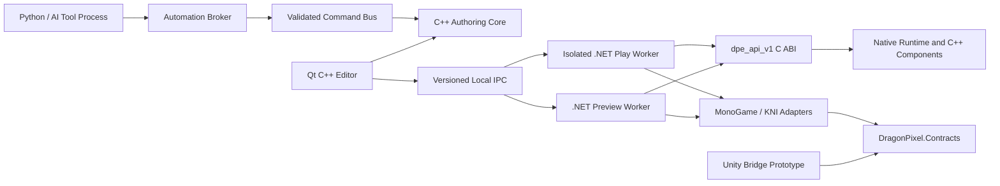
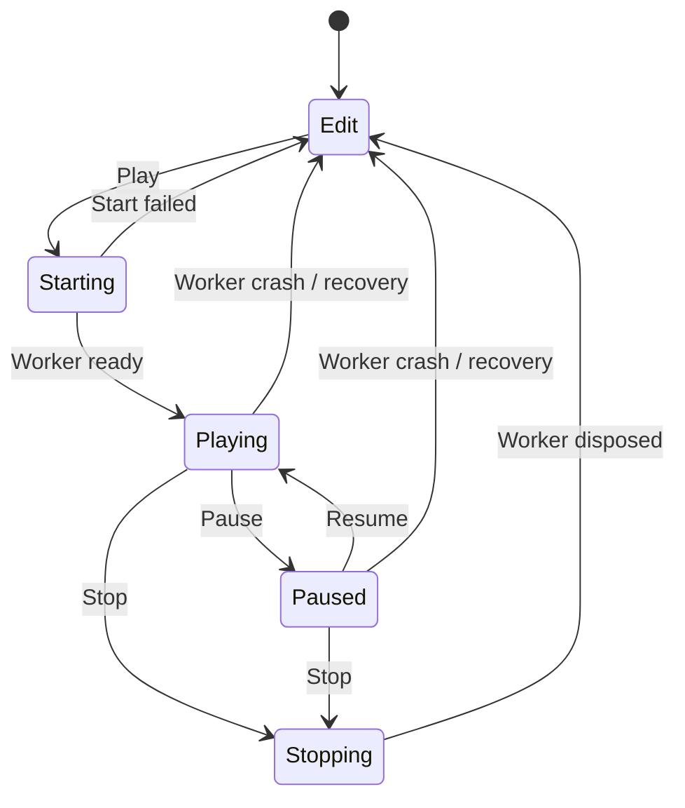

# Dragon Pixel Engine Design Document

> **Status:** Accepted architecture baseline for prototyping  
> **Design revision:** `DPE-ARCH-0002`  
> **Last reviewed:** 2026-07-24  
> **Current phase:** Architecture research; engine implementation has not started  
> **Documentation-system path:** `C:\Projects\Documentation\Engines\Dragon Pixel Engine\Dragon Pixel Engine Design Document.md`  
> **Repository mirror:** `C:\Projects\Github\Engines\Dragon Pixel Engine\docs\Dragon Pixel Engine Design Document.md`

This is the authoritative logical architecture document for Dragon Pixel Engine. Its documentation-system and repository copies are required mirrors of the same content; neither copy wins automatically if they differ. It is a living document: architectural changes must update both copies, the matching result in `Dragon Pixel Engine LLM Prompt Source.md`, the revision history, and any affected architecture decision records (ADRs). Compatibility facts are dated and must be reverified before dependency upgrades or when older than 90 days.

## Documentation Mirroring and Durable Response Capture

- Every Markdown file in `C:\Projects\Documentation\Engines\Dragon Pixel Engine` has a same-named, byte-identical mirror under the repository `docs` folder.
- Create, edit, rename, or remove a mirrored document in both locations in the same work item. Never leave synchronization as a follow-up task.
- Use UTF-8 without a byte-order mark and LF line endings for all mirrored Markdown files.
- If paired hashes differ, stop documentation, planning, or implementation work and reconcile the intended content explicitly. Do not select one side solely from path, timestamp, or Git status.
- Durable project documentation, implementation plans, architecture research, and substantive generated responses must be recorded in the appropriate living Markdown document or a descriptively named new Markdown document, then mirrored to both locations. A chat response alone is not the project record.
- `AGENTS.md` governs the mirror mapping and required verification. The repository copy provides version control; the external copy remains available to the user's documentation system.

## Decision Status and Evidence

- **Decision** means the project has selected the approach for the current architecture baseline. Reversing it requires an ADR.
- **Verified fact** means the statement is supported by a primary source listed in [Sources](#sources), checked on 2026-07-24.
- **Assumption** means the project has selected a working constraint that must be validated by a prototype or user testing.
- **Deferred decision** means the choice is intentionally outside the current architecture iteration; its decision gate is named.

### Verified technology baseline

- **Verified:** .NET 10 is an active LTS release supported through November 2028; C# 14 is the matching current language release.
- **Verified:** MonoGame's current migration guidance describes a .NET 8 dependency and permits applications to use .NET 10.
- **Verified:** KNI's current source targets `net8.0` and `netstandard2.0` in its principal framework projects. A Dragon Pixel `.NET 10` KNI worker is therefore a compatibility claim to test, not an upstream guarantee.
- **Verified:** Unity 6.3 LTS supports managed plug-ins targeting .NET Standard 2.1 and does not support plug-ins targeting .NET Core.
- **Verified:** Qt 6.11.1 is the current public Qt 6.11 release. Qt 6.11 supports Windows, macOS, and Linux and provides dock widgets, render-capable widgets, and accessibility interfaces.
- **Verified:** Qt's LGPLv3 option permits dynamic linking when all LGPL obligations are met, including notices, a corresponding-source offer, relinking rights, and the absence of restrictions that conflict with those rights. This document is not legal advice; distribution must pass a license review.

## 1. Product Definition and Non-Goals

Dragon Pixel Engine is a standalone, cross-platform game engine and visual editor with first-class 2D and 3D authoring. Its initial runtime focus is projects built on MonoGame and KNI. It also exposes portable contracts and tooling that can support other engines without making those engines dependencies of the core.

The primary users are programmers, technical designers, and designers who want an entity/component workflow over code-first MonoGame or KNI projects. The editor should feel familiar to Unity users through concepts such as scenes, a hierarchy, an Inspector, assets, dockable panels, edit/play states, and component-based authoring. Familiarity does not mean copying Unity implementation details, branding, layouts, or assets.

### Version 1.0 product outcomes

- Create, open, edit, validate, build, run, recover, archive, and upgrade a Dragon Pixel project on Windows, macOS, and Linux.
- Author a modest 2D or 3D project with entities, components, scenes, prefabs, assets, cameras, basic materials and lighting, and baseline physics authoring.
- Use C# and C++ components in the same scene without duplicate entity models or cross-runtime ownership ambiguity.
- Run projects through MonoGame and, after conformance validation, KNI adapters.
- Inspect an existing MonoGame or KNI project without modifying it, then perform a reversible, assisted migration.
- Extend runtime behavior, editor metadata, importers, and automation through versioned contracts.

### Explicit non-goals for 1.0

- Replacing MonoGame or KNI, or hiding access to their framework-specific capabilities when an advanced project needs them.
- Fully automatic conversion of arbitrary game loops, gameplay intent, dynamic code, custom native dependencies, or custom content processors.
- A supported Unreal Engine integration or a production-grade Unity replacement. Unity receives a contracts-and-bridge prototype only.
- Advanced AAA rendering features such as ray tracing, global illumination, large-world streaming terrain, cinematic pipelines, or VR/AR.
- Built-in networking, a visual scripting system, a marketplace, or a general-purpose IDE.
- Running Python or AI models inside the deterministic real-time game loop.
- Matching every Unity feature or UI detail before shipping a stable project workflow.

## 2. Proposed High-Level Architecture

### Architecture principles

1. Put interfaces at boundaries where multiple implementations, processes, runtimes, or versions genuinely exist. Do not create an interface for every class.
2. Keep the portable core independent of Qt, .NET, MonoGame, KNI, Unity, Python, and operating-system UI APIs.
3. Keep authoring data language-neutral. C# and C++ components are runtime implementations of one component record model.
4. Make ownership explicit. No owning raw pointer, exception, garbage-collected object, or framework object crosses a process or ABI boundary.
5. Make the editor authoritative for saved project state. Preview and play runtimes consume mirrors or snapshots.
6. Use immutable identifiers and versioned data at durable boundaries.
7. Isolate untrusted or crash-prone project code from the editor process.
8. Prefer reversible operations, atomic saves, structured diagnostics, and recovery over implicit mutation.

### Process topology



**Decision:** The native editor owns child runtime processes; it does not embed .NET in the editor process for normal operation.

- One preview worker mirrors the current authoring scene and produces viewport frames without owning the saved scene.
- Starting play creates an immutable run snapshot and launches a separate play worker.
- Pausing stops simulation updates while preserving rendering, inspection, and diagnostics.
- Stopping disposes the play worker and its world. Runtime changes are discarded. An explicit "Apply Play Changes" feature is deferred until it can be command-based and selective.
- A worker crash reports structured diagnostics, releases its shared resources, and leaves authoring state intact.
- Managed or native code changes restart the affected worker and rehydrate it from a snapshot. Version 1.0 does not rely on unloading arbitrary assemblies or native libraries in the editor.

This topology costs process startup time and requires IPC/frame transport, but it gives the best failure isolation, edit/play separation, runtime-version independence, and hot-reload recovery. In-process hosting with `hostfxr` remains a viable specialized alternative, not the default editor architecture.

### Runtime state machine



## 3. Module and Dependency Map

### Native modules

| Module | Responsibility | Allowed dependencies |
| --- | --- | --- |
| `DPE.Core` | IDs, results/errors, clocks, lifecycle primitives | C++ standard library only |
| `DPE.Scene` | Worlds, scenes, entities, hierarchy, component records | `DPE.Core`, metadata contracts |
| `DPE.Metadata` | Type/property descriptors and registries | `DPE.Core` |
| `DPE.Commands` | Commands, transactions, validation, undo records | `DPE.Core`, `DPE.Scene` public contracts |
| `DPE.Serialization` | JSON documents, schema versions, migrations | Core/scene/metadata contracts |
| `DPE.Assets.Contracts` | Asset IDs, import descriptors, cache keys | `DPE.Core` |
| `DPE.Diagnostics` | Structured events, categories, severity, correlation IDs | `DPE.Core` |
| `DPE.CAbi` | Stable C facade named `dpe_api_v1` | Public native core contracts only |
| `DPE.Editor.Services` | Project, selection, command, asset, runtime, layout services | Public core contracts and Qt adapters |
| `DPE.Editor` | Qt application shell and built-in panels | Editor services, Qt Widgets/GUI |

### Managed modules

| Module | Target | Responsibility |
| --- | --- | --- |
| `DragonPixel.Contracts` | `netstandard2.1` | IDs, metadata DTOs, command/result envelopes, portable attributes, serialization contracts |
| `DragonPixel.NativeInterop` | `net10.0` | Generated `LibraryImport` bindings, `SafeHandle` ownership, ABI version checks |
| `DragonPixel.Runtime` | `net10.0` | Worker host, component lifecycle, snapshots, IPC, diagnostics |
| `DragonPixel.Adapter.MonoGame` | `net10.0` | MonoGame device, loop, content, input, and rendering adapter |
| `DragonPixel.Adapter.Kni` | `net10.0` | KNI-specific device, loop, content, input, capability adapter; experimental until conformance passes |
| `DragonPixel.Unity.Contracts` | `netstandard2.1` | AOT-safe bridge DTOs and attributes only |
| `DragonPixel.Unity.Bridge` | Unity-supported profile | Minimal Unity-specific prototype; no standalone runtime dependency |
| `DragonPixel.Migration` | `net10.0` | Read-only MSBuild/Roslyn/content inspection and migration reports |

### Tooling modules

- `dragonpixel_tools` is an external Python package for inspection helpers, staged content processing, validation, tests, documentation, and AI orchestration.
- JSON schemas are versioned independently under a repository `schemas` area and consumed by C++, C#, Python, and editor tooling.
- Build/package tooling may depend on platform SDKs. The portable engine contracts may not depend on build tooling.

### Enforced dependency rules

- Portable native modules must not include Qt, CLR, MonoGame, KNI, Unity, or Python headers/types.
- `DragonPixel.Contracts` must not reference framework, editor, filesystem, networking, reflection-emission, or runtime-hosting packages.
- MonoGame types do not appear in the KNI adapter, and KNI types do not appear in the MonoGame adapter.
- Unity code may reference portable contracts, but portable contracts may never reference Unity assemblies.
- Editor panels mutate projects only through editor services and commands; they do not write scene files directly.
- Python and AI tools cannot directly mutate authoritative project files.

## 4. Recommended Technology Choices, Alternatives, and Tradeoffs

| Area | Decision | Why it fits | Important tradeoff / alternative |
| --- | --- | --- | --- |
| Native language | C++20 | Mature cross-platform baseline with modern ownership, concurrency, and library features | C++23 can be enabled feature-by-feature after the compiler matrix passes; Rust would improve memory safety but conflicts with the chosen native direction and adds another ABI/toolchain |
| Build | CMake with presets | Works across MSVC, Clang, GCC, IDEs, and CI | Meson is viable but has a smaller ecosystem for Qt/C++ engine projects |
| Editor UI | Qt 6.11 Widgets, dynamically linked | Built-in docking, model/view controls, keyboard support, accessibility, and render integration | wxWidgets is more permissive but requires more docking/polish work; Dear ImGui is valuable for debug tooling but is not the accessible application shell |
| Managed runtime | .NET 10 and C# 14 | Current LTS/runtime baseline and modern source generation/interop | KNI compatibility must be proven; no .NET dependency enters the native portable core |
| Unity contracts | .NET Standard 2.1 | Matches Unity 6.3's supported portable plug-in profile | It has a smaller API surface; standalone runtime packages remain `net10.0` |
| Authoring serialization | Deterministic UTF-8 JSON | Diffable, inspectable, language-neutral, and easy to preserve unknown data | YAML is friendlier for comments but has more parser/schema ambiguity; binary formats remain cache/transport options only |
| Control IPC | Length-prefixed JSON-RPC 2.0 | Debuggable, versionable, and easy to implement in C++, C#, and Python | Protobuf/gRPC is viable if profiling shows JSON is a bottleneck; viewport frames never use JSON |
| Frame transport | Versioned shared-memory interface; CPU BGRA first | Cross-platform proof of concept without binding the protocol to one graphics API | CPU readback is expensive; GPU shared handles are a later per-platform implementation behind the same interface |
| Python | External managed tool processes | Strong cancellation, permission, audit, and crash boundaries | Embedded Python is deferred and prohibited in the real-time loop |
| 3D interchange | glTF 2.0 as the preferred portable interchange format | Open, well specified, and broadly supported | Native/source formats may be imported through plugins; imported results use engine asset records |

### Initial desktop validation matrix

- Windows 11 x64 with MSVC 2022.
- macOS 14 or newer on Apple Silicon with current supported Xcode/Clang.
- Ubuntu 24.04 x64 with its supported GCC/Clang toolchain.

These are the Slice 1 CI/release baselines, not a permanent platform-support policy. Additional architectures and OS versions require passing the same conformance suite and a platform ADR update.

## 5. C++ and C# Interoperability Proposal

### Boundary selection

Use two boundaries for different purposes:

1. **Process boundary:** editor, preview worker, play worker, scanner, and Python tools communicate through versioned local messages.
2. **Native ABI boundary:** a managed worker calls the native runtime through a stable C ABI. C++ ABI types, templates, STL containers, exceptions, RTTI, and class layouts never cross it.

### `dpe_api_v1` contract

The public header exposes:

- an API/version query and function-table acquisition entry point;
- opaque 64-bit or pointer-sized handles whose ownership is documented per function;
- fixed-width integer and floating-point fields;
- UUID bytes in a fixed 16-byte representation;
- UTF-8 strings as pointer-plus-length views, never implicit null-terminated ownership;
- two-call output buffers (size query, then caller-provided buffer) or matching `dpe_alloc`/`dpe_free` functions from the same module;
- status codes plus a structured error record with stable error code, message, subsystem, and correlation ID;
- explicit create/retain/release or create/destroy pairs where ownership exists;
- capability and ABI-minor negotiation so newer optional functions can be discovered safely.

### Ownership rules

| Value | Owner | Boundary rule |
| --- | --- | --- |
| World, scene, entity, component runtime state | Native runtime instance | Managed code holds non-owning IDs/`SafeHandle`s only |
| C# component instance | Managed worker/GC | Native code stores a registered callback token, never a GC object pointer |
| Serialized data | Message/file sender until transfer completes | Receiver copies or maps it under an explicit lifetime |
| Callback data | Callee for callback duration only | Callback cannot retain a pointer unless a separate copy API says so |
| Error text | Producing module | Copied into caller buffer or freed by the matching module allocator |

Managed bindings use source-generated `LibraryImport`, `SafeHandle`, exact native type mappings, and unmanaged function pointers where callbacks are necessary. Microsoft recommends these patterns for modern .NET native interop.

### Failure and exception boundary

- C++ exceptions are caught inside every exported entry point and converted to a status/error record.
- Managed exceptions are caught at worker command/lifecycle boundaries and converted to structured diagnostics.
- A callback must not allow an exception to escape into native code.
- Fatal corruption or an unhandled worker failure terminates the worker, not the editor. The editor records the last command and worker logs for recovery.
- Timeouts and cancellation do not assume an arbitrary native call can be safely interrupted. Long operations must expose cooperative checkpoints or run in a disposable worker.

### Call granularity and performance

Do not invoke the ABI once per property or component per frame. Exchange snapshots, batched commands, contiguous component data, render submissions, and diagnostic batches. Profile before introducing shared-memory data-oriented stores across the ABI.

### Debugging and hot reload

- Workers announce PID, runtime/framework versions, build identifiers, loaded plugin manifests, and endpoint information after handshake.
- Visual Studio/Rider or lldb/gdb can attach to the worker without attaching to the editor.
- C# or C++ component recompilation restarts the preview/play worker and reloads a clean snapshot.
- Managed `AssemblyLoadContext` may be evaluated later for faster reload, but cooperative unloading is not a correctness dependency.

## 6. Entity, Component, Scene, World, and Prefab Model

### Model choice

**Decision:** Use a hybrid model: an object-oriented authoring graph and stable serialized component records, with data-oriented runtime stores allowed behind internal subsystem interfaces.

This fits inspection, scripting, undo, serialization, mixed languages, and migration better than exposing a pure archetype ECS as the public model. It still permits hot systems such as transforms, animation, rendering, or physics to compile component data into dense runtime representations. Data-oriented caches are derived and disposable; the authoring records remain authoritative.

### Identity and ownership

- IDs are RFC 9562 UUID version 4 values generated once and serialized in lowercase canonical form.
- A `World` owns loaded scenes and the runtime service context.
- A `Scene` owns its entity records, root ordering, scene settings, and referenced subscenes.
- An `EntityRecord` contains `id`, `name`, nullable `parentId`, `enabled`, ordered `components`, and editor flags that are explicitly marked serializable or transient.
- An entity belongs to exactly one scene at a time. Moving it between scenes is a command that preserves its ID unless a collision occurs.
- Components do not own entities. They reference their entity by stable ID/handle.
- Spatial behavior is provided by a `Transform` component. Non-spatial entities are valid.

### Canonical spatial conventions

- Right-handed coordinates, Y up, negative Z forward.
- Meters for world distance, seconds for time, radians internally, and degrees only as an editor presentation option.
- Quaternions are the canonical serialized 3D rotation; the Inspector may expose Euler editing.
- 2D uses the X/Y plane with Z for ordering/depth and orthographic cameras by default.
- Framework and Unity adapters perform explicit coordinate, winding, matrix-layout, and unit conversion. Conversions are covered by golden tests.

### Component records and runtime instances

Every serialized component record contains:

- stable `ComponentTypeId` UUID;
- diagnostic qualified name;
- component schema version;
- enabled state;
- runtime owner (`native`, `managed`, or `data-only`);
- JSON property payload.

C# and C++ components participate in the same entity model:

- The authoring record is independent of implementation language.
- A runtime registry resolves the type ID to a descriptor and factory.
- Native instances are owned by native component storage.
- Managed instances are owned by the worker's managed component host.
- Lifecycle dispatch groups calls by runtime/type and uses entity IDs or handles, not cross-language inheritance.
- References between components/entities serialize as stable IDs, never memory addresses.

The common runtime lifecycle is `Create`, `Enable`, fixed update, variable update, late update, render submission, `Disable`, and `Destroy`. Editor-only validation is a separate, explicitly permitted hook; merely opening a project must not execute arbitrary gameplay lifecycle code.

### Reflection and Inspector metadata

- C# attributes plus a source generator emit a metadata manifest and registration code at build time.
- C++ declarations use explicit registration macros or annotated declarations plus build-time code generation; raw compiler RTTI is not a public metadata format.
- Both emit one versioned metadata schema describing type IDs, display names, categories, property IDs, types, defaults, ranges, units, nullability, asset/entity reference kinds, visibility, read-only state, and custom drawer keys.
- The editor consumes manifests without loading game assemblies or native project libraries into the editor process.
- Runtime reflection may provide diagnostics, but source-generated manifests are the portable contract and AOT path.

### Scenes and prefabs

- A scene is a durable authoring document, not a live runtime object dump.
- A prefab is a reusable entity subtree with stable local entity/component IDs.
- A prefab instance records its source asset ID, source revision, local-to-instance ID mapping, and a deterministic list of property/structural overrides.
- Broken prefab references preserve the local instance and overrides and display a repairable diagnostic.
- Nested prefabs, override rebasing, and apply/revert UX are Slice 2 work behind this data contract.

## 7. Serialization and Versioning Strategy

### Durable files

| Artifact | Convention | Authority |
| --- | --- | --- |
| Project manifest | `DragonPixelProject.json` | Project identity, engine range, modules, startup scene, build targets |
| Scene | `*.dpescene` | Entity/component authoring data |
| Prefab | `*.dpeprefab` | Reusable entity subtree and defaults |
| Asset sidecar | `*.dpeasset` | Stable asset ID, source/importer/settings/dependencies |
| Shared workspace | `.dragonpixel/Workspace.json` | Team-approved editor configuration only |
| User editor state | `.dragonpixel/User/<user>.json` | Local layout, recent selections, camera state; excluded from source control by default |
| Migration report | `*.dpe-migration.json` plus `.md` | Machine-readable evidence plus human guidance |
| Import/cache output | `.dragonpixel/Cache/` | Disposable and never authoritative |

Files use strict UTF-8 JSON without comments or trailing commas. Writers use stable field ordering, invariant numeric formatting, and deterministic collection ordering where order has no domain meaning.

### Document envelope

Every durable document has a schema URI, integer `formatVersion`, document UUID, producer engine version, and payload. File-format version and individual component schema versions evolve independently.

```json
{
  "$schema": "dpe://schemas/scene/v1",
  "formatVersion": 1,
  "documentId": "00000000-0000-4000-8000-000000000000",
  "engineVersion": "0.0.0-dev",
  "payload": {}
}
```

### Compatibility and unknown data

- Unknown component type: retain the complete component record as an opaque JSON subtree, show its qualified name/type ID/version, disable runtime instantiation, and save it without dropping fields. Formatting may canonicalize; data must remain structurally equivalent.
- Renamed component: keep the type ID stable. Names are diagnostic and can change without migration.
- Replaced component: an explicit alias/migration record maps the old type ID/version to the new representation; never infer from names alone.
- Newer incompatible component: preserve it opaquely and report the required version/plugin.
- Unknown document field: preserve it when the schema marks the owning object extensible; reject it only when accepting it would change semantics or security.

### Migrations

- Migrations are ordered, deterministic, side-effect-free transformations from one version to the next.
- Each transformation records source/target version, tool build, timestamp, input/output hashes, warnings, and whether user decisions were required.
- Never migrate a project in place without an atomic backup and explicit confirmation. Existing-project import defaults to a new sibling Dragon Pixel project.
- A migration failure leaves the original and last valid document untouched.

### Save and recovery behavior

- Validate in memory, write a temporary file in the destination directory, flush it, then replace/rename atomically where the platform supports it.
- Keep a bounded recovery copy and a journal of committed project commands.
- On startup after an unclean exit, compare document hashes, journal position, and recovery copies and offer a preview before recovery.
- Runtime snapshots live in a session directory and cannot be confused with saved scenes.

## 8. Editor Architecture and Panel Model

### Application shell

Use `QApplication`, `QMainWindow`, and `QDockWidget` for the initial shell. Standard Qt widgets are preferred for controls because they already expose keyboard and accessibility behavior. Custom controls must define accessible names, roles, focus behavior, actions, and high-contrast behavior.

Built-in panels:

- **Scene View:** preview frame, editor camera, 2D/3D mode, selection outline, grid, gizmos, and runtime status.
- **Hierarchy:** scene/entity tree, active state, parenting, ordering, filtering, and multi-selection.
- **Project/Assets:** folders, asset records, importer status, search, previews, and dependency diagnostics.
- **Inspector:** metadata-driven component/property editors, validation, unknown component preservation, and add/remove/reorder commands.
- **Console:** structured logs, source/subsystem, severity, correlation, worker, play session, filtering, and navigation.
- **Later built-ins:** build/settings, profiler, migration, test runner, and plugin manager.

Each panel has a stable panel ID, contributes commands/menus through editor services, and serializes layout state separately from project content. Built-in panel implementation interfaces are internal C++; third-party panel ABI is not the engine C ABI.

### Editor services

- `IProjectService`: open/close/save/validate project and workspace state.
- `ISceneService`: scene lifetime, hierarchy, prefab operations, and authoring snapshots.
- `ISelectionService`: ordered selection, active object, selection origin, and change notifications.
- `ICommandService`: validation, transactions, undo/redo, preview/dry-run, and audit correlation.
- `IMetadataService`: type/property manifests, drawer lookup, and compatibility diagnostics.
- `IAssetService`: asset IDs, discovery, imports, cache, dependencies, and previews.
- `IRuntimeSessionService`: worker lifecycle, handshake, snapshot transfer, play state, and frame transport.
- `IDiagnosticsService`: structured events, sinks, retention, and console queries.

Interfaces are justified here because editor panels, headless tests, automation, and future plugins need substitutable implementations. Leaf UI widgets and simple domain values should remain concrete.

### Command, undo, and redo model

- Every authoritative mutation is an `IEditorCommand` with stable command type, typed/versioned payload, preconditions, validation, execution result, inverse data or checkpoint strategy, and affected IDs.
- Transactions group commands into one undo item and one audit event.
- Undo/redo stores domain operations, not UI callbacks or entire project copies.
- External tools call the same command service. They may request a dry-run that returns diagnostics and a change summary before commit.
- Long-running commands report progress and cooperative cancellation; cancellation must leave no partially committed authoritative state.

### Viewport frame transport

Control messages never carry image bytes. A negotiated `IFrameTransport` uses a versioned shared-memory header and multiple frame slots containing width, height, stride, pixel format, frame number, timestamp, and completion sequence. Slice 1 starts with BGRA8 sRGB CPU frames and latest-frame semantics. The editor may drop stale frames rather than stall simulation.

GPU sharing through D3D shared resources, IOSurface/Metal, or Vulkan external memory is a later transport implementation selected only after per-platform prototypes. The Qt surface and runtime protocol must not expose one graphics API as the engine contract.

## 9. MonoGame, KNI, Unity, and Future Unreal Integration

### Framework adapter contract

An internal managed adapter implements:

1. capability query;
2. initialization and graphics/input/audio setup;
3. snapshot loading and asset binding;
4. fixed and variable update scheduling;
5. 2D/3D render submission and frame production;
6. pause/resume/stop;
7. diagnostics and performance counters;
8. deterministic shutdown.

Framework-specific objects remain inside the adapter. Portable components submit engine render data or call an explicitly framework-specific extension obtained through capabilities. A project declares its required capabilities so unsupported combinations fail before play/build.

### MonoGame adapter

- Primary implementation and first conformance target.
- Use official MonoGame packages and platform templates, pinned centrally at the latest verified stable version when Slice 1 begins.
- Map Dragon Pixel loop phases onto MonoGame update/draw behavior without subclassing portable components from MonoGame classes.
- Integrate MGCB/content metadata through the asset service while retaining framework-specific escape hatches.
- DesktopGL is the initial common desktop validation path; platform-specific targets require separate capability tests.

### KNI adapter

- Separate package and worker composition; do not compile MonoGame and KNI types into one adapter assembly.
- Target the Dragon Pixel `.NET 10` worker while consuming KNI's compatible assets.
- Remain labeled **experimental** until the same scene, lifecycle, frame, content, input, shutdown, and packaging conformance suite passes on all three desktop baselines.
- Record KNI divergences as capabilities or adapter behavior, not conditionals in portable components.
- If .NET 10 or a platform fails, do not lower the engine-wide runtime baseline. Publish the failing matrix and block supported status until KNI/upstream or the adapter is corrected.

### Rendering abstraction

The authoring/runtime scene exposes framework-neutral cameras, transforms, sprite items, mesh items, materials, lights, render layers, and asset handles. Adapters translate these to framework resources. The v1 abstraction must support a practical sprite scene and a practical static/skinned-mesh scene with basic lighting, but it is not a lowest-common-denominator promise: capabilities expose optional framework features.

### Unity bridge prototype

Only `netstandard2.1` contracts, AOT-safe DTOs, generated metadata, serialization primitives, and a minimal command/scene exchange prototype are shared. The prototype must be tested with both Mono and IL2CPP-compatible code paths and may not use runtime code generation. Unity editor APIs, object lifecycles, serialization, rendering, and native plug-in loading remain in the Unity adapter.

### Unreal boundary

Unreal receives no implementation before 1.0. Stable C ABI, language-neutral documents, commands, metadata, and local protocol are the only intentional future hooks. No Unreal build, object, reflection, or module concept may enter the portable core in anticipation.

## 10. Existing MonoGame and KNI Project Migration Strategy

### Migration phases

1. **Discover:** choose a project/solution and create an out-of-process, read-only scan session.
2. **Evaluate:** use MSBuild's project model with the matching SDK, without running arbitrary custom targets by default.
3. **Analyze:** use Roslyn for syntax/semantic inspection where a safe compilation can be created; parse MGCB/KNI content files and asset directories.
4. **Report:** emit machine-readable JSON and a human Markdown report with evidence, confidence, and action classification.
5. **Plan:** let the user select a new sibling destination, adapter, startup project, asset strategy, and optional transformations.
6. **Generate:** create Dragon Pixel metadata and copies/links in staging, validate them, then commit atomically to the new destination.
7. **Verify:** build/run the original and migrated projects where possible and present behavioral gaps.

Before and after scanning, record source-tree file paths, sizes, timestamps, and hashes. A read-only scan must produce an identical source-tree manifest and must not restore packages or execute project targets unless the user explicitly permits a separately disclosed operation.

### First-release automation

The scanner can realistically automate:

- solution/project discovery, target frameworks, runtime identifiers, SDK and package references;
- MonoGame/KNI platform/package recognition;
- project references, conditional property groups, build configurations, and source files;
- common `Game` subclasses and recognizable `Initialize`, `LoadContent`, `Update`, and `Draw` overrides;
- MGCB/KNI content projects, source assets, output directories, and known processors/importers;
- common screen/state/service patterns as evidence-based candidates, not guaranteed semantics;
- native libraries, reflection/dynamic loading, unsafe code, platform conditionals, and custom build targets as risk flags;
- reusable source/assets and generation of a Dragon Pixel project manifest, asset sidecars, and an initial scene scaffold.

The following remain assisted:

- deciding how gameplay state maps to scenes/entities/components;
- rewriting game-loop ownership, static singletons, service locators, or custom dependency injection;
- translating dynamic/reflection-generated behavior;
- converting custom content processors, shaders, native dependencies, platform services, or unsupported graphics techniques;
- validating that migrated behavior is visually and functionally equivalent.

Every report item is classified `reuse`, `adapt`, `manual`, `unsupported`, or `unknown`, with confidence, source evidence, and a recommended next action. Low confidence is never presented as automatic conversion.

### Reversibility

- The default destination is a new sibling directory; the original is never modified.
- An optional overlay mode may add only Dragon Pixel metadata after preview and confirmation, with a generated removal manifest.
- Generated files record their source hashes and generator version.
- No migration step deletes or rewrites original code/assets.

## 11. Python and AI Tooling Architecture

Python is an external automation client, not an engine subsystem. The editor exposes an `AutomationBroker` over the same command protocol used by tested editor clients.

### Security and integrity model

- Endpoints are local-only: user-restricted named pipes on Windows and user-restricted Unix-domain sockets on macOS/Linux.
- The editor creates a random session capability token and passes it through a protected inherited channel, never a command-line argument or project file.
- Capabilities are explicit: inspect project, read asset, propose command, execute approved command, run build/test, write staging output, or import staged output.
- Project roots are read-only to tool processes by default. Generated files go to a per-operation staging directory.
- Authoritative changes are validated, summarized, and committed through commands. Direct project-file writes are rejected or detected by integrity checks.
- Destructive or broad changes require explicit approval unless a user-configured policy grants that exact command/capability.
- Each operation has timeout, progress, cooperative cancellation, and a final hard process-termination path.

### Audit and reproducibility

Append JSON Lines audit events containing operation/correlation ID, actor/tool/model identifier, command schema/version, capability grant, input hashes, environment/lockfile hash, parameters, random seed when relevant, proposed changes, approvals, result hashes, diagnostics, timestamps, and cancellation state. Secrets and private prompt content are redacted by policy.

Reproducible tools declare a Python version, lockfile, tool version, deterministic options, source hashes, and output manifest. Non-deterministic AI output is always treated as a proposal that must pass schema and domain validation.

### Supported workflows

- project and migration inspection;
- code/asset analysis;
- staged content processing and metadata generation;
- validation, builds, tests, and report generation;
- documentation generation;
- AI-assisted command, component, prefab, or scene proposals;
- replayable batch editor operations.

## 12. Plugin and Extension Model

### Plugin manifest

Every plugin declares:

- plugin UUID, name, semantic version, publisher, and integrity hash/signature data;
- required engine/editor/API version ranges;
- runtime kind (`native-worker`, `managed-worker`, `editor-declarative`, `editor-native-trusted`, `python-tool`);
- entry points and supported platforms/architectures;
- dependencies and optional capabilities;
- requested permissions;
- contributed component types, importers, commands, panels, property drawers, build targets, or automation methods.

### Runtime extensions

- Native components/plugins load only in worker processes through a versioned C function table. C++ class ABIs are private to a build.
- Managed plugins load in workers against `DragonPixel.Contracts`; their dependency set is isolated where practical.
- Component metadata is readable before code is loaded.
- A failed plugin is quarantined for the session with its data preserved opaquely.

### Editor extensions

- Prefer declarative panels, metadata-driven drawers, commands, and external tool processes.
- Native Qt editor plugins are explicitly trusted, exact-version-bound, disabled by default after a crash, and require an editor restart to update. They are not promised binary compatibility across editor minor versions until a later policy says so.
- Plugins cannot write project documents directly; they use editor services/commands.

### Compatibility policy

Public contracts use semantic versioning plus explicit protocol/format versions. Additive capabilities are negotiated. Breaking API, ABI, protocol, or document changes require an ADR, migration path, compatibility tests, and a documented deprecation window before 1.0 policy freeze.

## 13. Four-Slice Roadmap, Milestones, and Acceptance Criteria

### Slice 1: Core, infrastructure, scaffolding, and core editor

Milestones:

1. Accept foundational ADRs and pass the four risk prototypes.
2. Establish builds, dependency rules, schemas, diagnostics, and CI on all three desktop baselines.
3. Implement identity, scenes, component records, metadata, serialization, migrations, and command foundations.
4. Implement the C ABI, managed worker, MonoGame adapter, and KNI conformance adapter.
5. Implement the Qt shell, Scene, Hierarchy, Project, Inspector, and Console panels.
6. Implement project open/save and edit/play/pause/stop with worker recovery.

Acceptance:

- The same sample project opens on all baseline platforms.
- It displays a 2D sprite and 3D static mesh with cameras and basic lighting.
- A user can create/select/rename/reparent an entity, add one C++ and one C# component, edit exposed properties, save, close, reopen, and get structurally equivalent data.
- MonoGame play works on all baseline platforms. KNI either passes the same matrix or remains clearly experimental with failing evidence.
- Stop discards runtime-only changes; a worker crash cannot corrupt the saved scene.
- Unknown components survive load/save and appear as repairable diagnostics.

### Slice 2: Designer-friendly 2D and 3D tooling

Milestones include polished layouts, Inspector editors/validation, drag-and-drop, previews, 2D/3D gizmos, editor cameras, multi-selection, undo/redo, prefabs, custom drawers, and baseline lighting/physics authoring. Conduct keyboard, accessibility, and designer usability tests throughout rather than at the end.

Acceptance: a technical designer can assemble, validate, run, and revise a small 2D project and a small 3D project without editing generated metadata or scene JSON by hand.

### Slice 3: Project lifecycle and maintenance

Milestones include project templates, discovery/recent projects, read-only scan reports, reversible assisted migration, dependency/SDK validation, format upgrades, backup/recovery, archive/delete safeguards, builds/packages, plugin management, editor/engine updates, and the minimal Unity bridge prototype.

Acceptance: a user can create a project, migrate representative MonoGame and KNI samples without modifying the originals, build/package them, reopen/upgrade them, recover from an interrupted save, and safely archive them.

### Slice 4: Version 1.0 stabilization and polish

Milestones include profiling, memory/performance budgets, crash reports, long-running sessions, backward-compatible upgrade fixtures, security/license reviews, documentation/tutorials, keyboard/accessibility completion, distribution/update channels, plugin/API compatibility policy, and real-world migration testing.

Acceptance: all release gates pass on the supported matrix; no open data-loss defect exists; supported project formats upgrade from every public pre-1.0 fixture; installation/update/rollback are verified; and the documentation builds reproduce the reference 2D and 3D projects.

## 14. Risk Register

| Risk | Likelihood / impact | Mitigation and decision gate |
| --- | --- | --- |
| Cross-process viewport transport is too slow or inconsistent | High / High | Prototype CPU shared memory on all platforms; retain transport interface; measure GPU sharing before choosing per-platform implementations |
| Mixed C++/C# ownership causes leaks or use-after-free | Medium / Critical | Opaque handles, `SafeHandle`, allocator pairing, sanitizer/leak tests, forced exception/error cases |
| KNI does not work reliably on .NET 10 or all desktop targets | High / High | Separate adapter and conformance matrix; experimental label; never reduce engine baseline silently |
| Qt LGPL distribution is non-compliant | Medium / Critical | Dynamic linking, module inventory, notices/source/relinking package, automated artifact audit, pre-release legal review |
| Metadata generated by C# and C++ drifts | Medium / High | One schema, golden manifest fixtures, generator-version fields, cross-language conformance tests |
| Unknown or newer components lose data | Medium / Critical | Opaque record model and round-trip fixtures for every version; block saves on unrecoverable parsing |
| Edit/play leakage corrupts authoring data | Low / Critical | Separate play process/snapshot, read-only authoring mirror, command-only apply path, crash tests |
| Migration overpromises semantic conversion | High / High | Evidence/confidence reporting, read-only default, reversible sibling destination, assisted classification |
| Plugin/AI code corrupts projects or compromises the editor | Medium / Critical | Worker isolation, capabilities, staging, command validation, audit, trust/quarantine model |
| 2D+3D scope prevents a stable 1.0 | High / High | Define baseline workflows and explicit AAA non-goals; vertical slices and usability gates before breadth |
| Cross-platform behavior diverges late | Medium / High | All three desktop CI baselines begin in Slice 1; shared conformance fixtures and golden coordinate/render tests |
| Qt or .NET support window changes before 1.0 | Medium / Medium | Central version pins, 90-day fact review, upgrade ADR, supported-version CI |

Risks are reviewed at every slice exit. A risk becomes a blocker when its prototype or acceptance gate fails; it is not hidden by narrowing the test matrix after the fact.

## 15. Required Architecture Decision Records

Create these ADRs under the repository documentation when implementation begins:

1. `ADR-0001`: Editor, preview worker, and play worker process topology.
2. `ADR-0002`: Hybrid authoring component model and runtime data stores.
3. `ADR-0003`: Stable C ABI, ownership, allocation, and error conventions.
4. `ADR-0004`: MonoGame/KNI adapter boundary and capability model.
5. `ADR-0005`: Cross-language metadata generation and Inspector schema.
6. `ADR-0006`: JSON document formats, unknown-data preservation, and migrations.
7. `ADR-0007`: Qt Widgets selection, desktop support matrix, and LGPL compliance.
8. `ADR-0008`: Editor commands, undo/redo, and automation security.
9. `ADR-0009`: Plugin types, trust boundaries, and compatibility.
10. `ADR-0010`: Local IPC and viewport frame transport.
11. `ADR-0011`: Unity contract boundary and bridge prototype.
12. `ADR-0012`: Coordinate system, units, and adapter conversions.

ADRs begin as `Proposed`; only reviewed ADRs become `Accepted`. This design document summarizes accepted decisions but does not replace their rationale/history.

## 16. Proof-of-Concept Prototypes Before Full Development

### POC A: Native/managed ABI and ownership

Build a minimal C++ library plus .NET 10 console worker that negotiates `dpe_api_v1`, creates a world/entity, attaches one native component, exchanges UTF-8/error data, and destroys all state.

Pass criteria:

- Runs on all three desktop baselines.
- Ten thousand create/destroy cycles produce no sanitizer, invalid-handle, allocator-pair, or managed `SafeHandle` leak failure.
- Native and managed exceptions become structured errors without crossing the ABI.
- ABI version mismatch and missing capability fail cleanly.

### POC B: Worker lifecycle and viewport frames

Build a minimal Qt viewer plus separate MonoGame and KNI workers. Render one moving sprite and one lit static mesh to a 1280x720 BGRA shared-memory frame transport.

Pass criteria:

- MonoGame reaches 30 presented frames per second with median input-to-present latency below 100 ms on the baseline developer machines.
- Play, pause, resume, stop, and a forced worker crash leave the viewer responsive and release shared resources.
- The editor can restart and display a fresh snapshot without reopening the project.
- KNI results are recorded per platform; any failure blocks supported status, not the remaining architecture.

### POC C: Metadata and serialization

Generate one C# and one C++ component manifest with equivalent property types, load them into a headless Inspector model, serialize a scene, and load/save an intentionally missing/newer component.

Pass criteria:

- Both languages validate against the same metadata schema.
- Known properties preserve IDs, values, references, and numeric precision.
- The unknown component's JSON subtree is structurally identical after round-trip.
- Rename through a stable type/property ID requires no migration; an actual schema change requires one.

### POC D: Read-only project scanner

Scan representative MonoGame and KNI solutions containing content projects, common game-loop patterns, conditional builds, custom processors, and native dependencies.

Pass criteria:

- Pre/post source-tree manifests are identical.
- The report includes target frameworks, packages, content, game-loop evidence, assets, risks, reusable/adapt/manual classifications, confidence, and source locations.
- Unsupported evaluation or code patterns are reported as unknown/manual, not silently ignored.

## 17. Recommended First Implementation Chunk for Slice 1

After POCs and ADRs 0001-0007 are accepted, implement `S1.0 Architecture Bootstrap`. Do not build the full editor in this chunk.

### Repository scaffold

```text
/native/core
/native/scene
/native/metadata
/native/serialization
/native/cabi
/managed/DragonPixel.Contracts
/managed/DragonPixel.NativeInterop
/managed/DragonPixel.Runtime.Worker
/schemas
/samples/ArchitectureBootstrap
/tests/native
/tests/managed
/tests/conformance
/docs/adr
```

### Included behavior

- CMake presets and .NET solution/build orchestration for the three CI baselines.
- UUID/result/diagnostic primitives and the initial `dpe_api_v1` function table.
- One world, one scene, entity identity/name/parenting, component records, and a mandatory sample transform.
- One native sample component and one managed sample component using generated metadata.
- Scene JSON load/save, unknown-component preservation, and one sample format migration.
- A headless worker that loads a snapshot, invokes lifecycle methods, emits diagnostics, and shuts down.
- Unit, ABI, schema, round-trip, and cross-platform smoke tests.

### Excluded behavior

- Qt application shell or production viewport.
- General renderer, asset database, prefabs, undo/redo UI, project migration UI, Unity bridge, or plugin manager.
- Production hot reload, packaging, updater, or broad project templates.

### Definition of done

- Clean build/test succeeds on all three CI baselines.
- Public modules contain no forbidden dependencies.
- Managed/native samples operate on one canonical entity ID and serialize through the same component record format.
- All ownership/error/version mismatch tests pass.
- The design revision and accepted ADR links are updated before beginning the next chunk.

## Research Question Resolutions

1. **Responsibility split:** portable data/lifecycle/commands live in the native core; Qt UI in the editor; managed lifecycle/interop in workers; framework APIs in adapters; inspection/build/AI in external tooling.
2. **Safest interop:** process isolation plus a narrow versioned C ABI inside workers, with explicit handles, buffers, status codes, and generated managed wrappers.
3. **Process ownership:** the editor owns separate preview and play workers; it does not embed the normal managed runtime.
4. **UI framework:** Qt 6.11 Widgets under dynamic LGPLv3 compliance, because docking, desktop support, render integration, keyboard behavior, and accessibility outweigh its licensing/deployment cost.
5. **Reflection:** build-time C# and C++ metadata generation into one schema; no cross-runtime class reflection contract.
6. **Serialization:** deterministic UTF-8 JSON for authoritative data; binary only for disposable caches or measured transports.
7. **Missing/incompatible components:** preserve opaque component records and expose repair diagnostics.
8. **Edit/play isolation:** immutable play snapshots and a disposable play process; no implicit write-back.
9. **Adapter differences:** one conformance contract, separate packages, capability declarations, and framework-specific content/device behavior.
10. **Unity sharing:** only AOT-safe `.NET Standard 2.1` contracts/data/metadata; Unity APIs and runtime behavior remain adapter-specific.
11. **Python/AI:** local capability-based broker, staging, command validation, audit logs, cancellation, and reproducibility records.
12. **Migration:** read-only evidence-based scan followed by reversible assisted generation; semantic conversion remains human-guided.
13. **Unity-like 1.0 usability:** hierarchy, project/assets, Inspector, scene view/gizmos, console, edit/play controls, prefabs, undo/redo, validation, recovery, and keyboard/accessibility are essential; broad Unity feature parity is deferred.
14. **Largest risks/prototypes:** frame transport, ABI ownership, KNI compatibility, metadata/unknown data, and migration safety are reduced by POCs A-D before broad development.

## Focused First Architecture and Prototyping Iteration

1. Create and review ADRs 0001-0007 from this baseline.
2. Build POC A and POC C first because every later subsystem depends on safe identity, ownership, metadata, and serialization.
3. Build POC B on all desktop baselines before committing the editor viewport to a transport.
4. Build POC D against real small MonoGame/KNI fixtures before promising migration coverage.
5. Record measurements, failures, and decision changes in ADRs and both living documents.
6. Begin `S1.0 Architecture Bootstrap` only when POC gates pass or an ADR explicitly narrows/replaces a failed approach.

This iteration deliberately ends before a broad editor build. Its output is a proven foundation, not an enormous backlog or a partially integrated engine.

## Sources

Primary sources were accessed on 2026-07-24.

- [.NET and .NET Core support policy](https://dotnet.microsoft.com/en-us/platform/support/policy/dotnet-core)
- [What's new in C# 14](https://learn.microsoft.com/en-us/dotnet/csharp/whats-new/csharp-14)
- [Write a custom .NET runtime host](https://learn.microsoft.com/en-us/dotnet/core/tutorials/netcore-hosting)
- [.NET native interoperability best practices](https://learn.microsoft.com/en-us/dotnet/standard/native-interop/best-practices)
- [.NET assembly unloadability](https://learn.microsoft.com/en-us/dotnet/standard/assembly/unloadability)
- [MonoGame: upgrading from 3.8.x](https://docs.monogame.net/articles/migration/migrate_38.html)
- [MonoGame supported platforms](https://docs.monogame.net/articles/getting_started/platforms.html)
- [KNI repository and supported platforms](https://github.com/kniEngine/kni)
- [KNI framework target declarations](https://github.com/kniEngine/kni/blob/main/src/Xna.Framework/Xna.Framework.csproj)
- [Unity 6.3 LTS API compatibility levels for .NET](https://docs.unity3d.com/6000.3/Documentation/Manual/dotnet-profile-support.html)
- [Qt supported versions](https://doc.qt.io/qt-6/qt-releases.html)
- [Qt 6.11 supported platforms](https://doc.qt.io/qt-6/supported-platforms.html)
- [Qt `QDockWidget`](https://doc.qt.io/qt-6/qdockwidget.html)
- [Qt `QRhiWidget`](https://doc.qt.io/qt-6/qrhiwidget.html)
- [Qt Widgets accessibility](https://doc.qt.io/qt-6/accessible-qwidget.html)
- [Qt LGPL obligations](https://www.qt.io/development/open-source-lgpl-obligations)
- [JSON-RPC 2.0 specification](https://www.jsonrpc.org/specification)
- [RFC 8259: The JavaScript Object Notation data interchange format](https://www.rfc-editor.org/rfc/rfc8259)
- [RFC 9562: Universally Unique IDentifiers](https://www.rfc-editor.org/rfc/rfc9562)
- [Khronos glTF 2.0 specification](https://registry.khronos.org/glTF/specs/2.0/glTF-2.0.html)

## Revision History

| Revision | Date | Status | Summary |
| --- | --- | --- | --- |
| `DPE-ARCH-0001` | 2026-07-24 | Accepted baseline | Established product scope, process topology, hybrid component model, serialization, Qt/.NET/framework boundaries, migration/automation safety, four slices, risks, POCs, and `S1.0` |
| `DPE-ARCH-0002` | 2026-07-24 | Accepted governance update | Added byte-identical repository/document-system mirroring and durable capture requirements for project documentation, plans, and substantive responses |
